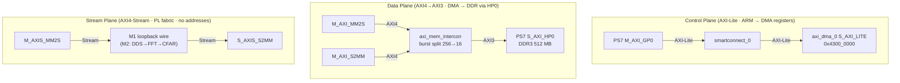
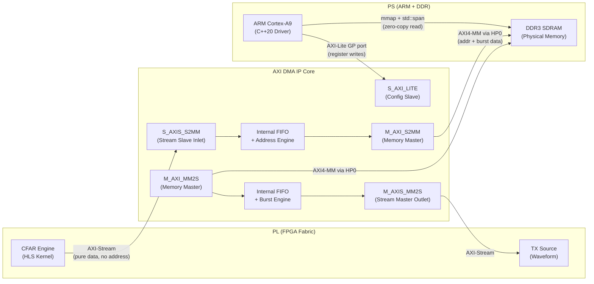
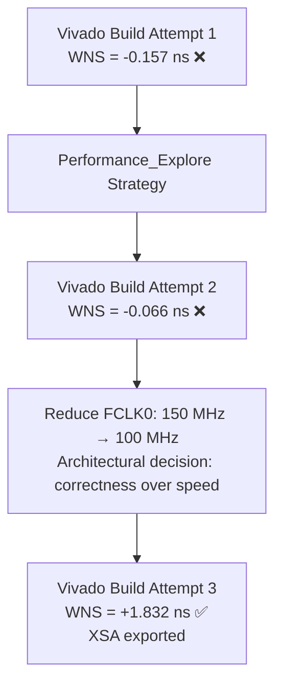
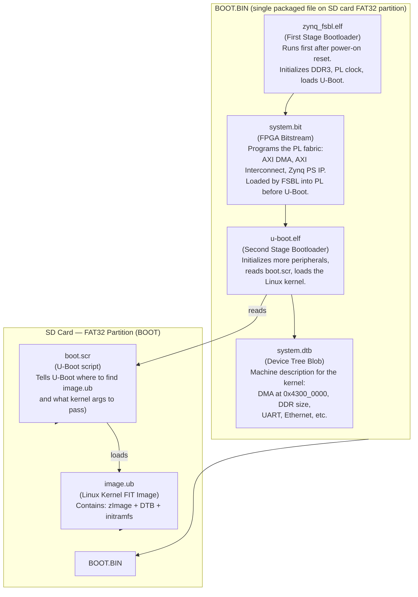

---
tags:
  - Radar
  - Zenith
  - AXI-DMA
  - PetaLinux
  - Vivado
  - TimingClosure
  - CrossCompilation
  - BuildInPublic
date: 2026-03-22
author: Charley Chang
milestone: M1 — Zenith-Core Foundation
week: Week 2
day: Day 2
continues_from: "[[Zenith_W2D1_BD_Complete_V3]]"
status: PetaLinux built. BOOT.BIN packaged. Board boot pending SD card.
---

# Zenith-Core · Week 2, Day 2 — PetaLinux Bring-Up & ARM Cross-Compilation
## Continuing from Day 1: Timing Recovery, OS Build, and Validation Binary

> **Day 2 summary in one sentence:**
> Picked up directly from the Day 1 XSA export — resolved a post-rebirth timing violation by reducing FCLK0 to 100 MHz, installed PetaLinux 2025.2 from scratch on WSL2 Ubuntu 24.04 (resolving nine dependency failures), built a custom Linux kernel with a 16 MB CMA reservation, cross-compiled the ARM validation binary `zenith_m1_validate`, and packaged `BOOT.BIN`. The board boot via SD card is the only remaining M1 gate.

---

## 0. Day 1 → Day 2 Handoff: Where We Left Off

> **Read this section first.** Day 2 work is a direct continuation of [[Zenith_W2D1_BD_Complete_V3]]. Nothing in Day 2 is self-contained — it only makes sense against the state the hardware was left in.

### 0.1 Day 1 Exit State (confirmed deliverables)

Day 1 concluded with the M1 Vivado Block Design fully wired and the first clean bitstream generated. The key confirmed facts were:

| Deliverable          | Value                                | Confirmed By                                                            |
| -------------------- | ------------------------------------ | ----------------------------------------------------------------------- |
| AXI DMA base address | `0x4300_0000`                        | Vivado Address Editor (manually set, matches `/proc/iomem` from Week 1) |
| DDR range via HP0    | `0x0000_0000 – 0x1FFF_FFFF` (512 MB) | Board constraint, Vivado enforced ceiling                               |
| HP0 clock source     | `FCLK_CLK0` (150 MHz)                | Tcl: `get_bd_nets -of_objects [get_bd_pins ps7_0/S_AXI_HP0_ACLK]`       |
| WNS at 150 MHz       | **+0.060 ns** ✅                      | Implementation timing report                                            |
| Bitstream            | `zenith_system_wrapper.bit`          | Vivado Generate Bitstream                                               |
| Hardware export      | `zenith_system_wrapper.xsa`          | File → Export Hardware (with bitstream)                                 |
| Loopback wire        | `M_AXIS_MM2S` → `S_AXIS_S2MM`        | Block Design — M1 loopback, no HLS kernel yet                           |
The session ended with the following items queued as the Day 2 mission:

```
P0-B  PetaLinux Setup  —— create zenith-petalinux project, ingest XSA,
                          configure CMA=16M, run petalinux-build
P0-C  First Board Run  —— cross-compile zenith_m1_validate, copy to board,
                          confirm "ZENITH M1 SUCCESS: Loopback Verified!"
```

### 0.2 The Day 2 Complication: Project Rebirth and Timing Re-Violation

Day 2 did not start cleanly from the Day 1 state. During project reorganisation (moving files back to the canonical `zenith_radar_os` path), Vivado's internal file-database cache became corrupted — the `.gen`, `.runs`, and `.cache` directories held stale references to generated IP header files that had been physically deleted. Vivado refused to self-repair because the project state was internally flagged as clean.

**The rebirth procedure** (canonical recovery for any corrupted Vivado project):

```tcl
# Step 1: In the broken project's Tcl Console — export the logical design
write_bd_tcl -force C:/Projects/zenith_system_soul.tcl

# Step 2: Create a fresh project at the target path, then reconstruct
source C:/Projects/zenith_system_soul.tcl
```

`write_bd_tcl` serialises every IP setting and wire connection into a reproducible script. The `.tcl` file is the true version-controllable artifact of a Block Design — not the generated XML or IP caches.

**Timing consequence of the rebirth:** After the fresh project's Place-and-Route ran with a new random seed, WNS dropped from the Day 1 value of +0.060 ns to **−0.157 ns** — a genuine setup violation. The router placed the AXI Interconnect blocks at slightly different physical locations, producing a routing wire ~2–3 mm longer and adding ~160 ps of RC propagation delay. This was resolved by reducing FCLK0 from 150 MHz to 100 MHz for the M1 milestone (full reasoning in §2.2 below). The Day 2 final bitstream shipped with **WNS = +1.832 ns**.

### 0.3 The Three-Plane Architecture Established in Day 1

Day 2 builds directly on the BD architecture documented in Day 1. The three AXI planes carry completely different physical protocols and must never be confused:



The DMA is the translator between the Stream Plane (pure data flow, no addresses, inside the PL) and the Data Plane (AXI4 with physical addresses, crossing to DDR). This is the conceptual core that drove every wiring decision in Day 1 and every driver decision in Day 2.

---

## 1. AXI Protocol Architecture: The Physical Law of PS/PL Communication

Before diving into the build log, this session produced a critical conceptual breakthrough that must be documented at textbook depth. Every future HLS kernel, every DMA driver, and every `std::span` zero-copy operation depends on internalizing this model.

### 1.1 The Two Worlds on One Chip

The Zynq-7020 contains two fundamentally different worlds connected by AXI bridges:

| World | Location | Protocol | Analogy |
|---|---|---|---|
| **PL (Programmable Logic)** | FPGA fabric | AXI-Stream | Pressurized water pipe — pure data flow, no addressing |
| **PS (Processing System)** | ARM Cortex-A9 | AXI Memory-Mapped | Highway with addresses — data finds its destination |

**The naming confusion that traps every new FPGA engineer:** Vivado's Block Design shows port names like `M_AXIS_MM2S`, `S_AXIS_S2MM`, `M_AXI_S2MM`, and `AXI_S2MM`. Four names, all containing `S2MM`, yet they describe fundamentally different physical interfaces. The cause is Xilinx's naming convention, which encodes **two independent pieces of information** simultaneously:

```
M_AXIS_S2MM
│  │     └─── Business direction: Stream-to-Memory-Map (S2MM)
│  └───────── Protocol: AXIS = AXI4-Stream (no addresses)
└──────────── Role: M = Master, S = Slave
```

Understanding that `AXIS_` and `AXI_` are different protocols — not just name variants — is the key.

### 1.2 AXI-Stream (AXIS): The King of Speed Inside the PL

AXI4-Stream has **no address lines**. It is a unidirectional, continuously flowing pipe between two logic blocks. The only handshake signals are:

- `TVALID`: Master asserts, "I have valid data."
- `TREADY`: Slave asserts, "I am ready to accept."
- `TDATA`: The actual payload.
- `TLAST`: Packet boundary marker.

Transfer occurs on every rising clock edge where both `TVALID` and `TREADY` are high simultaneously. There is no concept of "destination" or "source address." Data simply flows downstream, one word per clock, at the full fabric clock rate.

**Why this is the performance king:** At 150 MHz with a 32-bit data bus, AXI-Stream achieves $150 \times 10^6 \times 4 = 600$ MB/s sustained throughput with `II=1` — every clock cycle delivers a new sample. There is no DDR latency, no address decode, no arbitration. In HLS C++, this maps directly to `hls::stream<ap_axis<32,1,1,1>>`.

**Zenith usage:** Every inter-operator link inside the PL — ADC → 1D-FFT → 2D-FFT → CFAR → DMA inlet — uses AXI-Stream. Data never leaves the fabric until it hits the DMA gateway.

### 1.3 AXI Memory-Mapped (AXI4-MM via HP Port): The PS/DDR Bridge

AXI4-MM is the full bus protocol with address channels (`AWADDR`, `ARADDR`), write data channels (`WDATA`), read data channels (`RDATA`), and response channels. It is the protocol that DDR controllers understand.

The Zynq PS provides four dedicated **AXI High-Performance (HP) ports** (HP0–HP3) that connect the PL fabric directly to the DDR controller, bypassing the ARM L1/L2 caches. Each HP port is a 64-bit AXI4 slave interface capable of up to ~1.2 GB/s burst bandwidth.

**Why HP bypasses cache:** The ARM caches are coherent only with the ARM's own instruction stream. When the PL writes to DDR via the HP port, the ARM's L2 cache is not notified. The corresponding cache lines remain stale. The ARM driver **must** explicitly invalidate these lines before reading fresh PL data:

```cpp
// Mandatory before reading PL output from DDR via HP port
__builtin___clear_cache(region.data(), region.data() + region.size());
```

**Zenith usage:** The DMA engine connects to HP0. The PL never "knows" the DDR address — only the DMA does.

### 1.4 The DMA Engine: Protocol Translator at the PS/PL Boundary

The AXI DMA IP core is a hardware finite state machine that acts as a **protocol bridge** between the two worlds. It has three distinct port types:



The critical insight is that a single byte of radar data takes **one journey through the DMA**, not two:

1. The CFAR engine produces a detection struct and streams it out via `M_AXIS` (AXI-Stream, no address).
2. The DMA receives it at `S_AXIS_S2MM` (the "inlet" — no DDR yet).
3. The DMA's internal address engine, pre-loaded with the destination physical address by the ARM driver via AXI-Lite, wraps the raw stream data in an AXI4-MM burst transaction.
4. The DMA drives `M_AXI_S2MM` (the "outlet"), which traverses the HP0 high-speed path to write the data into DDR at `0x1040_0000`.
5. The ARM reads it zero-copy via `std::span` (after cache invalidation).

**`S_AXIS_S2MM` and `M_AXI_S2MM` are the two ends of the same pipe.** The `S2MM` suffix on both simply identifies their shared business direction — they are not two separate data paths.

### 1.5 The Arm-Before-Trigger Sequence: Why Order Matters

The ARM must program the DMA **before** starting the PL kernel. If the PL starts transmitting before the DMA's `TREADY` is asserted, the AXI-Stream stalls. Since HLS kernels by default block on stream writes (`ap_ctrl_hs`), this causes a pipeline deadlock that only clears when the DMA is eventually programmed — but by then, `TLAST` alignment is corrupted.

**Correct six-step sequence (locked into Zenith architecture):**
```
1. ARM writes S2MM destination address (RX_PHYS_BASE) to DMA register 0x48
2. ARM writes transfer length to DMA register 0x58 → TREADY goes HIGH
3. ARM writes MM2S source address (TX_PHYS_BASE) to DMA register 0x18
4. ARM writes MM2S length to DMA register 0x28 → TVALID drives the PL
5. PL and DMA exchange data (both TVALID and TREADY are HIGH)
6. ARM polls DMA Status Register (0x34, bit 1) until Idle
```

---

## 2. Vivado Hardware Build: Project Corruption, Rebirth, and Timing Closure

### 2.1 The "Read-Only" Project Corruption and the Rebirth Procedure

**Failure mode encountered:** After initial block design work, Vivado reported:
```
ERROR: [Common 17-1293] The path
'c:/Projects/zenith_radar_os/hardware/block-design/zenith_bd.gen/
sources_1/bd/zenith_system/sim' already exists, is a directory,
but is not writable.
```

**Root cause:** Vivado maintains a live file database (`.xpr`, `.gen`, `.cache`, `.runs`) that caches generated IP source files. When these caches were corrupted (likely by an interrupted generation run), Vivado entered a state where it looked for header files that it believed existed but were physically absent. Because the project state was internally flagged as "clean," Vivado refused to regenerate the missing files.

**Rebirth procedure — extract the logical design from the broken project:**

The Vivado Block Design's logical description (IP settings, port connections, address assignments) is entirely separable from the generated build artifacts. The `write_bd_tcl` command serializes this logical description into a reproducible Tcl script.

```tcl
# In the Vivado Tcl Console of the broken project:
write_bd_tcl -force C:/Projects/zenith_system_soul.tcl
```

This script captured every wire connection and IP configuration. A fresh Vivado project was then created at `C:/Projects/zenith_v2/`, and the design was reconstructed in a clean build environment:

```tcl
# In the Tcl Console of the NEW clean project:
source C:/Projects/zenith_system_soul.tcl
```

**Post-rebirth checklist applied:**
- DMA loopback wire: `M_AXIS_MM2S` → `S_AXIS_S2MM` (for M1 loopback validation)
- Create HDL Wrapper (Vivado-managed)
- Generate Bitstream

**Documentation principle:** The `write_bd_tcl` → `source` pattern is the canonical recovery procedure for any corrupted Vivado project. It is also the recommended method for version-controlling block designs in Git (store the `.tcl` file, not the generated artifacts).

### 2.2 Setup Timing Violations: Physics at the Picosecond Scale

**Understanding WNS (Worst Negative Slack) and TNS (Total Negative Slack):**

For a target clock period $T_{clk}$, the timing analyzer computes:

$$\text{Slack} = T_{clk} - T_{data\_path}$$

where $T_{data\_path}$ is the actual propagation time of the critical path through combinational logic and interconnect.

- **WNS > 0 (green):** The slowest path arrives before the clock edge. The design is timing-clean.
- **WNS < 0 (red):** A path takes longer than one clock period. The receiving flip-flop samples data that has not yet settled. This produces **metastability** or a captured wrong logic value.

**First build result (post-rebirth):** WNS = **−0.157 ns**

This means the critical path required $6.66 + 0.157 = 6.817$ ns to propagate, but the 150 MHz clock allows only 6.66 ns. The physical cause: the Vivado Place-and-Route engine used a different random seed after the rebirth and placed the AXI Interconnect blocks further apart on the silicon canvas. The interconnect routing wire was approximately 2–3 mm longer, adding ~160 ps of RC propagation delay.

**Running a bitstream with negative WNS is physically hazardous.** The silicon will appear to function correctly under ideal conditions but will produce intermittent silent data corruption at temperature or voltage extremes, manifesting as dropped AXI-Stream packets or DMA state machine deadlocks.

**Fix attempt 1: `Performance_Explore` strategy**

Vivado's default routing strategy optimizes for compile time. `Performance_Explore` instructs the router to spend more iterations finding shorter physical wire routes:

```
Settings → Implementation → Strategy: Performance_Explore
```

Result: WNS improved from −0.157 ns to **−0.066 ns**. Better, but still a violation (66 ps below closure).

**Fix attempt 2: Reduce FCLK0 from 150 MHz to 100 MHz (adopted)**

At 100 MHz, $T_{clk} = 10$ ns, providing 10 − 6.817 = **+3.18 ns of slack**. This is architecturally sound for M1 because:

1. The M1 milestone's validation objective is **logical correctness** of the DMA data path (TVALID/TREADY handshake, correct data written to DDR), not maximum throughput.
2. The fundamental AXI protocol behavior is identical at 100 MHz and 150 MHz.
3. The 150 MHz target will be re-applied in M2 when custom HLS FFT kernels are added and timing closure becomes a real engineering challenge.

**Final build result:** WNS = **+1.832 ns** ✅

The XSA (Hardware Handoff File) was exported with `Include Bitstream` checked, confirming the DMA address assignment at `0x4300_0000` in Vivado's Address Editor.



---

## 3. PetaLinux 2025.2 Installation: WSL2 Ubuntu 24.04 Bring-Up

### 3.1 What PetaLinux Actually Is

PetaLinux is not a custom operating system. It is a collection of Python and Bash wrapper scripts built on top of the **Yocto Project** — an open-source meta-build framework for embedded Linux. When `petalinux-build` is executed, it ultimately calls Yocto's `bitbake` build engine in the background.

**Why PetaLinux was chosen over native Yocto for M1–M4:** The primary value is `petalinux-config --get-hw-description`. This single command parses the Vivado-generated `.xsa` file, reads the complete hardware block design (DMA address, PS configuration, DDR memory map), and automatically generates the base Device Tree (`pl.dtsi`). In native Yocto, this process requires manual System Device Tree (SDT) tooling, custom BitBake recipes, and Xilinx meta-layer management — a 2–3 week engineering detour.

**PetaLinux deprecation note (important for long-term planning):** AMD/Xilinx announced that PetaLinux will be end-of-life in the 2026.2 release. The migration path is to pure AMD EDF (Embedded Development Flow) with native Yocto. Since all PetaLinux knowledge directly transfers (it is Yocto), the M1–M4 investment is not wasted.

### 3.2 The Dependency Resolution Chain (Complete Record)

The following is the complete, ordered sequence of dependency failures encountered on Ubuntu 24.04 (Noble Numbat) and their resolutions. This serves as a definitive reference for future WSL2 installations.

**Environment:** Ubuntu 24.04 (Noble) on WSL2, DESKTOP-CHIMERA, PetaLinux v2025.2

```
PetaLinux 2025.2 installer: petalinux-v2025.2-11160223-installer.run (3.09 GB)
```

| # | Error | Root Cause | Fix |
|---|---|---|---|
| 1 | `Package 'tftpd' has no installation candidate` | Ubuntu 24.04 renamed `tftpd` to `tftpd-hpa` | `sudo apt install -y tftpd-hpa` |
| 2 | `Unable to locate package zlib1g:i386` | Ubuntu 24.04 dropped i386 architecture packages from default repos | Skipped (not strictly required for Zynq builds) |
| 3 | Missing: `xterm`, `texinfo`, `gcc-multilib`, `ncurses` | PetaLinux installer dependency check | `sudo apt install -y xterm texinfo gcc-multilib libncurses5-dev libncursesw5-dev` |
| 4 | `[WARNING] /bin/sh is not bash` | Ubuntu default shell is `dash` for speed; PetaLinux requires `bash` | `sudo dpkg-reconfigure dash` → select **No** |
| 5 | `Your display is too small to run Menuconfig! It must be at least 19 lines by 80 columns` | WSL2 terminal window too small | Maximize WSL2 terminal window |
| 6 | `The tool nslookup is required but not found` | `dnsutils` package not installed by default in Ubuntu 24.04 | `sudo apt install -y dnsutils` |
| 7 | `ERROR: libtinfo.so.5 is required by meta-xilinx-tools` | Ubuntu 24.04 (Noble) removed legacy ncurses5 libraries; only ncurses6 is in default repos | Add Ubuntu 22.04 (Jammy) universe repo, then install: `sudo add-apt-repository "deb http://archive.ubuntu.com/ubuntu/ jammy universe"` → `sudo apt install -y libncurses5 libtinfo5 libncursesw5` |
| 8 | `E: Unable to locate package libncurses5` (initial attempt) | Noble repo doesn't have these packages; must pull from Jammy | See fix 7 |
| 9 | `Command 'arm-linux-gnueabihf-g++' not found` | ARM cross-compiler not installed | `sudo apt install -y g++-arm-linux-gnueabihf` |

**Shell fix deep-dive — why `dash` vs `bash` matters:**

Ubuntu's default `/bin/sh` symlinks to `dash` (the Debian Almquist Shell) for boot performance. Dash implements only the POSIX shell standard and deliberately omits many `bash` extensions. PetaLinux's build system internally sources scripts using constructs like `[[ ... ]]` (bash-specific double brackets), `${var//pattern/replace}` (bash parameter substitution), and `local` keyword semantics. When these run under `dash`, they fail silently or produce incorrect behavior mid-compilation — a failure that manifests 45 minutes into `petalinux-build`, not during configuration.

### 3.3 PetaLinux Project Creation and Hardware Ingestion

```bash
# 1. Activate the PetaLinux environment (required in every new terminal session)
source /opt/petalinux/2025.2/settings.sh

# 2. Create the project — this scaffolds the Yocto directory structure
#    for a Zynq-7000 series target
petalinux-create -t project --template zynq -n zenith-petalinux
cd zenith-petalinux

# 3. Ingest the Vivado hardware definition
#    This parses the .xsa and auto-generates:
#    - project-spec/hw-description/system.xsa (renamed copy)
#    - project-spec/configs/ (Kconfig files for the kernel)
#    - A base Device Tree fragment (pl.dtsi) describing the DMA at 0x4300_0000
petalinux-config \
  --get-hw-description=/mnt/c/Projects/zenith_radar_os/hardware/block-design/zenith_bd/
```

**What the XSA ingestion produces:** PetaLinux reads the Vivado Block Design's address editor and automatically generates a Device Tree entry recognizing `axi_dma_0` at `0x43000000`. This is the automated equivalent of manually writing the `.dtsi` fragment below.

### 3.4 The CMA Reservation: Physical Foundation of Zero-Copy

**What CMA (Contiguous Memory Allocator) is:** The Linux kernel's memory allocator (`buddy allocator`) distributes physical RAM pages to processes on demand. Over time, available pages become scattered across non-contiguous physical addresses. Standard DMA engines require **physically contiguous memory** because they program a single base address into their destination register — they cannot handle scatter-gather lists by default.

CMA pre-reserves a contiguous physical block at boot time, before the buddy allocator starts fragmenting RAM. This block is protected from general-purpose allocation for the lifetime of the system. The DMA driver then requests memory from this reserved pool.

**The M1 CMA configuration:**

Inside `menuconfig` (accessed via `petalinux-config`), navigate to:
```
DTG Settings → Kernel Bootargs → [enable user-defined bootargs]
```

Enter the following kernel command line argument:
```
console=ttyPS0,115200 earlyprintk cma=16M
```

| Argument | Purpose |
|---|---|
| `console=ttyPS0,115200` | Route kernel log output to the Zynq's first UART (PS UART0) at 115200 baud |
| `earlyprintk` | Enable kernel messages before the console driver fully initializes — critical for debugging early boot failures |
| `cma=16M` | Reserve 16 MB of physically contiguous RAM exclusively for DMA operations |

**Memory layout after CMA reservation (Zynq-7020, 512 MB DDR3):**
```
Physical DDR3 Address Space (0x0000_0000 → 0x1FFF_FFFF, 512 MB)
─────────────────────────────────────────────────────────────────
  0x0000_0000 → 0x3EFF_FFFF  (494 MB)  General-purpose Linux RAM
  ┌─────────────────────────────────────────────────────────────┐
  │ 0x3F00_0000 → 0x3F3F_FFFF  (4 MB)  Zenith TX Buffer (M1)   │
  │ 0x3F40_0000 → 0x3F7F_FFFF  (4 MB)  Zenith RX Buffer (M1)   │
  │ 0x3F80_0000 → 0x3FFF_FFFF  (8 MB)  Reserved / future use   │
  │                ← 16 MB CMA Region →                         │
  └─────────────────────────────────────────────────────────────┘
```

Note: These addresses reflect the M1 initial layout. The definitive Zenith memory map (with `CMA_PHYS_BASE = 0x1000_0000`) is defined in `zenith_memory_map.hpp` and may be updated as the project evolves. The M1 validation code used `TX_PHYS_BASE = 0x3F00_0000` as an initial approximation.

### 3.5 The Sstate-Cache Failure and Its Resolution

During `petalinux-build`, BitBake first attempts to download pre-compiled binary packages from a Yocto sstate (shared state) cache mirror — a major time-saving optimization. When the mirror is unavailable or the cache hash signatures do not match the current build configuration, BitBake reports:

```
ERROR: expat-2.6.4-r0 do_package_write_rpm_setscene: Fetcher failure:
Unable to find file file://5b/c9/sstate:expat:...tar.zst.siginfo
```

The `.siginfo` file is a cryptographic signature file that BitBake checks before downloading the binary. A missing `.siginfo` is a cache miss, not a package error. The resolution was:

```bash
# Force the affected recipes to rebuild from source (skip cache)
petalinux-build -c expat -x cleansstate
petalinux-build -c readline -x cleansstate

# Resume full build — BitBake now builds these packages from source
petalinux-build
```

**Final build result:**
```
NOTE: Tasks Summary: Attempted 5953 tasks of which 5947 didn't need
to be rerun and all succeeded.
[INFO] Successfully built project
```

### 3.6 The Linux Boot Image Stack

Understanding what each file in `images/linux/` does:



**BOOT.BIN packaging command:**
```bash
# Copy Vivado bitstream to the PetaLinux images directory first
cp /mnt/c/Projects/zenith_radar_os/hardware/block-design/zenith_bd/\
zenith_bd.runs/impl_1_copy_1/zenith_system_wrapper.bit \
~/zenith-petalinux/images/linux/system.bit

# Package into BOOT.BIN
petalinux-package --boot \
  --fsbl images/linux/zynq_fsbl.elf \
  --fpga images/linux/system.bit \
  --u-boot \
  --force
```

**Successful output confirms:**
```
[INFO] Bootimage generated successfully
[INFO] Successfully Generated BIN File
```

---

## 4. ARM Cross-Compilation: M1 Validation Binary

### 4.1 Cross-Compilation Fundamentals

The development machine (DESKTOP-CHIMERA) runs an x86-64 (AMD64) CPU. The target board (ALINX AX7020) runs an ARM Cortex-A9 (ARMv7-A, 32-bit hard-float). Code compiled natively for x86-64 produces ELF binaries with x86 instruction encodings that the ARM processor cannot execute.

A **cross-compiler** is a compiler that runs on one architecture (host: x86-64) and produces executable code for a different architecture (target: ARMv7-A). The GNU cross-toolchain follows the naming convention:

```
arm-linux-gnueabihf-g++
│    │     │       │
│    │     │       └── hf = hard-float (FPU instructions, not software emulation)
│    │     └────────── eabi = Embedded Application Binary Interface (ARM ABI standard)
│    └──────────────── linux = Linux OS target (generates Linux ELF, not bare-metal)
└───────────────────── arm = target architecture
```

**Installation:**
```bash
sudo apt install -y g++-arm-linux-gnueabihf
```

### 4.2 The `zenith_m1_validate.cpp` Final Source

The initial code provided by Gemini was missing `#include <cstdint>`, which defines `uintptr_t`, `uint32_t`, and related fixed-width integer types. In C++, these types are not globally visible — they are defined in `<cstdint>` per the C++11 standard (inherited from C99's `<stdint.h>`). The compiler error cascade:

```
main.cpp:9:11: error: 'uintptr_t' does not name a type
note: 'uintptr_t' is defined in header '<cstdint>';
      did you forget to '#include <cstdint>'?
```

**Corrected final source:**

```cpp
// zenith-radar-os/software/m1_validation/main.cpp
#include <iostream>
#include <fcntl.h>
#include <sys/mman.h>
#include <unistd.h>
#include <span>      // C++20: std::span for zero-copy memory views
#include <cstdint>   // Required: uint32_t, uintptr_t

// M1 Memory Map (initial layout — will migrate to zenith_memory_map.hpp)
constexpr uintptr_t AXI_DMA_BASE = 0x43000000; // From Vivado Address Editor
constexpr uintptr_t TX_PHYS_BASE = 0x3F000000; // CMA: TX buffer start
constexpr uintptr_t RX_PHYS_BASE = 0x3F400000; // CMA: RX buffer start (+4MB)

int main() {
    // Open /dev/mem — direct physical address space access
    // Requires: root privileges (or cap_sys_rawio capability)
    int fd = open("/dev/mem", O_RDWR | O_SYNC);
    if (fd < 0) { perror("open /dev/mem"); return 1; }

    // Map DMA control registers (0x10000 = 64KB, covers full DMA register space)
    void* dma_map = mmap(nullptr, 0x10000,
                         PROT_READ | PROT_WRITE, MAP_SHARED,
                         fd, AXI_DMA_BASE);
    volatile uint32_t* dma = static_cast<volatile uint32_t*>(dma_map);

    // Map CMA TX and RX buffers (4MB each)
    void* tx_map = mmap(nullptr, 0x400000,
                        PROT_READ | PROT_WRITE, MAP_SHARED, fd, TX_PHYS_BASE);
    void* rx_map = mmap(nullptr, 0x400000,
                        PROT_READ | PROT_WRITE, MAP_SHARED, fd, RX_PHYS_BASE);

    uint32_t* tx_ptr = static_cast<uint32_t*>(tx_map);
    uint32_t* rx_ptr = static_cast<uint32_t*>(rx_map);

    // Step 1: Write test pattern using std::span (zero-copy — no intermediate buffer)
    std::span<uint32_t> tx_buf(tx_ptr, 1024);
    for (size_t i = 0; i < tx_buf.size(); ++i)
        tx_buf[i] = static_cast<uint32_t>(0xDEADBEEF + i);

    // Step 2: ARM the S2MM (receive) channel FIRST — establishes TREADY=1
    dma[0x30/4] = 0x1;                                    // S2MM_DMACR: Run bit
    dma[0x48/4] = static_cast<uint32_t>(RX_PHYS_BASE);    // S2MM_DA: destination
    dma[0x58/4] = 4096;                                   // S2MM_LENGTH: triggers TREADY

    // Step 3: Arm the MM2S (transmit) channel — this starts the loopback
    dma[0x00/4] = 0x1;                                    // MM2S_DMACR: Run bit
    dma[0x18/4] = static_cast<uint32_t>(TX_PHYS_BASE);    // MM2S_SA: source address
    dma[0x28/4] = 4096;                                   // MM2S_LENGTH: triggers TVALID

    // Step 4: Poll until S2MM reports Idle (bit 1 of S2MM_DMASR)
    std::cout << "Transferring..." << std::endl;
    while (!(dma[0x34/4] & 0x02)) {
        usleep(100); // 100 µs polling interval
    }

    // Step 5: Verify (cache invalidation would be needed here on real hardware)
    std::span<uint32_t> rx_buf(rx_ptr, 1024);
    if (rx_buf[0] == 0xDEADBEEF) {
        std::cout << "ZENITH M1 SUCCESS: Loopback Verified!" << std::endl;
    } else {
        std::cout << "M1 FAILURE: Data Mismatch. Rx[0] = 0x"
                  << std::hex << rx_buf[0] << std::endl;
    }

    close(fd);
    return 0;
}
```

**Cross-compilation command:**
```bash
arm-linux-gnueabihf-g++ -std=c++20 -O2 -Wall main.cpp -o zenith_m1_validate
```

**Verification:**
```bash
file zenith_m1_validate
# zenith_m1_validate: ELF 32-bit LSB pie executable, ARM, EABI5 version 1 (SYSV),
# dynamically linked, interpreter /lib/ld-linux-armhf.so.3, for GNU/Linux 3.2.0
```

The binary is a valid **32-bit ARM ELF** targeting ARMv7-A with hard-float ABI. It will execute on the Zynq Cortex-A9.

**Known architectural issues with this M1 code (to fix before board run):**
1. **Missing cache invalidation:** After the DMA writes to DDR via HP0, the ARM must call `__builtin___clear_cache()` before reading `rx_buf`. Without this, the ARM reads stale L2 cache values, not the DMA-written data.
2. **Physical address hardcoding:** The `TX_PHYS_BASE` / `RX_PHYS_BASE` constants must match the CMA region reserved by the kernel. The `cma=16M` bootarg reserves the top 16MB of DDR, but the exact physical base address depends on total DDR size. A proper implementation queries the CMA device node from `/proc/device-tree` or uses the UIO framework.
3. **No timeout on polling loop:** `while (!(dma[0x34/4] & 0x02))` will spin forever on hardware failure. Production code must include a timeout counter.

---

## 5. AXI DMA Register Map Reference (Xilinx PG021)

For direct register access via `/dev/mem` (as in `zenith_m1_validate`):

| Offset | Register | Key Bits | Description |
|---|---|---|---|
| `0x00` | MM2S_DMACR | [0] Run/Stop | 1=Run (start engine) |
| `0x04` | MM2S_DMASR | [1] Idle, [4] IOC_Irq | Status; poll bit[1] for completion |
| `0x18` | MM2S_SA | [31:0] | Source Address (physical, 32-bit) |
| `0x28` | MM2S_LENGTH | [25:0] | Transfer length in bytes; **writing triggers TVALID** |
| `0x30` | S2MM_DMACR | [0] Run/Stop | 1=Run (arm receiver) |
| `0x34` | S2MM_DMASR | [1] Idle, [4] IOC_Irq | Status; poll bit[1] for completion |
| `0x48` | S2MM_DA | [31:0] | Destination Address (physical, 32-bit) |
| `0x58` | S2MM_LENGTH | [25:0] | Transfer length in bytes; **writing triggers TREADY** |

Note: Array index arithmetic for `volatile uint32_t*` pointer: `dma[offset/4]` is equivalent to accessing the register at byte offset `offset`.

---

## 6. Project State Machine: M1 Status

```mermaid
stateDiagram-v2
    [*] --> HardwareBuild
    HardwareBuild : Vivado Block Design
    HardwareBuild --> TimingViolation : First bitstream WNS = -0.157ns
    TimingViolation --> PartialFix : Performance_Explore
    PartialFix : WNS = -0.066ns (still failing)
    PartialFix --> ClockReduced : FCLK0 150MHz → 100MHz
    ClockReduced : WNS = +1.832ns ✅
    ClockReduced --> XSAExported : Export Hardware with Bitstream
    XSAExported --> PetaLinuxInstall : 3.09GB installer downloaded
    PetaLinuxInstall --> DependencyHell : 9 dependency failures resolved
    DependencyHell --> ProjectCreated : petalinux-create
    ProjectCreated --> HWIngested : petalinux-config --get-hw-description
    HWIngested --> CMAConfigured : cma=16M in kernel bootargs
    CMAConfigured --> BuildFailed1 : libtinfo.so.5 missing
    BuildFailed1 --> BuildFailed2 : Jammy repo added, ncurses5 installed
    BuildFailed2 : sstate-cache mismatch for expat/readline
    BuildFailed2 --> BuildSuccess : cleansstate + rebuild
    BuildSuccess : 5953/5953 tasks succeeded ✅
    BuildSuccess --> BOOTBINGenerated : petalinux-package --boot
    BOOTBINGenerated : BOOT.BIN, image.ub, boot.scr ready ✅
    BOOTBINGenerated --> CrossCompiled : arm-linux-gnueabihf-g++ -std=c++20
    CrossCompiled : zenith_m1_validate (ARM ELF 32-bit) ✅
    CrossCompiled --> PendingBoot : Need SD card reader
    PendingBoot : [CURRENT STATE] Copy to SD card → Power on board
```



---

## 7. Next Steps (P0 → P1)

**P0 (Must complete before any M2 work):**
- [ ] Obtain SD card reader
- [ ] Format SD card: FAT32 partition (~512 MB), copy `BOOT.BIN` + `image.ub` + `boot.scr`
- [ ] Power on AX7020, connect UART (115200 baud via PuTTY/MobaXterm)
- [ ] Confirm boot messages and Linux login prompt (`root/root`)
- [ ] Transfer `zenith_m1_validate` via `scp`
- [ ] Add `__builtin___clear_cache()` before `rx_buf` read (critical correctness fix)
- [ ] Run validation, confirm "ZENITH M1 SUCCESS: Loopback Verified!"
- [ ] Capture serial log for GitHub commit and Substack Post #1

**P1 (Architectural cleanup before M2):**
- [ ] Migrate hardcoded addresses to `zenith_memory_map.hpp`
- [ ] Add polling timeout to DMA wait loop
- [ ] Add `[[nodiscard]]` and `noexcept` to DMA helper functions
- [ ] Write Obsidian ADR: DMA address assignment, CMA size, clock frequency decision

**P2 (Content pipeline):**
- [ ] Draft Substack Post #1: "I built a radar OS from scratch with AI — and here's what the timing report looks like"
- [ ] Publish bitstream generation screenshot + WNS improvement timeline as visual story hook
- [ ] GitHub README: update M1 status to "Hardware validated, board boot pending"

---

## 8. Key Decisions Log (ADR Summary)

| Decision | Chosen | Rejected | Rationale |
|---|---|---|---|
| M1 clock frequency | 100 MHz | 150 MHz | Timing closure priority; 150 MHz re-targeted for M2 with HLS kernels |
| Vivado project recovery | Write BD TCL + fresh project | Clean/rebuild old project | File-lock corruption was unrecoverable without TCL export |
| PetaLinux vs native Yocto | PetaLinux 2025.2 | Native AMD EDF/Yocto | XSA parsing automation; Yocto migration planned post-M4 |
| M1 DMA access method | `/dev/mem` + mmap | UIO framework, kernel driver | Zero external dependencies; acceptable for M1 loopback validation |
| CMA size | 16 MB | 32 MB / 64 MB | Sufficient for M1; revisit at M3 (full RD Map buffers) |

---

*Document version: Week 2 Final · 2026-03-22 · Charley Chang*
*Status: Hardware built. OS built. Board boot is the only remaining M1 gate.*
