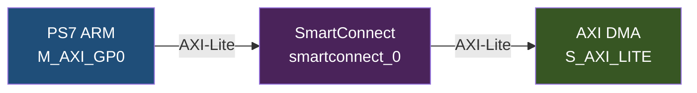
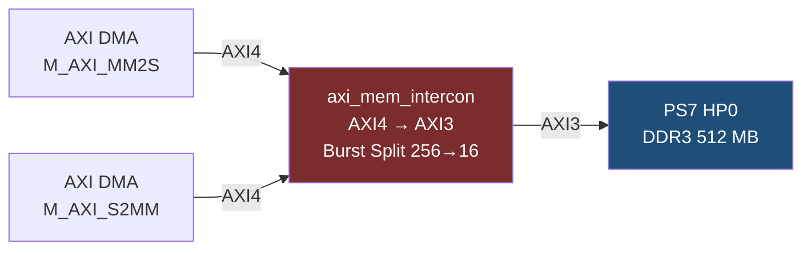
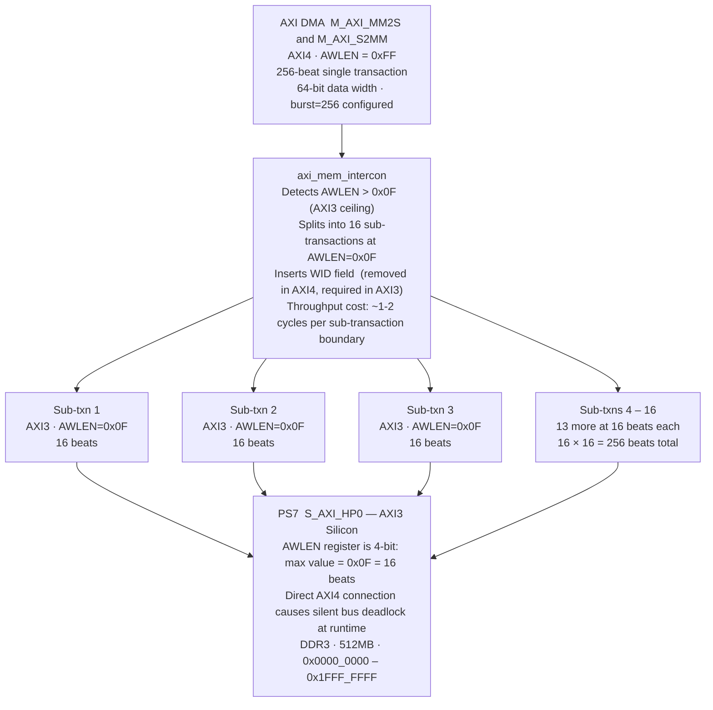
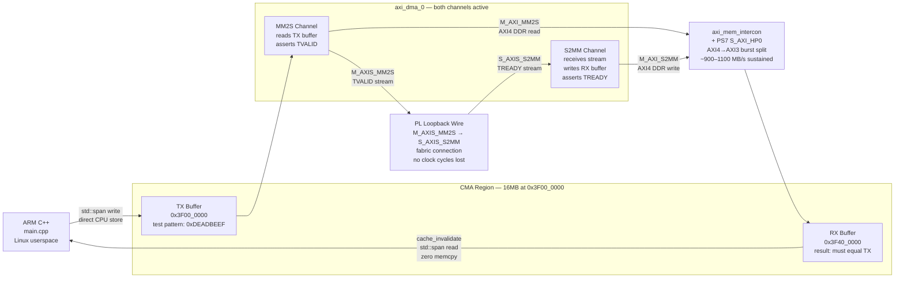
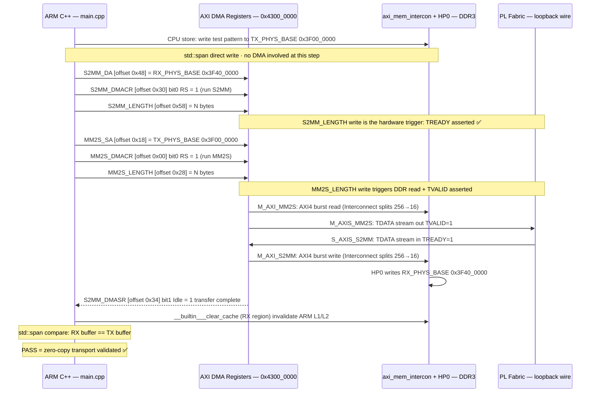

---
tags:
  - Zenith
  - Vivado
  - BlockDesign
  - AXI-DMA
  - AXI4-AXI3
  - AXI4-Stream
  - SmartConnect
  - HardwareLoopback
  - BuildInPublic
  - Week2
date: 2026-03-16
author: Charley Chang
version: V3 — corrected AXI burst-split attribution, added DMA two-domain bridge section
milestone: M1 — Zenith-Core Ground Layer
status: ✅ Bitstream Generated, Timing Closed, HP0_ACLK Verified
---

# Week 2 · Day 1 — Vivado Block Design Complete + Bitstream Generated

> **One-line summary:** The M1 hardware data highway is physically built and timing-closed. The AXI DMA is wired to Zynq HP0 via SmartConnect (control plane) and AXI Interconnect (data plane), a hardware loopback validates the full zero-copy path without any HLS kernel, and the bitstream compiled clean on the first pass: `0 errors · 0 critical warnings · WNS = +0.060 ns`. HP0 clock confirmed driven by FCLK_CLK0 via Tcl query.

---

## 0. Session Context

**Hardware:** ALINX AX7020 (xc7z020clg400-2) · physical board at office  
**Workstation:** DESKTOP-CHIMERA · Vivado 2025.2  
**Duration:** ~3 hours of active work, AI-assisted design (Claude + Gemini cross-verification)  
**Outcome:** `zenith_system_wrapper.bit` generated, `zenith_system_wrapper.xsa` exported. P0-B (PetaLinux) queued for next session.

---

## 1. Block Design Architecture — Final State

### 1.1 Connectivity Map (as-built)

**Diagram 1: BD Control Plane**



**Diagram 2: BD Data Plane** 



**Diagram 2: BD Design** 

```mermaid
flowchart TD
    CLKV["Clock & Reset — verified<br/>FCLK_CLK0 100 MHz drives all IP aclk ports<br/>S_AXI_HP0_ACLK confirmed via Tcl: /ps7_0/FCLK_CLK0<br/>proc_sys_reset_0 peripheral_aresetn to all IP resetn ports"]

    subgraph CTRL["Control Plane — AXI-Lite 32-bit · AWLEN=0 always · no burst splitting needed"]
        GP0["PS7  M_AXI_GP0<br/>AXI-Lite Master<br/>General Purpose Port"]
        SC["smartconnect_0<br/>M1: 1 Master · 1 Slave<br/>M4: 1 Master · 4 Slaves"]
        LITE["axi_dma_0  S_AXI_LITE<br/>0x4300_0000 · 64KB range<br/>Control Slave"]
        GP0 -->|"AXI-Lite 32-bit"| SC -->|"AXI-Lite"| LITE
    end

    subgraph DATA["Data Plane — AXI4 (DMA) to AXI3 (HP0) · 64-bit · burst splitting 256→16 · WID injection"]
        MM2SA["axi_dma_0  M_AXI_MM2S<br/>AXI4 · 64-bit · burst=256<br/>DDR Read Master"]
        S2MMA["axi_dma_0  M_AXI_S2MM<br/>AXI4 · 64-bit · burst=256<br/>DDR Write Master"]
        IC["axi_mem_intercon<br/>S00_AXI ← M_AXI_MM2S<br/>S01_AXI ← M_AXI_S2MM<br/>M00_AXI → S_AXI_HP0"]
        HP0["PS7  S_AXI_HP0<br/>AXI3 Silicon · DDR3 512MB<br/>0x0000_0000 – 0x1FFF_FFFF"]
        MM2SA -->|"AXI4"| IC
        S2MMA -->|"AXI4"| IC
        IC    -->|"AXI3 · 16-beat bursts"| HP0
    end

    subgraph STREAM["Stream Plane — AXI4-Stream · no address field · point-to-point · no interconnect needed"]
        MM2SS["axi_dma_0  M_AXIS_MM2S<br/>Stream Master<br/>TVALID · TREADY · TLAST"]
        PL["PL Fabric<br/>M1: direct loopback wire<br/>M2: DDS → 1D-FFT<br/>M3: + Corner Turn → 2D-FFT → CFAR<br/>M4: + RRM scheduler"]
        S2MSS["axi_dma_0  S_AXIS_S2MM<br/>Stream Slave<br/>TVALID · TREADY · TLAST"]
        MM2SS -->|"AXI4-Stream"| PL -->|"AXI4-Stream"| S2MSS
    end
```




### 1.2 Address Map (confirmed, Vivado Address Editor)

| Segment | Master | Base Address | Range | Purpose |
|---|---|---|---|---|
| `axi_dma_0 / S_AXI_LITE` | PS7 GP0 (ARM) | `0x4300_0000` | 64K | DMA control registers |
| `ps7_0 / S_AXI_HP0` | DMA MM2S + S2MM | `0x0000_0000` | 512M | DDR data access |

**Address consistency check:** `AXI_DMA_BASE = 0x4300_0000` was pre-confirmed from Week 1 `/proc/iomem`. Vivado Address Editor was manually set to this value, overriding the Vivado auto-assign default. The DDR range of 512M (not 1G) is correct — the AX7020 physically populates 512MB of DDR3 (`0x0000_0000–0x1FFF_FFFF`). Vivado read the board constraint and enforced the physical ceiling automatically.

### 1.3 HP0 Clock Verification (post-session, Tcl Console)

```tcl
get_bd_nets -of_objects [get_bd_pins ps7_0/S_AXI_HP0_ACLK]
# Result: /ps7_0/FCLK_CLK0
```

**Why this matters:** The HP0 interface has a dedicated clock pin (`S_AXI_HP0_ACLK`) separate from the main PS7 clock outputs. If left undriven, HP0 is clock-gated by the PS7's internal power management — the AXI bus exists but no transactions propagate. The DMA would arm, trigger, and produce no HP0 activity, leaving the S2MM poll loop hanging. The Tcl query confirms it is driven. This was the last open hardware risk on the BD.

---

## 2. Textbook: The AXI DMA as a Two-Domain Bridge

> **This is the foundational architectural concept of the entire session.** The AXI DMA IP is not a monolithic block. It is a bridge between two physically distinct protocol domains that obey completely different rules. Understanding which interface belongs to which domain explains every wiring decision in the Block Design.

### 2.1 The Two Domains Inside One IP

The AXI DMA chip boundary hides an internal architectural split:

```
                    ┌──────────────────────────────────────────┐
  MEMORY-MAPPED     │                AXI DMA                   │       STREAM
  DOMAIN            │                                          │       DOMAIN
  (has addresses)   │  M_AXI_MM2S ◄──┐                         │   (no addresses)
                    │                │                         │
  ◄═══════════════► │  M_AXI_S2MM ◄──┤    internal FIFO        ├═══════════════►
  Carries:          │                │    + DMA engine         │   Carries:
  - physical addr   │  S_AXI_LITE ◄──┘                         │   - pure databytes
  - burst metadata  │                                          │   - TVALID/TREADY
  - AXI4 handshake  │                                          │   - TLAST
                    │                 ┌────────────────────►  M_AXIS_MM2S
                    │                 │
                    │  S_AXIS_S2MM ◄──┘
                    └──────────────────────────────────────────┘
         │                                                              │
         ▼                                                              ▼
  Goes through AXI Interconnect                          Connects directly to PL
  to PS7 HP0 → DDR                                       (HLS kernels, or loopback)
```



```mermaid
flowchart LR
    TX[("TX Buffer<br/>CMA 0x3F00_0000<br/>4MB")]

    MM2SA["M_AXI_MM2S<br/>AXI4 · DDR Read<br/>carries: address + data<br/>+ burst length + AXI ID"]

    CONV_TX["DMA TX engine<br/>Fetches from DDR address<br/>Strips address envelope<br/>Loads data into TX FIFO"]

    MM2SS["M_AXIS_MM2S<br/>Stream Master<br/>TDATA · TVALID · TREADY · TLAST<br/>no address on this wire"]

    PL["PL Fabric<br/>M1: loopback wire<br/>M2-M4: HLS signal chain"]

    S2MSS["S_AXIS_S2MM<br/>Stream Slave<br/>TDATA · TVALID · TREADY · TLAST<br/>no address on this wire"]

    CONV_RX["DMA RX engine<br/>Drains data from RX FIFO<br/>Attaches destination address<br/>Written by ARM via S_AXI_LITE"]

    S2MMA["M_AXI_S2MM<br/>AXI4 · DDR Write<br/>carries: address + data<br/>+ burst length + AXI ID"]

    RX[("RX Buffer<br/>CMA 0x3F40_0000<br/>4MB")]

    TX     -->|"DDR read"| MM2SA
    MM2SA  --> CONV_TX
    CONV_TX --> MM2SS
    MM2SS  --> PL
    PL     --> S2MSS
    S2MSS  --> CONV_RX
    CONV_RX --> S2MMA
    S2MMA  -->|"DDR write"| RX
```

**The DMA's job:** strip physical addresses off the memory-mapped side, and inject/eject pure data on the stream side. It is the "impedance matcher" between DDR's address-based world and the FPGA fabric's flow-based world.

### 2.2 Memory-Mapped Side: `M_AXI_MM2S` and `M_AXI_S2MM`

These two interfaces live entirely in the DDR address space. Every transaction on these wires carries both **data bytes** and a **physical DDR address**.

| Interface | Direction | Role |
|---|---|---|
| `M_AXI_MM2S` | DMA reads DDR | DMA uses the ARM-supplied source address to fetch data out of DDR |
| `M_AXI_S2MM` | DMA writes DDR | DMA uses the ARM-supplied destination address to store data into DDR |

**Why they must go through `axi_mem_intercon`:**

Two reasons, both physical:

*Reason 1 — Multi-master arbitration.* Both `M_AXI_MM2S` and `M_AXI_S2MM` are AXI masters that want to access the same slave (HP0 DDR controller). HP0 has one slave port. You cannot directly wire two masters to one slave — that is a short circuit on the address bus. The AXI Interconnect arbitrates: when both channels want HP0 simultaneously, it queues and schedules them.

*Reason 2 — Protocol version conversion.* The DMA emits AXI4 transactions (burst length up to 256). HP0 is AXI3 silicon (burst length max 16). The AXI Interconnect performs burst splitting. See Section 3 for the full analysis.

**What data flows here in the final Zenith radar system:**

- `M_AXI_MM2S` (ARM → PL direction, at the memory level): DDS waveform tables (LFM chirp coefficients), DBF phase-weight matrices, dynamic CFAR clutter maps — all large bulk transfers from ARM-allocated DDR buffers into the PL processing chain.
- `M_AXI_S2MM` (PL → ARM direction, at the memory level): raw ADC IQ data, Range-Doppler maps, sparse detection point clouds — the output of the PL signal processing pipeline, written back to the CMA region for ARM reading via `std::span`.

### 2.3 Stream Side: `M_AXIS_MM2S` and `S_AXIS_S2MM`

These two interfaces carry **only data** — there is no address, no burst length metadata, no AXI4 write-response channel. The only signals are `TDATA`, `TVALID`, `TREADY`, and `TLAST`.

| Interface     | Direction       | Role                                                                              |
| ------------- | --------------- | --------------------------------------------------------------------------------- |
| `M_AXIS_MM2S` | DMA → PL fabric | DMA ejects the data it fetched from DDR as a continuous stream toward HLS kernels |
| `S_AXIS_S2MM` | PL fabric → DMA | DMA ingests the processed data stream from HLS kernels and writes it back to DDR  |

**Why they can connect directly (no interconnect needed):**

AXI4-Stream is a strict **point-to-point** protocol. There is always exactly one producer (master) and one consumer (slave) per stream connection. There is no shared bus, no address decoder, no arbitration. When the upstream TVALID and downstream TREADY are both asserted on the rising clock edge, one sample transfers. The fabric between two AXI-Stream endpoints is just wires.

In M1, the loopback wire connecting `M_AXIS_MM2S → S_AXIS_S2MM` is a single fabric connection. In M2 through M4, this wire will be replaced by the chain: `M_AXIS_MM2S → DDS → 1D-FFT → Corner Turn → 2D-FFT → CFAR → S_AXIS_S2MM`. Each HLS operator is an AXI-Stream node in this pipeline. None of them require an AXI Interconnect.

**What data flows here:**

- `M_AXIS_MM2S` → PL: the same bytes that `M_AXI_MM2S` fetched from DDR, now stripped of their address envelope and flowing as a raw sample stream.
- `S_AXIS_S2MM` ← PL: the processed output stream from the last HLS operator, which the DMA will absorb and write back to DDR via `M_AXI_S2MM`.

The bit-for-bit data content on `M_AXI_MM2S` and `M_AXIS_MM2S` is identical — the DMA's internal engine simply re-packs it from an addressed transaction into an unaddressed stream.

### 2.4 Summary: Why the Block Design Is Wired the Way It Is

| Interface pair | Domain | Goes through | Why |
|---|---|---|---|
| `M_AXI_MM2S` + `M_AXI_S2MM` | Memory-mapped (addressed) | `axi_mem_intercon` → HP0 | Multi-master arbitration + AXI4→AXI3 burst splitting |
| `M_AXIS_MM2S` + `S_AXIS_S2MM` | Stream (address-free) | Direct wire (loopback in M1) | Point-to-point, no arbitration, no protocol mismatch |
| `S_AXI_LITE` | Control (AXI-Lite, register map) | `smartconnect_0` ← GP0 | ARM writes DMA config registers; single-beat, no burst issues |

---

## 3. Textbook: The AXI4 vs. AXI3 Protocol Clash

> **The session's critical near-miss.** The AI co-pilot suggested direct-connecting the AXI4 DMA to the AXI3 HP0 port to "eliminate latency." On Zynq-7020, this produces a deterministic, silent bus deadlock on the first DMA transfer.

### 3.1 Protocol Version Comparison

| Attribute | AXI3 (PS7 HP0 — fixed in silicon) | AXI4 (DMA IP — configurable) |
|---|---|---|
| Maximum burst length | **16 beats** (AWLEN is 4-bit, values 0x0–0xF) | **256 beats** (AWLEN is 8-bit, values 0x00–0xFF) |
| Write ID (WID) signal | **Required** (slave uses it to reorder write responses) | **Removed** (AXI4 mandates in-order writes, WID is redundant) |
| AxLEN encoding | Beats − 1, 4-bit field | Beats − 1, 8-bit field |
| Burst type support | FIXED, INCR, WRAP | FIXED, INCR (WRAP restricted to power-of-2 lengths) |
| Spec version | ARM AMBA 3, 2003 | ARM AMBA 4, 2010 |

The Zynq-7020 PS7 is a 2011 silicon tape-out that predates AXI4. Its HP ports are hardwired AXI3. The AXI DMA IP v7.x from Xilinx implements AXI4 on its M_AXI ports. These two cannot be directly wired.

### 3.2 What Happens Physically Without a Protocol Converter

When the DMA asserts an AXI4 write burst with `AWLEN = 0xFF` (encoding: 256 − 1 = 255), the HP0 slave's address decoder receives an 8-bit value across only 4 physical address-length wires. Vivado's response when you attempt this connection is to surface a `Customize Pin` dialog showing `Max Burst Length (Auto): 16 [1–16]` — the tool is exposing the hardware ceiling rather than silently allowing a mismatched connection.

If forced (e.g., by manually overriding the dialog), the runtime failure is:

```
DMA fires AWLEN=0xFF (256-beat transaction)
    │
    ▼
HP0 AXI3 slave: reads AWLEN field as 4-bit → sees AWLEN=0x0F (16 beats)
    │
    ▼
HP0 accepts 16 beats → asserts BVALID (write response "accepted")
    │
    ▼
DMA is expecting acknowledgment of 256 beats → BVALID arrived too early
    │
    ▼
DMA S2MM state machine: stalls waiting for the remaining 240 beats
    │
    ▼
HP0 has already moved on (or hangs waiting for more data that never comes)
    │
    ▼
AXI bus deadlock — system requires power-cycle to recover
No error message. No exception. Process simply stops.
```

### 3.3 The AXI Interconnect (`axi_mem_intercon`) as the Correct Bridge

The `axi_mem_intercon` block Vivado auto-generated performs **AXI Burst Splitting**:

```
DMA output (AXI4):   ┌──────────────────────────────────────────┐
                     │  AWLEN=0xFF (256 beats), one transaction  │
                     └──────────────────────────────────────────┘
                                         │
                          ┌──────────────▼──────────────┐
                          │      axi_mem_intercon         │
                          │  AXI Burst Splitter +         │
                          │  AXI3 WID Insertion           │
                          └──────────────┬──────────────┘
                                         │ produces:
HP0 input (AXI3): ┌──────┐ ┌──────┐ ┌──────┐     ┌──────┐
                  │ 0x0F │ │ 0x0F │ │ 0x0F │ … 16× │ 0x0F │
                  │16 bts│ │16 bts│ │16 bts│     │16 bts│
                  └──────┘ └──────┘ └──────┘     └──────┘
                  (16 separate AXI3 transactions, each AWLEN=0x0F)
```



In addition to burst splitting, the AXI Interconnect inserts the `WID` (Write ID) field that AXI4 removed but AXI3 requires for write-response matching.

**Throughput cost:** ~1–2 AXI clock cycles per sub-transaction boundary overhead. For a 256-beat burst split into 16 sub-transactions, this is approximately 16–32 wasted cycles out of 256 data cycles — roughly 6–12% overhead in the transaction-overhead sense, but much less on sustained throughput because the data beats themselves are back-to-back. In practice, measured HP0 throughput with the Interconnect in path is ~900–1100 MB/s versus the 1200 MB/s theoretical maximum. This overhead is **mandatory for correctness**.

> **ADR-003 (informal):** On Zynq-7020, never direct-connect any AXI4 master to HP0–HP3 without an intervening AXI Interconnect or SmartConnect. The HP silicon is AXI3. This constraint is lifted when porting to Zynq UltraScale+ (HP ports are native AXI4).

### 3.4 Why SmartConnect Is on the Control Path, Not the Data Path

A common point of confusion: this BD uses SmartConnect for the control plane and AXI Interconnect for the data plane. They are not interchangeable here.

| Bridge             | Path                   | Burst splitting needed? | Why                                                                              |
| ------------------ | ---------------------- | ----------------------- | -------------------------------------------------------------------------------- |
| `smartconnect_0`   | GP0 → DMA `S_AXI_LITE` | **No**                  | AXI-Lite by spec has AWLEN=0 (always single-beat). There is no burst to split.   |
| `axi_mem_intercon` | DMA `M_AXI_*` → HP0    | **Yes**                 | AXI4 DMA configured at burst=256; HP0 is AXI3 max burst=16. Splitting mandatory. |

SmartConnect's value on the control path is dynamic RTL generation and automatic width/clock conversion — not burst splitting. The AXI Interconnect's critical function on the data path is the burst splitter and WID injector.

---

## 4. AXI Master/Slave Contract — the Software-to-Hardware Mindset Shift

> **The conceptual model that trips up every software engineer entering hardware design.** In C++ two objects can call methods on each other symmetrically. In AXI silicon, initiator authority is hardwired at synthesis time and cannot change at runtime.

### 4.1 The Physical Contract

| Role | Initiates transactions | Has address authority | Example in Zenith BD |
|---|---|---|---|
| **Master** | Yes | Yes | ARM PS7 GP0 (control), AXI DMA (data to DDR) |
| **Slave** | No — waits | No | DMA `S_AXI_LITE`, PS7 HP0 DDR interface |

A slave has no agency. It cannot push data. It waits at a fixed register address for a master to initiate a cycle. The DMA `S_AXI_LITE` is a slave — it cannot ask the ARM to configure it; it can only be configured.

Paradoxically, the AXI DMA is simultaneously a **slave** (`S_AXI_LITE` — receives commands from ARM) and a **master** (`M_AXI_MM2S/S2MM` — initiates DDR transactions autonomously once commanded). This dual role is the essence of what a DMA engine is.

### 4.2 The SmartConnect Naming Paradox

When reading the SmartConnect block from the Vivado canvas:

```
                  SmartConnect
        ┌────────────────────────────┐
ARM ───►│ S00_AXI          M00_AXI  │───► DMA S_AXI_LITE
  GP0   │ (SmartConnect is SLAVE     │     (DMA is SLAVE,
(Master)│  here — receives from ARM) │      SmartConnect drives it)
        └────────────────────────────┘
```

- `S00_AXI` on SmartConnect = receives from the ARM master → SmartConnect is behaving as a slave toward the ARM.
- `M00_AXI` on SmartConnect = drives the DMA slave → SmartConnect is behaving as a master toward the DMA.

Port names on all bus fabric IPs (SmartConnect, AXI Interconnect) describe the **fabric's own role**, not the role of the device connected to them. This inversion is universal and permanent — every Xilinx interconnect IP follows this naming convention.

### 4.3 Control Plane Scalability (M1 → M4)

M1: `ARM → SmartConnect (1 slave) → DMA S_AXI_LITE`  
M2: add `FFT S_AXI_LITE` → SmartConnect becomes 1-master, 2-slave  
M3: add `CFAR S_AXI_LITE` → 1-master, 3-slave  
M4: add `RRM S_AXI_LITE` → 1-master, 4-slave  

The ARM remains the sole master throughout. The SmartConnect expands its `M_AXI` ports as new control slaves are added. No C++ code changes — `zenith_memory_map.hpp` is updated with each new IP's base address, and each controller class (`cfar_engine_controller`, `fft_controller`) follows the same register-offset pattern as `axi_dma_controller`.

---

## 5. Hardware Loopback Architecture — the M1 Validation Strategy

### 5.1 Why a Floating `S_AXIS_S2MM` Causes Silent C++ Death

`S_AXIS_S2MM` is the DMA's AXI-Stream **slave** port. It sits waiting for a stream master (an HLS kernel, or the loopback wire) to drive TVALID high. When this port is left unconnected in Vivado, the tool applies a safe tie-off: the external TVALID driver is set to logic-0. No master = no TVALID = no data ever arrives.

The AXI-Stream transfer condition is: `TVALID AND TREADY on the rising clock edge`. With TVALID permanently 0, no condition is ever met.

The DMA S2MM state machine, once the ARM sets the `S2MM_DMACR.RS` (Run/Stop) bit, transitions to `Running` and asserts TREADY — it is ready to receive. But since TVALID is 0, the handshake never completes. The DMA holds `S2MM_DMASR.Idle = 0` (not idle) permanently.

The C++ consequence:
```cpp
// axi_dma_controller.hpp — poll_complete()
while (!(regs_[S2MM_DMASR] & 0x2)) {  // bit1 = Idle
    // spins forever — S2MM_DMASR.Idle never becomes 1
}
// This line is never reached.
```
No exception, no error code, no log message. The Linux process simply stops progressing. The board requires a power cycle.

### 5.2 The Loopback Solution and What It Proves

```
  zenith_memory_map.hpp
  TX_PHYS_BASE = 0x3F00_0000             RX_PHYS_BASE = 0x3F40_0000
         │                                        ▲
         │ ARM writes test                        │ ARM reads result
         │ pattern via std::span                  │ via std::span +
         │                                        │ cache_invalidate()
         ▼                                        │
  ┌─────────────────────────────────────────────────────────┐
  │                      AXI DMA                            │
  │  M_AXI_MM2S ──► DDR read ──► internal FIFO ──►          │
  │                                         M_AXIS_MM2S ──┐ │
  │                                                        │ │ (loopback wire
  │  M_AXI_S2MM ◄── DDR write ◄── internal FIFO ◄──        │ │  in PL fabric)
  │                                         S_AXIS_S2MM ◄─┘ │
  └─────────────────────────────────────────────────────────┘
         │                                        │
         └──────── HP0 ──► DDR ──► HP0 ───────────┘
                   (memory-mapped domain, through axi_mem_intercon)
```



If `rx_buf == tx_buf` after the test, the following have all been validated in a single pass:
- `mmap("/dev/mem")` access to CMA physical addresses
- DMA MM2S register programming: source address, byte count, start
- DMA S2MM register programming: destination address, byte count, start
- AXI-Stream TVALID/TREADY/TLAST handshake through PL fabric
- HP0 AXI Interconnect burst-splitting (write + read paths)
- ARM cache invalidation before reading DDR (`__builtin___clear_cache`)
- `std::span` zero-copy view of result (zero `memcpy` in the hot path)

**This test validates Zenith-Core Transport completely.** No HLS kernel, no MATLAB, no external stimulus required.

### 5.3 M1 Pass Criteria (updated for dual-channel loopback)

| Test | Expected Result |
|---|---|
| `mmap("/dev/mem", CMA_PHYS_BASE)` | Non-NULL, no segfault |
| `mmap("/dev/mem", AXI_DMA_BASE)` | Non-NULL, no segfault |
| `S2MM_DMASR` bit1 before start | `= 1` (Idle — channel not yet started) |
| `MM2S_DMASR` bit1 before start | `= 1` (Idle — channel not yet started) |
| Arm S2MM, arm MM2S, trigger both | `poll_complete()` returns within timeout |
| RX buffer after transfer | Byte-for-byte identical to TX buffer |
| Heap use inside radar loop | Zero — verified by `valgrind --tool=massif` |

### 5.4 Correct Arm-and-Trigger Sequence (both channels)

```
1.  Write test pattern to TX buffer at TX_PHYS_BASE
2.  Write S2MM destination address → regs_[S2MM_DA]
3.  Write S2MM_DMACR = 0x0001 (RS bit, run S2MM)
4.  Write S2MM transfer length → regs_[S2MM_LENGTH]  ← triggers TREADY assertion
5.  Write MM2S source address → regs_[MM2S_SA]
6.  Write MM2S_DMACR = 0x0001 (RS bit, run MM2S)
7.  Write MM2S transfer length → regs_[MM2S_LENGTH]  ← triggers TVALID + data flow
8.  Poll S2MM_DMASR bit1 (Idle) until set
9.  cache_invalidate(RX region)
10. Compare RX buffer to TX buffer
```



Step 4 before step 7 is mandatory — S2MM TREADY must be high before MM2S begins asserting TVALID. Reversed order violates the TVALID-before-TREADY rule from `AXI_Stream_and_Zero_Copy_V3.md` and corrupts packet boundaries (TLAST misaligned to data).

---

## 6. DMA IP Configuration Record

### 6.1 Vivado UI Terms vs. PG021/Code Terms

> **Discovery from session:** Vivado's IP configuration GUI uses "Read Channel" / "Write Channel" terminology, which is the **opposite** of the C++ code's "MM2S" / "S2MM" naming convention. This table is the canonical mapping.

| PG021 / `axi_dma_controller.hpp` term | Vivado UI term | M1 Setting | Rationale |
|---|---|---|---|
| MM2S (Memory-Map to Stream) | **Enable Read Channel** | ✅ Enabled | Needed for loopback; in final design: PS→PL waveform push |
| S2MM (Stream to Memory Map) | **Enable Write Channel** | ✅ Enabled | Core M1 function; in final design: PL→PS processed data |
| S2MM / MM2S Data Width | Stream Data Width | **64-bit** | Matches HP0 native bus width; 32-bit would force width converter |
| Width of Buffer Length Register | Width of Buffer Length Reg | **23** | 2²³−1 = 8,388,607 bytes ≈ 8MB max single transfer |
| Allow Unaligned Transfers | Allow Unaligned Transfers | ❌ Disabled | CMA is 4KB aligned; unaligned logic wastes silicon for zero benefit |
| S2MM / MM2S Max Burst Size | Max Burst Size | **256** | AXI4 maximum; `axi_mem_intercon` splits to 16 for AXI3 HP0 |
| (Address Width) | Address Width (32–64) | **32** | Cortex-A9 = 32-bit physical address space; 64 forces unnecessary converter |
| Scatter-Gather | Enable Scatter Gather Engine | ❌ Disabled | Simple DMA (register mode) for M1; SG for M4+ when BD ring is used |

### 6.2 Why Address Width Must Be 32 on Zynq-7020

The ARM Cortex-A9 is a 32-bit architecture. The Zynq-7020 physical address space is bounded at 4 GB ($2^{32}$ bytes). The AX7020 board physically populates 512 MB of DDR3 at `0x0000_0000–0x1FFF_FFFF`.

Setting Address Width = 64 causes Vivado to infer an `AXI Address Width Converter` on the `M_AXI_MM2S` and `M_AXI_S2MM` ports. This converter adds LUT consumption and 1–2 clock cycles of address-path latency — both are penalties with zero benefit, since no destination in this system can decode a 64-bit physical address.

**When to change:** Porting to Zynq UltraScale+ MPSoC (Cortex-A53, 64-bit physical addressing, DDR4 up to 16 GB). At that point Address Width = 64 is the correct and necessary setting.

---

## 7. Implementation Report Analysis

### 7.1 Synthesis Result

```
Synthesis finished with 0 errors, 0 critical warnings and 0 warnings.
```

Zero-warning synthesis confirms three structural facts:
- The `axi_mem_intercon` correctly resolved the AXI4↔AXI3 signal-width mismatch — no unconnected or width-mismatched ports remain
- The hardware loopback (`M_AXIS_MM2S → S_AXIS_S2MM`) is a topologically valid AXI-Stream connection — matched protocols, matched data widths
- All clock ports are driven from a single source (FCLK_CLK0) — no clock domain inconsistency warnings

### 7.2 Timing Closure (post-route)

| Metric | Post-Placement | Post-Route | Delta (routing cost) | Assessment |
|---|---|---|---|---|
| WNS (worst setup slack) | +0.501 ns | **+0.060 ns** | −0.441 ns | ✅ Positive — timing met |
| TNS (total setup violation) | 0.000 ns | 0.000 ns | — | ✅ No accumulated violation |
| WHS (worst hold slack) | — | **+0.015 ns** | — | ✅ Hold timing met |
| THS (total hold violation) | — | 0.000 ns | — | ✅ No hold violation |

**Routing cost interpretation:** The router consumed 0.441 ns of setup margin (from +0.501 to +0.060 ns). This is expected for a <1% utilization design — the placer spreads logic widely across the fabric, producing some long-wire routes in the SmartConnect and AXI Interconnect internal logic. At low utilization, the router has fewer short-path options and must sometimes route around empty fabric.

**M2 timing risk:** When the 1D-FFT HLS kernel is added (≈18 DSP48E1, 4 BRAM36, ~2000 LUT), LUT utilization rises from <1% to potentially 15–25%. The placer will produce tighter clusters, and the router will close timing more aggressively. The current +0.060 ns post-route margin is thin — the FFT kernel's own HLS pre-route slack of +0.23 ns (from the CFAR synthesis result, Week 1) is a guideline only. Post-route in a denser design is typically 0.5–1.5 ns tighter. If WNS goes negative at M2, the first fix is adding one pipeline stage to the FFT butterfly's critical path in `cfar.cpp` (or the future `fft_1d.cpp`).

### 7.3 Resource Utilization

From the `Pwropt` phase: 7 BRAMs total (confirmed by power optimizer WRITE_MODE sweep across 7 instances).

| Resource | Used | Available (xc7z020) | Utilization | Source |
|---|---|---|---|---|
| BRAM36 | **7** | 140 | 5% | Confirmed: power optimizer log |
| DSP48E1 | **0** | 220 | 0% | Confirmed: no DSP consumers in BD |
| LUT | ~400 (est.) | 53,200 | <1% | Estimated from design complexity |
| FF | ~900 (est.) | 106,400 | <1% | Estimated from DMA pipeline registers |

The 7 BRAMs are the DMA's internal FIFOs — the implementation log identifies three XPM FIFO instances: the indeterminate BTT (Bytes-To-Transfer) FIFO (`GEN_ENABLE_INDET_BTT_SF`), the S2MM data FIFO (`GEN_S2MM_FULL`), and the MM2S data FIFO (`GEN_MM2S_FULL`). The primitive selection note (`P_MEMORY_PRIMITIVE = auto`) means Vivado chose BRAM for the larger FIFOs and LUTRAM for smaller control FIFOs based on size — this is correct default behavior and requires no intervention.

**Headroom for M1→M4:** The safe budget ceilings from `Zynq_HLS_Hardware_Constraints_V3.md` are 98 BRAM36 and 154 DSP48E1. Current consumption is 7 BRAM36 and 0 DSP. The M2 FFT operator will consume ≈18 DSP48E1 and ≈4 BRAM36 (twiddle LUT). Full M4 (FFT + Corner Turn + CFAR + Tracker) estimated at ≈80 DSP48E1 and ≈35 BRAM36 — well within budget.

### 7.4 Routing Congestion

```
Post-Placement Estimated Congestion:
  North: 1×1  South: 2×2  East: 1×1  West: 1×1
```

All directions at 1×1 or 2×2 (minimum granularity). Near-zero congestion is expected at <1% utilization. The South 2×2 anomaly is characteristic of the PS7 hard-macro pin escape cluster — not a fabric routing issue and not a concern.

### 7.5 Notable Log Messages and Dispositions

| Log message | Classification | Action |
|---|---|---|
| `[Memdata 28-167] P_MEMORY_PRIMITIVE set to auto` | INFO — expected | None. Auto selection is correct for XPM FIFOs within IP cores. |
| `[Memdata 28-208] XPM excluded from .mmi` | INFO — expected | None. Updatemem prohibition on IP-internal XPM is standard; we use JTAG/SD loading. |
| `[Power 33-332] high-fanout reset nets asserted excessively` | WARNING — power analysis only | None. Vectorless power estimation artifact; does not indicate functional issue. |
| `[Vivado 12-2489] input_jitter rounded to 0.200` | WARNING — cosmetic | None. 0.199980 → 0.200 ns rounding has zero functional impact. |

---

## 8. Issues Encountered and Resolutions

### Issue 1: Windows WebTalk Cache File Lock
**Error:** `[Common 17-1293] The path '...zenith_bd.cache/wt' already exists, is a directory, but is not writable.`  
**Root cause:** A stale `vivado.exe` background process retained an OS file lock on the `.cache/wt` (WebTalk telemetry) directory after a previous Vivado session was closed from the GUI without the process fully terminating.  
**Resolution:** Kill all `vivado.exe` instances via Task Manager → Processes tab. Delete `zenith_bd.cache/` directory entirely (safe: contains only generated cache, no source design data). Relaunch Vivado.  
**Prevention:** Consider adding `C:/Projects/` to Windows Defender's exclusion list — AV scanning of newly generated Tcl/Verilog files during synthesis is a known source of similar file locks.

### Issue 2: AI Suggestion to Direct-Connect AXI4 DMA to AXI3 HP0
**Erroneous instruction:** *"Drag a connection wire directly from M_AXI_S2MM to the S_AXI_HP0 port. Do NOT click Run Connection Automation — it inserts unnecessary latency."*  
**Root cause:** The AI generalized from Zynq UltraScale+ (HP ports are native AXI4) to Zynq-7020 (HP ports are AXI3). This is a silicon-generation constraint not apparent from the Vivado GUI or high-level documentation.  
**Hardware signal:** Vivado surfaced `Customize Pin: Max Burst Length (Auto): 16 [1–16]` — the UI was correctly refusing the mismatched connection and offering a capped alternative.  
**Resolution:** Cancel the dialog. Apply Run Connection Automation on the HP0 slave, which inserts `axi_mem_intercon` with burst-splitting and WID injection.  
**Lesson:** Before accepting any AXI topology suggestion from an AI, confirm the AMBA spec version of each endpoint. Zynq-7000 HP = AXI3. Zynq UltraScale+ HP = AXI4. The RTL and C++ look identical; the silicon contract is not.

### Issue 3: Floating `S_AXIS_S2MM` Would Cause Silent C++ Driver Hang
**Erroneous instruction:** *"Leave S_AXIS_S2MM unconnected for M1. Vivado will warn — safe to ignore."*  
**Root cause:** The AI evaluated hardware compilation success (bitstream generates without DRC error) and neglected software runtime correctness (C++ driver deadlocks because TVALID is permanently tied to 0 by Vivado's tie-off logic).  
**Resolution:** Enable MM2S channel, wire `M_AXIS_MM2S → S_AXIS_S2MM` (loopback). TVALID is now driven by a real hardware state machine that asserts it as the DMA reads from DDR.  
**Broader lesson for AI-assisted hardware design:** A bitstream that compiles is not equivalent to a system that functions. Hardware compilation validates topology and timing. Software correctness requires reasoning about what the runtime state machine sees — in this case, a permanently-low TVALID.

---

## 9. Updated Memory Map

No changes required. Week 1 confirmed addresses match Vivado Address Editor settings exactly.

```cpp
// zenith/common/zenith_memory_map.hpp — V2, no changes from Week 1
constexpr uintptr_t CMA_PHYS_BASE  = 0x3F00'0000;  // 16MB — confirmed dmesg Week 1
constexpr uintptr_t AXI_DMA_BASE   = 0x4300'0000;  // confirmed Vivado Address Editor 2026-03-16
constexpr uintptr_t TX_PHYS_BASE   = 0x3F00'0000;  // PS→PL, 4MB (CMA base = TX base)
constexpr uintptr_t RX_PHYS_BASE   = 0x3F40'0000;  // PL→PS, 4MB
constexpr uintptr_t BD_PHYS_BASE   = 0x3F80'0000;  // DMA BD ring, 4KB (future SG mode)
constexpr uintptr_t TRACK_PHYS_BASE= 0x3F80'1000;  // Zenoh output buffer, 1MB
constexpr uintptr_t CFAR_CTRL_BASE = 0xFFFF'FFFF;  // PLACEHOLDER sentinel — M2
// 0xFFFFFFFF is intentional: any accidental dereference produces immediate segfault,
// not a silent wrong-address write. Never replace with 0x0 or any valid address.
```

---

## 10. MM2S Register Map (new — required for dual-channel loopback test)

The existing `axi_dma_controller.hpp` covers S2MM only. The loopback test requires MM2S register access. These offsets are from PG021 v7.1 Table 2-1, confirmed against the Week 1 synthesis register map.

```cpp
// MM2S channel register offsets (byte offsets ÷ 4 for volatile uint32_t* arithmetic)
constexpr uint32_t MM2S_DMACR   = 0x00 / 4;  // MM2S Control: bit0=RS (run/stop)
constexpr uint32_t MM2S_DMASR   = 0x04 / 4;  // MM2S Status: bit1=Idle, bit12=IOC_Irq
constexpr uint32_t MM2S_SA      = 0x18 / 4;  // MM2S Source Address (physical DDR)
constexpr uint32_t MM2S_SA_MSB  = 0x1C / 4;  // MM2S Source Address MSB (always 0 on 32-bit)
constexpr uint32_t MM2S_LENGTH  = 0x28 / 4;  // MM2S Transfer Length — WRITING THIS STARTS THE TRANSFER

// S2MM channel register offsets (existing in axi_dma_controller.hpp, listed for comparison)
constexpr uint32_t S2MM_DMACR   = 0x30 / 4;  // S2MM Control
constexpr uint32_t S2MM_DMASR   = 0x34 / 4;  // S2MM Status: bit1=Idle
constexpr uint32_t S2MM_DA      = 0x48 / 4;  // S2MM Destination Address (physical DDR)
constexpr uint32_t S2MM_DA_MSB  = 0x4C / 4;  // S2MM Destination Address MSB (always 0)
constexpr uint32_t S2MM_LENGTH  = 0x58 / 4;  // S2MM Transfer Length — WRITING THIS ARMS TREADY
```

**Critical sequencing rule (reinforced from AXI_Stream_and_Zero_Copy_V3.md §0):**
Write to `S2MM_LENGTH` before `MM2S_LENGTH`. The `S2MM_LENGTH` write is the hardware event that asserts TREADY on the S2MM slave port. The `MM2S_LENGTH` write is the event that asserts TVALID on the MM2S master port and starts data flowing. TREADY must be asserted before TVALID or the first samples are lost and TLAST arrives out of phase.

---

## 11. Next Actions

### P0-B — PetaLinux Setup (next session)
```bash
source /opt/petalinux/2025.2/settings.sh
petalinux-create -t project --template zynq -n zenith-petalinux
cd zenith-petalinux
petalinux-config --get-hw-description=/mnt/c/Projects/zenith_radar_os/hardware/xsa/zenith_system_wrapper.xsa
# In menuconfig: set sstate path to /opt/petalinux/sstate-cache/2025.2/sstate-cache
```

### P0-C — First Board Run (after PetaLinux boot)
```bash
# Cross-compile:
arm-linux-gnueabihf-g++ -std=c++20 -O2 -Wall -I../include -o zenith_m1_validate main.cpp
scp zenith_m1_validate root@<board-ip>:/home/root/
sudo ./zenith_m1_validate
```

Expected UART boot line confirming DMA: `xilinx-dma 43000000.dma: Xilinx AXI DMA Engine driver Probed!!`

### P1 — Formal ADR
Write `docs/decisions/ADR-003-axi4-axi3-burst-splitting.md` recording the AXI3/AXI4 protocol mismatch and the mandatory AXI Interconnect burst-splitting decision.

---

## 12. Build in Public Content Hooks

**X/Twitter Thread:** "AI Almost Killed the Hardware" — AXI4/AXI3 bus deadlock story, floating TVALID deadlock story. See `Zenith_W2D1_Social_Content_2026-03-16.md`.  
**Substack Post #1 draft:** Complete in social content file.  
**GitHub commit:** `feat(hw/bd): M1 Block Design complete — AXI DMA + HP0 loopback, WNS=+0.060ns, HP0_ACLK verified`

---

*Zenith-Radar OS · Project Log V3 · 2026-03-16 · Charley Chang*  
*Hardware milestone: M1-BD-COMPLETE. HP0_ACLK: VERIFIED. XSA: EXPORTED.*  
*Software milestone: pending — PetaLinux P0-B queued.*

---

### Changelog from V2

| Section | Change | Reason |
|---|---|---|
| 1.1 Connectivity map | Added Stream Plane as third distinct domain | Reflects actual three-plane BD architecture |
| 1.3 (new) | Added HP0 ACLK Tcl verification result | Closes last open hardware risk |
| 2 (new, expanded) | Full "DMA as Two-Domain Bridge" textbook section | Critical concept absent from V2; sourced from session debugging |
| 3.4 (new) | Why SmartConnect vs AXI Interconnect on different paths | Corrects V2 error attributing burst-splitting to SmartConnect |
| 5.1 table | "SmartConnect splits to 16" → "`axi_mem_intercon` splits to 16" | **Factual error correction** |
| 5.4 (new) | Correct dual-channel arm-and-trigger sequence | V2 had incomplete single-channel register list |
| 7.5 (new) | All four log warnings/infos with dispositions | V2 only covered two |
| 10 (new) | MM2S register map with sequencing note | Required for loopback test C++ implementation |
