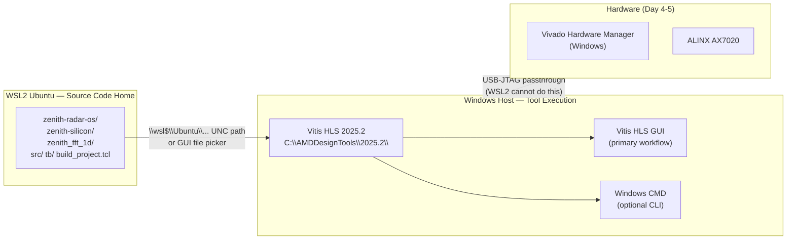
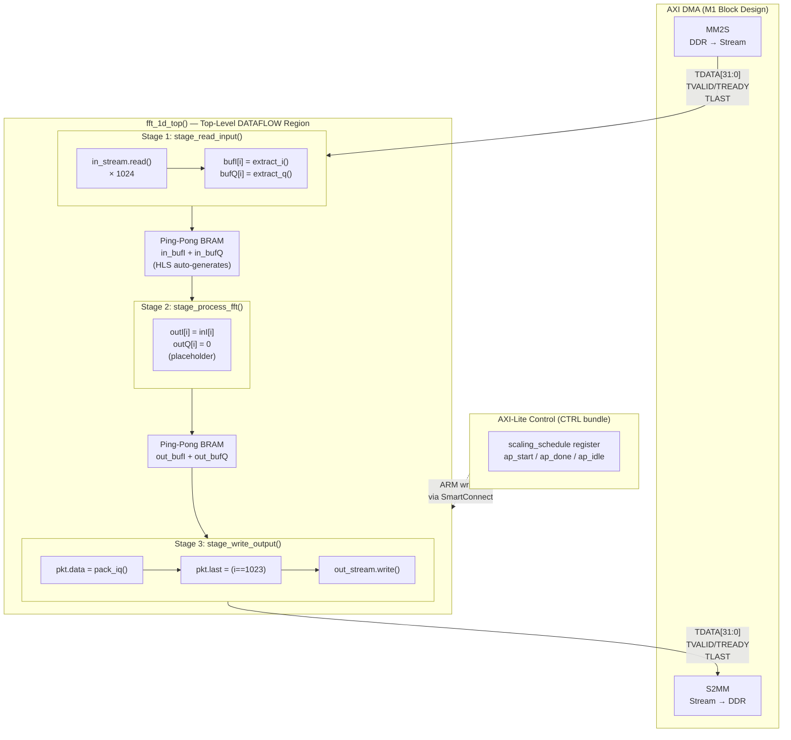
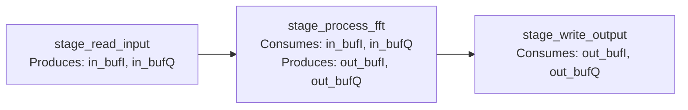
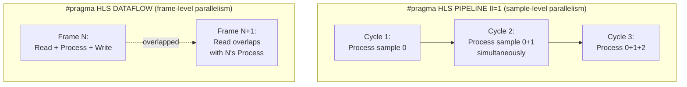
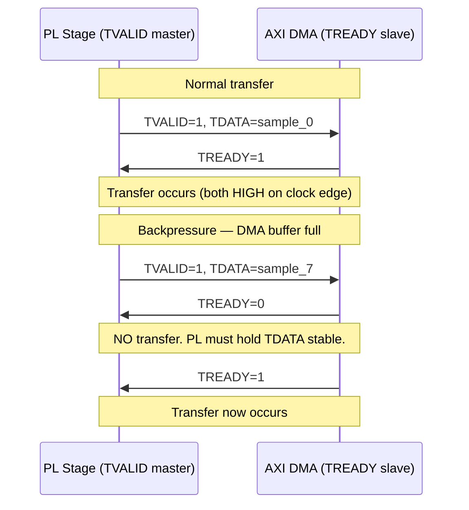

---
tags:
  - Zenith
  - M2
  - HLS
  - AXI-Stream
  - DATAFLOW
  - BRAM
  - FixedPoint
  - Week3
  - Day1
date: 2026-04-20
author: Charley Chang
milestone: M2
status: Complete — C-Sim PASS
---

# Week 3 · Day 1 — HLS 1D-FFT Kernel: AXI-Stream Interface & DATAFLOW Architecture

> **One-line summary:** Today we built the "plumbing" of the FFT accelerator — the AXI-Stream I/O pipeline and DATAFLOW topology that will house the butterfly computation starting Day 3. The placeholder kernel passes C-Simulation.
> The data path architecture is now locked and hardware-correct.

---

## 0. What Day 1 Actually Accomplished (and Why It Matters)

Before dissecting any code, it is worth being precise about what "Day 1 plumbing" means at the hardware level — because it is not merely boilerplate.

The three-stage placeholder kernel establishes three things that are **architecturally irreversible** once the real FFT is inserted on Day 3:

1. **The AXI-Stream contract** — how I/Q samples are packed into 32-bit TDATA words, where TLAST fires, and which TUSER/TID/TDEST bits carry metadata. Changing this later requires redesigning the M1 Block Design.

2. **The DATAFLOW topology** — the specific pattern of ping-pong BRAM buffers that enables stage-level parallelism. The boundary between stages and the SPSC (Single-Producer/Single-Consumer) constraint cannot be retrofitted after the design is committed.

3. **The fixed-point type contract** — `ap_int<16>` for internal computation with `ap_fixed<16,1>` in the header. This determines the numerical dynamic range every downstream stage (FFT twiddle factors, CFAR threshold math) must be designed around.

All three of these decisions are validated by today's C-Simulation. Passing C-Sim is the proof that these contracts are self-consistent.

---

## 1. Toolchain Architecture: Why Vitis HLS Lives on Windows

Today's biggest time cost was not writing code — it was resolving the Vitis 2025.2 environment. The lesson is architectural and worth encoding.



**Why not run Vitis inside WSL?**

Vitis HLS 2025.2 is a Windows-native installation at `C:\AMDDesignTools\2025.2\`. The Linux `.sh` settings script only exists when you run the Linux installer *inside* WSL — which was not done. Attempting to call `/tools/Xilinx/...` from WSL therefore fails with "No such file."

**Why the CLI path-hunting failed:**

In Vitis 2025.2 (Unified IDE), AMD restructured the HLS command dispatch. The old standalone `vitis_hls.bat` at `Vitis_HLS\bin\` no longer exists as a separate product folder — it lives inside the unified `Vitis\` tree. `settings64.bat` also does not reliably add `vitis_hls` to `%PATH%` in 2025.2. Every path Gemini suggested was a guess. The brute-force `unwrapped\vitis_hls.exe` path also did not exist. The `pushd Z:\...` UNC mapping added further ambiguity for relative file resolution.

**Resolution: Vitis HLS GUI (Windows Start Menu)**

The GUI reads source files via the `\\wsl$\Ubuntu\...` UNC network path,which Windows Explorer and the GUI file picker handle natively. For interactive HLS work (C-Sim, synthesis reports, waveform viewing), the GUI is the correct tool. CLI automation (`vitis_hls -f build_project.tcl`) belongs to the CI/CD pipeline phase, not Day 1 kernel design.

**Encoded Rule:** Vitis HLS GUI runs on Windows. Source files live in WSL. JTAG programming runs on Windows. PetaLinux build runs in WSL. These four statements are the complete toolchain topology for this project.

---

## 2. File Structure

```
zenith-radar-os/
└── zenith-silicon/
    └── zenith_fft_1d/
        ├── src/
        │   ├── fft_1d.hpp          ← Hardware contract: types, constants, inline functions
        │   └── fft_1d.cpp          ← Synthesizable logic: three-stage DATAFLOW kernel
        ├── tb/
        │   └── fft_1d_tb.cpp       ← C-Simulation testbench (NOT synthesized)
        └── build_project.tcl       ← Vitis HLS project generator script
```

**Why separate `src/` and `tb/`?**

HLS tools distinguish between "synthesizable" files (those that become silicon) and "testbench" files (those that only run in C-Simulation). Testbenches can use the full C++ standard library — `std::cout`, `<iostream>`, dynamic memory — none of which can be synthesized into hardware. Mixing them in one directory risks accidentally including testbench code in synthesis, which either errors or produces nonsensical hardware.

---

## 3. Deep Dive: `fft_1d.hpp` — The Hardware Contract

The header is not "just declarations." Every line defines a physical constraint that the hardware synthesizer will enforce.

```cpp
#pragma once
```

Standard include guard. Prevents the header from being parsed twice during synthesis, which would cause duplicate type definitions that confuse the HLS type-checker.

---

```cpp
#include "ap_int.h"
#include "ap_fixed.h"
#include "ap_axi_sdata.h"
#include "hls_stream.h"
```

These are **Xilinx Arbitrary Precision (AP) libraries** — not standard C++. They ship with Vitis HLS and are understood by the synthesis engine.

| Header           | What it provides                                           | Why needed                                                                     |
| ---------------- | ---------------------------------------------------------- | ------------------------------------------------------------------------------ |
| `ap_int.h`       | `ap_int<N>`, `ap_uint<N>` — N-bit signed/unsigned integers | Bit-exact integer arithmetic; hardware infers exactly N flip-flops             |
| `ap_fixed.h`     | `ap_fixed<W,I,...>` — fixed-point numbers                  | Radar ADC data is fixed-point; native type prevents accidental float inference |
| `ap_axi_sdata.h` | `ap_axiu<W,U,I,D>` — AXI-Stream packet struct              | Models all 8 AXI-Stream signals in one C++ type                                |
| `hls_stream.h`   | `hls::stream<T>` — synthesizable FIFO queue                | The only correct way to model AXI-Stream dataflow in HLS                       |

**Why not use `int` or `float`?**

`int` in HLS is always 32 bits. When you need 16-bit I and 16-bit Q, using `int` for each wastes 50% of the available BRAM bandwidth and doubles the data path width for no gain. `float` causes the HLS tool to infer IEEE-754 floating-point arithmetic units — at 4 DSP48 slices per multiply, this would exhaust the Zynq-7020's 220-slice budget before the FFT even starts.

---

```cpp
constexpr int FFT_LENGTH = 1024;
constexpr int IQ_STREAM_WIDTH = 32;
```

`constexpr` tells both the C++ compiler and the HLS synthesis engine that these values are compile-time constants. The synthesis engine uses them to statically size arrays (`ap_int<16> bufI[FFT_LENGTH]`), loop bounds (`for (int i = 0; i < FFT_LENGTH; i++)`), and TLAST generation counters.

**Why 1024 and 32?**

- `FFT_LENGTH = 1024 = 2^10` is required for a radix-2 Cooley-Tukey FFT. Non-power-of-2 sizes require more complex DIF/DIT architectures with much higher DSP48 consumption. Our range resolution target (Δr = c/2B) for M2 validation doesn't require more bins than this.

- `IQ_STREAM_WIDTH = 32`: the M1 AXI DMA is configured for a 32-bit stream width (`AXI4-Stream Data Width = 32`). This is locked in the Block Design and cannot be changed without regenerating the M1 hardware. We pack 16-bit I and 16-bit Q into this single 32-bit TDATA word. This is also exactly the format expected by the Xilinx FFT IP Core (`xk_re[15:0]` + `xk_im[15:0]`).

---

```cpp
using iq_sample_t = ap_fixed<16, 1, AP_TRN, AP_WRAP>;
```

This is the most technically dense line in the header. Let's unpack every argument.

**`ap_fixed<W, I, Q_Mode, O_Mode>`:**

| Parameter | Value | Meaning |
|---|---|---|
| `W` | 16 | Total word width in bits |
| `I` | 1 | Number of bits to the LEFT of the decimal point (integer bits) |
| `Q_Mode` | `AP_TRN` | Quantization mode when truncating excess fractional bits |
| `O_Mode` | `AP_WRAP` | Overflow mode when result exceeds the representable range |

**What does Q1.15 actually represent?**

With W=16, I=1, the format is called **Q1.15**:
- 1 bit: sign (the implicit binary point is here)
- 15 bits: fractional part

The representable range is [-1.0, 1.0 - 2^-15], i.e., approximately [-1, +1).  
$LSB = 2^-15 ≈ 3.05 × 10^-5$.(*LSB=Least Significant Bit（最低有效位）*)

This maps naturally to normalized ADC output. An ADC full-scale signal of ±1.0V is represented as ±32767 in integer terms, or equivalently ±0.99997 in Q1.15.

**Why `AP_TRN` (truncation) instead of `AP_RND_CONV` (convergent rounding)?**

`AP_TRN` drops the excess fractional bits without rounding. This is cheaper in hardware (zero extra logic) and introduces a deterministic downward bias of at most -0.5 LSB. `AP_RND_CONV` (round-to-nearest-even) eliminates that bias but costs 1 adder per operation — at 1024 FFT points, that adds up.

For M2 C-Simulation validation, `AP_TRN` is correct. If MATLAB bit-exact comparison reveals a systematic DC offset in the FFT output, we revisit this choice at M3. This is an explicit deferred decision, not an oversight.

**Why `AP_WRAP` (wrap-around) instead of `AP_SAT` (saturation)?**

`AP_SAT` clamps overflow to ±max, which prevents arithmetic accidents from propagating. **However, in a properly scaled radar processing chain (signal amplitude < 0.5 full-scale at ADC input to leave headroom for FFT growth)**, overflow should never occur at the ADC input stage. `AP_WRAP` is cheaper (zero extra logic vs. a comparator + clamp mux). Saturation becomes important at the FFT output stage where coherent integration can cause magnitude growth of up to `10×log₁₀(1024) = 30 dB`. That is handled by the `scaling_schedule` register, not by `AP_SAT` on the input type.

---

```cpp
typedef ap_axiu<IQ_STREAM_WIDTH, 1, 1, 1> axis_iq_t;
```

`ap_axiu<DataWidth, TUSERWidth, TIDWidth, TDESTWidth>` models the complete AXI4-Stream packet. The template parameters control the sideband signal widths.

| AXI-Stream Signal | Width | Zenith Usage |
|---|---|---|
| `TDATA` | 32 bits | Packed I (bits 15:0) + Q (bits 31:16) |
| `TVALID` | 1 bit | Auto-managed by `hls::stream` — producer asserts when data ready |
| `TREADY` | 1 bit | Auto-managed by downstream stage — asserted when stage can accept |
| `TLAST` | 1 bit | End-of-frame marker; maps to `pkt.last` in code |
| `TUSER` | 1 bit | Sideband metadata; maps to `pkt.user` (chirp_lsb in full chain) |
| `TID` | 1 bit | Stream ID; maps to `pkt.id` (RX channel for DBF in M4+) |
| `TDEST` | 1 bit | Destination; maps to `pkt.dest` (routing, reserved) |
| `TKEEP` | 4 bits | Byte-enable; all 4 bytes valid → `pkt.keep = 0xF` |
| `TSTRB` | 4 bits | Byte position; all bytes are data bytes → `pkt.strb = 0xF` |

**Why does `hls::stream` model both TVALID and TREADY automatically?**

`hls::stream<T>` is a synthesizable FIFO. When you call `.read()`, the HLS tool generates the handshake logic: TREADY asserts when the FIFO is not full, TVALID asserts when the FIFO is not empty. You never write handshake logic by hand — the tool infers it from the `.read()` / `.write()` calls. This is why using `hls::stream` is mandatory for AXI-Stream modeling — raw C++ arrays have no handshake semantics and cause deadlocks when synthesized into AXI-Stream ports.

---

```cpp
inline ap_int<16> extract_i(ap_uint<32> tdata) {
#pragma HLS INLINE
    return tdata.range(15, 0);
}
```

**The `.range(hi, lo)` method** is an AP library operator that extracts a contiguous bit slice. It compiles to a wire connection in hardware — literally zero logic gates. The synthesis tool sees `tdata.range(15,0)` and routes wires directly from TDATA bits 15:0 to the output port. No shift, no mask, no arithmetic instruction.

**`#pragma HLS INLINE`** forces the HLS tool to dissolve this function's boundary and merge its logic into whatever calls it. Without `INLINE`, HLS might create a sub-module boundary, which adds one level of hierarchy to the synthesis report and can sometimes prevent pipeline optimizations from crossing the function boundary. For a function this small (a single wire tap), inlining is always correct.

**Why `ap_uint<32>` input but `ap_int<16>` output?**

`TDATA` is an unsigned bit container — it has no arithmetic meaning as a whole 32-bit word. We declare it `ap_uint<32>`. But the I-sample extracted from it IS a signed Q1.15 value, so we return `ap_int<16>` (signed 16-bit). The `.range(15,0)` slice copies bits without sign extension or modification — the sign bit lives at position 15 in the extracted `ap_int<16>`.

---

## 4. Deep Dive: `fft_1d.cpp` — The Synthesizable Logic

### 4.1 Architecture Map



### 4.2 Why Three Separate Static Functions?

```cpp
static void stage_read_input(...) { ... }
static void stage_process_fft(...) { ... }
static void stage_write_output(...) { ... }
```

**The `static` keyword in HLS C++** means these functions have internal linkage — they are not visible outside this translation unit. In hardware terms: these functions will not be exposed as IP ports. They are internal sub-modules.

**Why three functions instead of one loop?**

This is the prerequisite for `#pragma HLS DATAFLOW`. The DATAFLOW pragma requires the top-level function to consist of a sequence of function calls or loops where each call consumes the output of the previous one. HLS then schedules these calls to overlap in time:

```
Without DATAFLOW (sequential):
  Frame N:   [READ 1024cy][PROCESS 1024cy][WRITE 1024cy]   Total: 3072 cycles
  Frame N+1:                                               [READ...]

With DATAFLOW (pipelined):
  Frame N:   [READ 1024cy][PROCESS 1024cy][WRITE 1024cy]
  Frame N+1:              [READ 1024cy]...
  Frame N+2:                             [READ 1024cy]...

  Throughput: one frame every 1024 cycles (bottleneck stage = FFT)
  instead of one frame every 3072 cycles
```

**This 3× throughput difference is not optional for radar.** The ADC produces samples at the FPGA clock rate. If the FFT can't keep up, samples are dropped, which corrupts the phase coherence across pulses and destroys velocity estimation — the entire purpose of the Doppler FFT.

### 4.3 Stage 1 — `stage_read_input`

```cpp
static void stage_read_input(hls::stream<axis_iq_t>& in_stream,
                             ap_int<16> bufI[FFT_LENGTH],
                             ap_int<16> bufQ[FFT_LENGTH]) {
  for (int i = 0; i < FFT_LENGTH; i++) {
#pragma HLS PIPELINE II = 1
    axis_iq_t pkt = in_stream.read();
    bufI[i] = extract_i(pkt.data);
    bufQ[i] = extract_q(pkt.data);
  }
}
```

**`hls::stream<axis_iq_t>&`** — passed by reference, not by value. In hardware, a stream is a wire connection between modules. There is no concept of "copying" a stream. Passing by value would be a C++ abstraction that breaks down at synthesis time — the HLS tool would either error or create spurious FIFO copies. **All `hls::stream` arguments must be passed by reference.**

**`#pragma HLS PIPELINE II=1`** applied to the loop, not the function. This directs the synthesis engine to pipeline the loop body: iteration N+1 starts before iteration N finishes. `II=1` means accept a new input sample every 1 clock cycle. At 150 MHz, this equals 150 million samples per second — exactly matching the maximum AXI-Stream throughput of the M1 DMA.

**Physical mechanism of `II=1` for a memory-write loop:**

Each iteration writes one sample to `bufI[i]` and `bufQ[i]`. For `II=1` to be achievable, the BRAM must accept one write per clock cycle. A standard single-port BRAM (`RAM_1P`) can do this. However, Stage 2 later reads from the same BRAM while Stage 1 is writing (DATAFLOW ping-pong). This simultaneous read+write requires a dual-port BRAM (`RAM_2P`). This is why `BIND_STORAGE` specifying `type=RAM_2P` is essential — without it, the HLS tool might infer `RAM_1P` or LUTRAM and the DATAFLOW ping-pong will fail or achieve `II > 1`.

**Why not just use `AP_TRN_ZERO` or other rounding modes for the slice?**

`extract_i()` returns an `ap_int<16>` — a signed type. The `.range(15,0)` operation copies bits verbatim with no rounding, because there is no fractional truncation happening here. The Q1.15 `ap_fixed` type in the header is for later arithmetic operations. In the read stage, we are doing I/O, not arithmetic.

### 4.4 Stage 2 — `stage_process_fft` (Placeholder)

```cpp
static void stage_process_fft(ap_int<16> bufI[FFT_LENGTH],
                              ap_int<16> bufQ[FFT_LENGTH],
                              ap_int<16> outI[FFT_LENGTH],
                              ap_int<16> outQ[FFT_LENGTH],
                              ap_uint<32> scaling_schedule) {
  (void)bufQ;
  (void)scaling_schedule;
  for (int i = 0; i < FFT_LENGTH; i++) {
#pragma HLS PIPELINE II = 1
    outI[i] = bufI[i];
    outQ[i] = 0;
  }
}
```

**`(void)bufQ; (void)scaling_schedule;`** — these suppress compiler and HLS warnings for unused arguments. In hardware terms: these signals will be present as ports on the sub-module but will not be connected to any logic. The synthesis tool will issue a "port is never driven/read" INFO message, which is expected and acceptable for a placeholder. Using `(void)` explicitly signals to any reader that the omission is intentional.

**Why is `outQ[i] = 0` (not `outQ[i] = bufQ[i]`)?**

Deliberately zeroing the Q output makes the testbench verification fully deterministic. When C-Sim checks `out_Q != 0`, any failure unambiguously means the DATAFLOW pipeline is corrupting data. If we passed Q through, a subtle bug in the buffer indexing (e.g., an off-by-one in the ping-pong mechanism) might produce the correct value on the "right" iteration and silently pass. Zeroing Q creates a strict "did Q survive the pipeline?" contract.

This is a **hardware verification principle**: make the expected output as distinguishable from possible failure modes as possible.

**Why does Stage 2 have four array arguments instead of two?**

This is the SPSC (Single-Producer / Single-Consumer) constraint of DATAFLOW.

```
LEGAL:
  Stage 1 → writes in_bufI[]  → Stage 2 reads in_bufI[]
  Stage 2 → writes out_bufI[] → Stage 3 reads out_bufI[]

ILLEGAL:
  Stage 1 writes buf[], Stage 2 writes buf[], Stage 3 reads buf[]
  (two producers → DATAFLOW cannot create a deterministic ping-pong)
```

If Stage 2 read from `in_bufI` and wrote back to `in_bufI` (in-place), there would be a Read-After-Write dependency with Stage 1 still filling the same buffer — a race condition. The solution is always separate input and output buffer arguments.

### 4.5 Stage 3 — `stage_write_output`

```cpp
static void stage_write_output(ap_int<16> outI[FFT_LENGTH],
                               ap_int<16> outQ[FFT_LENGTH],
                               hls::stream<axis_iq_t>& out_stream) {
  for (int i = 0; i < FFT_LENGTH; i++) {
#pragma HLS PIPELINE II = 1
    axis_iq_t pkt;
    pkt.data = pack_iq(outI[i], outQ[i]);
    pkt.last = (i == FFT_LENGTH - 1) ? 1 : 0;
    pkt.keep = 0xF;
    pkt.strb = 0xF;
    pkt.user = 0;
    pkt.id = 0;
    pkt.dest = 0;
    out_stream.write(pkt);
  }
}
```

**`pkt.last = (i == FFT_LENGTH - 1) ? 1 : 0;`**

TLAST is the most safety-critical signal in the write stage. It tells the AXI DMA's S2MM channel: "this is the last byte of the current DMA transfer. Write all accumulated data to DDR and signal completion to the ARM."

If TLAST is asserted too early (say, at sample 512), the DMA considers the transfer complete with half the data. The ARM reads a 512-sample buffer thinking it has 1024 samples → garbage FFT output (because the first half is new samples, the last half is random values).

If TLAST is never asserted (left at 0), the DMA S2MM channel never reaches its expected byte count → the ARM's `poll_complete()` call hangs indefinitely.

**Critically: TLAST is generated by a counter inside the PL logic** — the `i == FFT_LENGTH - 1` comparison runs in the PL clock domain at 150 MHz. This is correct. The alternative — driving TLAST from an ARM GPIO write — would be a Clock Domain Crossing bug (CDC Rule 5.4 from the constraints doc): the ARM bus runs asynchronously to the PL AXI-Stream clock, so an ARM-driven `TLAST` would be metastable relative to the stream data.

**`pkt.keep = 0xF; pkt.strb = 0xF;`**

For a 32-bit (4-byte) TDATA:
- `TKEEP[n] = 1` means byte n is part of the data transfer (not padding)
- `TSTRB[n] = 1` means byte n is a data byte (not a position byte)

Setting both to `0xF` (binary: `1111`) marks all 4 bytes as valid data bytes. The AXI DMA on the receiving end (S2MM) uses these signals to decide how many bytes to write to DDR. If any bit in TKEEP is 0, the DMA may write fewer bytes than expected, corrupting the buffer layout.

**Why explicit zero for `pkt.user`, `pkt.id`, `pkt.dest`?**

`ap_axiu` fields are **not zero-initialized by default** in HLS (unlike C global variables). If left unset, the synthesis tool may infer them as "X" (unknown/undriven) in RTL, which generates simulation warnings and can cause unpredictable behavior when those signals are routed to downstream IP. Explicit zeros document the intent: these fields are reserved in M2 and will be populated in M3+ (TUSER carries chirp_lsb in the full chain).

### 4.6 Top-Level — `fft_1d_top` and Its Pragmas

```cpp
void fft_1d_top(hls::stream<axis_iq_t>& in_stream,
                hls::stream<axis_iq_t>& out_stream,
                ap_uint<32> scaling_schedule) {
#pragma HLS INTERFACE axis port = in_stream
#pragma HLS INTERFACE axis port = out_stream
#pragma HLS INTERFACE s_axilite port = scaling_schedule bundle = CTRL
#pragma HLS INTERFACE s_axilite port = return bundle = CTRL
```

**`#pragma HLS INTERFACE` is the single most important pragma in the file.**

It defines the hardware port protocol for each function argument. Without it, HLS makes its own inference, which changes between tool versions and produces unpredictable port protocols.

**`axis` protocol for stream ports:**

When you specify `INTERFACE axis` on an `hls::stream` argument, HLS generates:
- A TDATA port of width matching your stream element width (32 bits here)
- TVALID / TREADY handshake wires
- TLAST, TUSER, TID, TDEST sideband wires (widths from the `ap_axiu` template)

This makes the HLS IP directly plug-compatible with the AXI DMA's MM2S/S2MM stream ports in the Vivado Block Design.

**`s_axilite` protocol for scalar arguments:**

When you specify `s_axilite` on a scalar like `scaling_schedule`, HLS generates a memory-mapped register accessible via the AXI-Lite bus. The ARM writes to this register by writing a 32-bit word to the mapped address. In the full chain, the ARM sets `scaling_schedule` before triggering each frame of FFT processing.

**`bundle = CTRL`** groups all AXI-Lite ports into a single AXI-Lite slave interface named `CTRL`. This is important for the Vivado Block Design: rather than connecting three separate AXI-Lite interfaces (one for `scaling_schedule`, one for `return`, potentially one per scalar), we connect one `S_AXI_CTRL` port to the SmartConnect.

**`port = return`** is mandatory. It exposes the `ap_ctrl_hs` handshake registers:
- `ap_start` (write 1 to begin processing one frame)
- `ap_done`  (reads 1 when current frame is complete)
- `ap_idle`  (reads 1 when ready for new frame)

Without `port = return`, the ARM has no way to trigger the kernel. The DMA will send data but the FFT kernel will never start processing it.

---

```cpp
  ap_int<16> in_bufI[FFT_LENGTH];
  ap_int<16> in_bufQ[FFT_LENGTH];
  ap_int<16> out_bufI[FFT_LENGTH];
  ap_int<16> out_bufQ[FFT_LENGTH];

#pragma HLS BIND_STORAGE variable = in_bufI  type = RAM_2P impl = BRAM
#pragma HLS BIND_STORAGE variable = in_bufQ  type = RAM_2P impl = BRAM
#pragma HLS BIND_STORAGE variable = out_bufI type = RAM_2P impl = BRAM
#pragma HLS BIND_STORAGE variable = out_bufQ type = RAM_2P impl = BRAM
```

**Why are the buffers declared in `fft_1d_top`, not inside the stage functions?**

DATAFLOW ping-pong requires the buffer to be accessible to both the producer stage and the consumer stage simultaneously. If `in_bufI` were declared inside `stage_read_input`, it would be local to that function — invisible to `stage_process_fft`. Declaring them in the shared parent scope and passing them as arguments to both stages is the required DATAFLOW pattern.

The HLS tool then creates **two copies** of each buffer (ping and pong) so consecutive frames can overlap:

```
Frame N:   Stage 1 writes  → in_bufI_ping
           Stage 2 reads   ← in_bufI_ping (concurrently)
Frame N+1: Stage 1 writes  → in_bufI_pong
           Stage 2 reads   ← in_bufI_pong (concurrently, after frame N+1 starts)
```

This automatic doubling is why the BRAM estimate says ~4 BRAM for four arrays but in practice the synthesis report will show ~8 BRAM (2 copies of each array × 4 arrays). Each 1024-element `ap_int<16>` array = 2048 bytes = < 1 BRAM36 block per array before ping-pong.

**`BIND_STORAGE type=RAM_2P impl=BRAM`:**

`RAM_2P` (Dual-Port RAM) means the BRAM block exposes two independent R/W ports. This is required because:
- Port A: Stage 2 reads output data while computing FFT
- Port B: Stage 1 writes the next frame's input data simultaneously

If `RAM_1P` (single-port) were used, Stages 1 and 2 could not operate on the
same BRAM simultaneously → II would degrade to > 1024 cycles → DATAFLOW
pipeline stalls.

`impl=BRAM` forces the tool to use dedicated Block RAM primitives instead of:
- `LUTRAM` (uses LUTs as RAM) — timing fails at 150 MHz for large arrays
- Registers (FF) — exhausts flip-flop budget, only suitable for < 32 elements

---

```cpp
#pragma HLS DATAFLOW
  stage_read_input(in_stream, in_bufI, in_bufQ);
  stage_process_fft(in_bufI, in_bufQ, out_bufI, out_bufQ, scaling_schedule);
  stage_write_output(out_bufI, out_bufQ, out_stream);
```

**The pragma must appear between the last local declaration and the first function call.** If placed before the declarations or inside a stage function, the HLS tool either ignores it or emits a warning.

**DATAFLOW dependency graph (must be acyclic):**



**What DATAFLOW does NOT allow:**
- A buffer produced by Stage 1 being consumed by both Stage 2 AND Stage 3 (fan-out → two consumers → not SPSC)
- A function calling another function that also calls a third function (nested calls → HLS loses track of producer/consumer relationships)
- Global variables written by one stage and read by another (implicit communication → breaks static dependency analysis)

---

## 5. Deep Dive: `fft_1d_tb.cpp` — The C-Simulation Testbench

The testbench is not synthesized. It is a C++ program that calls `fft_1d_top()` as if it were a normal function. The HLS simulator executes this C++ code at software speed and verifies functional correctness before any hardware synthesis is attempted.

**The principle: never run synthesis on unverified code.**

Synthesis takes minutes. C-Simulation takes seconds. A bug found at C-Sim costs seconds to fix; the same bug found after synthesis costs 15-30 minutes of synthesis re-run time.

```cpp
hls::stream<axis_iq_t> sim_in_stream("sim_in");
hls::stream<axis_iq_t> sim_out_stream("sim_out");
```

The string argument `"sim_in"` is a **debug name**. In C-Simulation, if an `hls::stream` overflows (more writes than reads) or underflows (more reads than writes), the simulator prints the stream name in the error message, making it easy to identify which stream has the bug.

```cpp
ap_int<16> test_I = i;        // Simple ramp: 0, 1, 2...
ap_int<16> test_Q = i + 100;  // Should be dropped by the hardware
```

The test vector uses a ramp for I (expected to pass through) and `i + 100` for Q (expected to be zeroed by the placeholder). This is a deliberate asymmetry: if I appears in the Q output or Q appears in the I output, it reveals whether the extract/pack functions correctly separate the I and Q bit lanes.

**The `i + 100` value for Q is also a guard against index confusion.** If there were a subtle bug where `extract_q` returned the I bits (an off-by-16 shift), the testbench would see `out_Q = i` (0, 1, 2...) instead of `i + 100`. The non-zero, non-ramp baseline makes such confusion detectable.

```cpp
if (i == FFT_LENGTH - 1 && pkt_out.last != 1) {
    std::cerr << "ERROR: TLAST not asserted on final sample!\n";
    error_count++;
}
```

**TLAST is verified explicitly.** The testbench does not just check data values — it verifies the AXI-Stream framing contract. A kernel that produces correct data but wrong TLAST will hang the DMA on hardware. C-Sim is the cheapest place to catch this.

**A subtle gap in the testbench: TLAST is NOT checked for premature assertion.**

The current testbench only checks that TLAST is asserted on the last sample. It does not check that TLAST is 0 on samples 0 through 1022. A bug that asserts TLAST at sample 512 would not be caught. This is a known limitation to address at M3 when the testbench is extended.

---

## 6. Synthesis Resource Estimate (Pre-Run)

This estimate is produced before running synthesis. Update after synthesis
report is available on Day 2.

```
// ─── RESOURCE ESTIMATE ────────────────────────────────────────────────────
// Kernel: fft_1d_top (Day 1 placeholder — passthrough, no FFT math)
// DSP48E1:  0    (no multiplication in placeholder)
// BRAM36:   ~8   (4 arrays × 2KB each × 2 ping-pong copies = ~8 BRAM)
//           Note: actual BRAM36 count depends on HLS ping-pong implementation;
//           each 2KB buffer fits in 1 BRAM36 but ping-pong doubles it.
// LUT:      ~200 (control logic, DATAFLOW channel arbitration, mux)
// FF:       ~300 (pipeline registers for PIPELINE II=1 loops)
// II:       1    (all three pipeline loops)
// Clock:    150 MHz (6.67 ns period)
// Status:   UNVERIFIED — update from Day 2 synthesis report
// ─────────────────────────────────────────────────────────────────────────
```

**What changes when the real FFT is inserted on Day 3:**

| Resource | Placeholder | Real 1024-pt FFT (estimate)                              | Budget   |
| -------- | ----------- | -------------------------------------------------------- | -------- |
| DSP48E1  | 0           | ~18 (10 butterfly stages × ~2 DSP/stage with Karatsuba)  | ≤ 154    |
| BRAM36   | ~8          | ~12 (+ twiddle factor LUT: 1024 × 32-bit = 4KB = 1 BRAM) | ≤ 98     |
| LUT      | ~200        | ~1500 (butterfly control, bit-reversal, counter logic)   | ≤ 37,240 |

All three rows are well within the Zynq-7020 safe budget, confirming that the M2 architecture is feasible before a single line of FFT code is written.

---

## 7. Key Concepts Synthesized

### 7.1 The HLS Synthesis Mental Model

HLS does not compile C++ into assembly and run it on a processor. It **synthesizes logic gates** that implement the C++ computation:
- A `for` loop becomes a **pipelined datapath** where each "iteration" corresponds to a clock cycle of hardware operation.
- An array declaration becomes a **BRAM allocation** or register bank.
- A function call becomes a **hardware sub-module** with interface signals.
- An `hls::stream` becomes a **FIFO** with TVALID/TREADY handshake logic.

The C++ code is a behavioral specification. Pragmas are synthesis directives that constrain how that specification maps to hardware.

### 7.2 DATAFLOW vs PIPELINE: Two Levels of Parallelism



PIPELINE operates within a single stage — it overlaps consecutive sample operations. DATAFLOW operates across stages — it overlaps the processing of consecutive data frames. Both are required for real-time radar throughput.

### 7.3 The AXI-Stream Handshake at the Physical Level



The `hls::stream.write()` call manages the TVALID assertion automatically.
The `hls::stream.read()` call waits (stalls the pipeline) until TREADY is asserted by the downstream module. This is why `hls::stream` is not a simple FIFO — it models a flow-controlled wire that can stall.

---

## 8. Day 1 Exit Checklist

| Item | Status |
|---|---|
| `fft_1d.hpp` — interface contract | ✅ Complete |
| `fft_1d.cpp` — DATAFLOW topology | ✅ Complete |
| `fft_1d_tb.cpp` — C-Sim testbench | ✅ Complete |
| Vitis HLS project created (GUI, 150 MHz, xc7z020clg400-2) | ✅ Complete |
| C-Simulation PASS | ✅ `SUCCESS: Day 1 Plumbing C-Sim Passed! TLAST and Q=0 verified.` |
| All four BIND_STORAGE pragmas present | ✅ Complete |
| Resource estimate comment block | ✅ Present |
| Toolchain path issue documented | ✅ Root-caused and encoded above |

---

## 9. Carry-Forward to Day 2

**Deferred decisions (explicitly tracked):**
- `AP_TRN` vs `AP_RND_CONV` for quantization: revisit after MATLAB bit-exact comparison reveals any systematic offset in the FFT output.
- TLAST premature-assertion check: add to testbench before M3.
- `(void)bufQ` usage: remove when real FFT processes both I and Q components.

**Day 2 objective:** Run HLS Synthesis. Read the report. Confirm `II=1` on all three stages. Confirm BRAM usage matches this estimate. Export IP `.zip`.

**Key number to watch in the synthesis report:**
```
Interval (min):   ~1028  ← confirms DATAFLOW recognized all three stages
Achieved II:      1      ← on all three PIPELINE loops
BRAM_18K Used:    ~16    ← (8 BRAM36 = 16 BRAM_18K) expected
```

If Interval > 1028 or II > 1 appears on any stage, stop and diagnose before proceeding to Day 3 FFT integration.

---

*Week 3 Day 1 Note — 2026-04-20 — Charley Chang* 
*C-Sim PASS confirmed. DATAFLOW topology locked. AXI-Stream contract established.*
*Next: Day 2 HLS Synthesis → Day 3 MATLAB Reference + `hls::fft<>` integration.*
