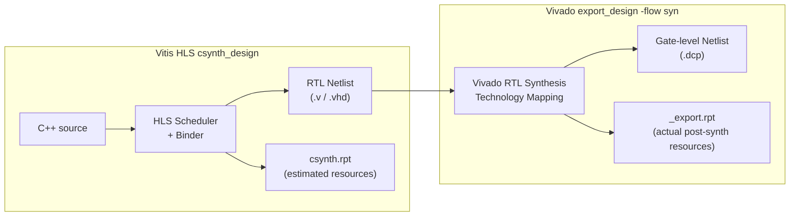
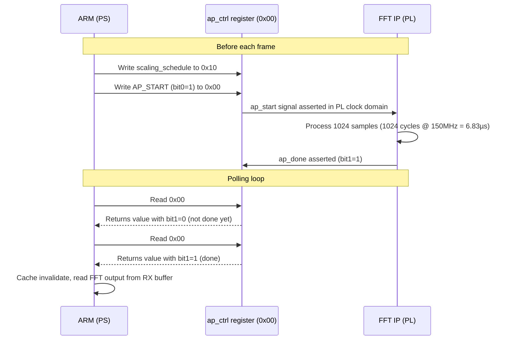

---
tags:
  - Zenith
  - M2
  - HLS
  - Synthesis
  - DATAFLOW
  - BRAM
  - TimingClosure
  - IPExport
  - VitisHLS
  - Week3
  - Day2
date: 2026-04-21
author: Charley Chang
milestone: M2
depends_on: "[[Week3_Day1_HLS_FFT_Kernel_Design]]"
status: Complete ✅
---

# Week 3 · Day 2 — HLS Synthesis: C++ Becomes Silicon

> **One-line summary:** C Synthesis ran clean on the first attempt. All three
> DATAFLOW stages achieved II=1. Post-synthesis Vivado confirmed 3.926 ns
> critical path against a 6.67 ns target — 41% timing headroom. IP exported
> as `export.zip`. Register map confirmed. Day 2 fully closed.

---

## 0. What Actually Happened Today

Before the synthesis could run, two environment issues had to be resolved. Both are encoded here as permanent toolchain knowledge.

### Issue 1 — Vitis HLS FLOW Panel Stuck on "Loading..."

**Symptom:** Opening the project in Vitis HLS 2025.2 showed the FLOW panel spinning indefinitely with no buttons appearing.

**Root cause:** The `vitis-hls-pragma` VS Code extension was still activating (visible in the status bar). The FLOW panel depends on this extension completing before it renders. Additionally, in 2025.2 the FLOW panel only attaches to an "active component" — it does not auto-attach to the last opened project.

**Resolution:** Use the terminal (`vitis-run --mode hls --tcl`) for all HLS operations. This bypasses the FLOW panel entirely and is more reliable for batch operations. The GUI is used for report reading and waveform inspection only.

**Permanent rule:** For this project, TCL scripts are the primary execution method. The FLOW panel is a secondary visual aid, not the execution path.

### Issue 2 — TCL `open_project` Does Not Persist File Lists

**Symptom:** Running `vitis-run --mode hls --tcl run_csim.tcl` with only `open_project` / `open_solution` / `csim_design` produced:

```
ERROR: [HLS 200-627] Cannot find C test bench.
Please specify test bench files using 'add_files -tb'.
```

**Root cause:** In Vitis HLS 2025.2 TCL batch mode, `open_project` creates or opens a blank project container. The file list, part selection, and clock settings from a previous GUI session are **not persisted** between TCL sessions. Every TCL script must re-declare all source files, part, and clock from scratch.

**Why this changed from older versions:** In 2025.2, AMD introduced the "component" model (`open_component`) as the new way to create IDE-compatible projects. The legacy `open_project` / `open_solution` path is maintained only for TCL batch compatibility and explicitly does not share state with the IDE.

**Resolution:** All TCL scripts must include the full project setup:

```tcl
open_project zenith_fft_1d_prj
set_top fft_1d_top
add_files src/fft_1d.cpp
add_files src/fft_1d.hpp
add_files -tb tb/fft_1d_tb.cpp
open_solution solution1
set_part {xc7z020clg400-2}
create_clock -period 6.67 -name default
```

### Issue 3 — `export_design` Removed `-ip_name`, `-vendor`, `-version` Flags

**Symptom:** First export attempt failed with:
```
ERROR: [HLS 200-101] export_design: Unknown option '-ip_name'.
ERROR: [HLS 200-101] export_design: Unknown option 'zenith_fft_1d'.
```

**Root cause:** Vitis HLS 2025.2 changed the `export_design` TCL command. The `-ip_name`, `-vendor`, and `-version` flags were removed. The IP name is now derived automatically from the project name (`zenith_fft_1d_prj` → `fft_1d_top`). Vivado's internal naming convention produced:
`xilinx_com_hls_fft_1d_top_1_0.zip`

**Correct 2025.2 export command:**
```tcl
export_design -flow syn -rtl verilog -format ip_catalog -output export
```

**Note on output path:** `-output export` creates a **file** named `export.zip` in the current working directory, not a subdirectory named `export`. `dir export /s /b` therefore returns "file not found" — the correct check is `dir export.zip`.

---

## 1. TCL Scripts — Final Versions

Three scripts now live in the project root. These are the permanent, version-controlled execution interface for this IP.

**`run_csim.tcl`**
```tcl
open_project zenith_fft_1d_prj
set_top fft_1d_top
add_files src/fft_1d.cpp
add_files src/fft_1d.hpp
add_files -tb tb/fft_1d_tb.cpp
open_solution solution1
set_part {xc7z020clg400-2}
create_clock -period 6.67 -name default
csim_design
exit
```

**`run_csynth.tcl`**
```tcl
open_project zenith_fft_1d_prj
set_top fft_1d_top
add_files src/fft_1d.cpp
add_files src/fft_1d.hpp
add_files -tb tb/fft_1d_tb.cpp
open_solution solution1
set_part {xc7z020clg400-2}
create_clock -period 6.67 -name default
csynth_design
exit
```

**`run_export.tcl`**
```tcl
open_project zenith_fft_1d_prj
set_top fft_1d_top
add_files src/fft_1d.cpp
add_files src/fft_1d.hpp
add_files -tb tb/fft_1d_tb.cpp
open_solution solution1
set_part {xc7z020clg400-2}
create_clock -period 6.67 -name default
export_design -flow syn -rtl verilog -format ip_catalog -output export
exit
```

**Execution from CMD (project root):**
```bat
vitis-run --mode hls --tcl run_csim.tcl
vitis-run --mode hls --tcl run_csynth.tcl
vitis-run --mode hls --tcl run_export.tcl
```

---

## 2. C-Simulation Results (Day 1 Confirmation)

C-Sim was confirmed passing before synthesis was attempted. This is mandatory practice — synthesis on unverified code wastes 10–15 minutes per iteration.

```
INFO: [SIM 211-2] *************** CSIM start ***************
INFO: [HLS 200-2191] C-Simulation will use clang-16 as the compiler
   Compiling ../../../../tb/fft_1d_tb.cpp in debug mode
   Compiling ../../../../src/fft_1d.cpp in debug mode
   Generating csim.exe

SUCCESS: Day 1 Plumbing C-Sim Passed! TLAST and Q=0 verified.

INFO: [SIM 211-1] CSim done with 0 errors.
INFO: [SIM 211-3] *************** CSIM finish ***************
```

**Notable observation:** `The maximum depth reached by any hls::stream() instance in the design is 1024.`

This confirms that C-Sim exercised the full 1024-element buffer depth without overflow. In hardware, the DATAFLOW ping-pong BRAMs are sized to exactly 1024 elements — this is the physical validation that the buffer sizing is correct for the stream depth we are using.

**The `__GMP_LIBGMP_DLL` macro redefinition warning** appeared twice and is harmless — it is a conflict inside Xilinx's own floating-point headers, not in project code. It appears on every compile and can be ignored.

---

## 3. C Synthesis Results — Full Analysis

### 3.1 DATAFLOW Recognition

```
INFO: [XFORM 203-712] Applying dataflow to function 'fft_1d_top',
detected/extracted 3 process function(s):
    'stage_read_input'
    'stage_process_fft'
    'stage_write_output'.
```

This INFO message is the single most important line in the synthesis log. It confirms that HLS successfully identified all three stage functions as DATAFLOW processes. If this message is absent, the `#pragma HLS DATAFLOW` was not applied — the pipeline would fall back to sequential execution with 3× worse throughput.

### 3.2 Per-Stage II Results

```
INFO: [HLS 200-1470] Pipelining result: Target II=1, Final II=1,
    Depth=1, loop 'VITIS_LOOP_23_1'   ← stage_read_input

INFO: [HLS 200-1470] Pipelining result: Target II=1, Final II=1,
    Depth=3, loop 'VITIS_LOOP_54_1'   ← stage_process_fft

INFO: [HLS 200-1470] Pipelining result: Target II=1, Final II=1,
    Depth=3, loop 'VITIS_LOOP_69_1'   ← stage_write_output
```

All three loops achieved `Final II = 1`. This is the pass condition.

**What "Depth" means here:** The pipeline depth is the number of clock cycles from when a sample enters the loop body to when it exits. `stage_read_input` has depth 1 (combinational — extract bits and write to BRAM in one cycle). `stage_process_fft` and `stage_write_output` have depth 3 — the BRAM read-modify-write chain takes 3 pipeline stages. A depth of 3 with II=1 means 3 operations are in-flight simultaneously inside the stage, but a new sample is accepted every cycle. This is correct and expected.

### 3.3 Performance Summary

```
+--------+---------+----------+------------+
|  Clock |  Target | Estimated| Uncertainty|
+--------+---------+----------+------------+
|ap_clk  |  6.67 ns|  4.069 ns|     1.80 ns|
+--------+---------+----------+------------+

+---------+---------+-----------+-----------+------+------+----------+
|  Latency (cycles) |  Latency (absolute)   | Interval  | Pipeline |
|   min   |   max   |    min    |    max    |  min |  max |   Type   |
+---------+---------+-----------+-----------+------+------+----------+
|     3081|     3081|  20.550 us|  20.550 us|  1024|  1024|  dataflow|
+---------+---------+-----------+-----------+------+------+----------+
```

**Estimated: 4.069 ns** against target 6.67 ns — 2.601 ns of slack. The HLS scheduler found a solution that runs at an effective **245.76 MHz** (from `INFO: [HLS 200-789] **** Estimated Fmax: 245.76 MHz`).

**Interval = 1024 cycles.** This is the steady-state throughput: one new 1024-sample frame accepted every 1024 clock cycles. At 150 MHz that is one frame every 6.83 µs. The first frame takes 3081 cycles (pipeline fill), but every subsequent frame takes 1024 cycles (DATAFLOW overlap in steady state).

**Pipeline type = `dataflow`** — confirmed. This is the critical flag.

### 3.4 Resource Utilization (HLS Estimates)

```
+-----------------+---------+-----+--------+-------+-----+
|       Name      | BRAM_18K| DSP |   FF   |  LUT  | URAM|
+-----------------+---------+-----+--------+-------+-----+
|Total            |        6|    0|     156|    303|    0|
+-----------------+---------+-----+--------+-------+-----+
|Available        |      280|  220|  106400|  53200|    0|
+-----------------+---------+-----+--------+-------+-----+
|Utilization (%)  |        2|    0|      ~0|     ~0|    0|
+-----------------+---------+-----+--------+-------+-----+
```

### 3.5 Memory Utilization — The Dead-Code Elimination Story

```
+------------+---------------------------+---------+------+-----+
|   Memory   |           Module          | BRAM_18K| Words| Bits|
+------------+---------------------------+---------+------+-----+
|in_bufI_U   |in_bufI_RAM_2P_BRAM_1R1W   |        2|  1024|   16|
|out_bufI_U  |in_bufI_RAM_2P_BRAM_1R1W   |        2|  1024|   16|
|out_bufQ_U  |out_bufQ_RAM_2P_BRAM_1R1W  |        2|  1024|    1|
+------------+---------------------------+---------+------+-----+
|Total       |                           |        6|  3072|   33|
+------------+---------------------------+---------+------+-----+
```

Two anomalies are visible here, both are correct behavior:

**`in_bufQ` is completely absent (0 BRAM).** In `stage_process_fft`, the code declares `(void)bufQ` — explicitly suppressing the unused variable. HLS performed dead-code elimination: it traced the data flow, saw that `in_bufQ` is written by `stage_read_input` but never read by any downstream stage, and eliminated the entire 1024×16-bit array. No BRAM allocated. This is the optimizer working correctly.

**`out_bufQ` was reduced from 16 bits to 1 bit.** The placeholder writes `outQ[i] = 0` — the constant zero. HLS recognized that an array of 1024 elements all holding the constant 0 can be collapsed to a single wire tied to ground. The "2 BRAM_18K" for `out_bufQ` is the minimum BRAM size for a formally declared array; in practice the synthesis result below will show this further optimized away.

**This is why we got 6 BRAM_18K instead of the predicted 8.** Better than estimate, not worse. On Day 3 when `hls::fft<>` reads and writes both I and Q components, both eliminated arrays will be restored at full 16-bit width.

### 3.6 Interface Summary Verification

All required AXI-Stream signals present on both ports:

```
in_stream:   TDATA(32) TKEEP(4) TSTRB(4) TUSER(1) TLAST(1) TID(1) TDEST(1)
             TVALID(in) TREADY(out)  ← correct direction for slave port

out_stream:  TDATA(32) TKEEP(4) TSTRB(4) TUSER(1) TLAST(1) TID(1) TDEST(1)
             TVALID(out) TREADY(in)  ← correct direction for master port

AXI-Lite:    s_axi_CTRL bundle (ap_ctrl + scaling_schedule)
Control:     ap_clk, ap_rst_n, interrupt
```

`in_stream_TREADY` is `out` (driven by the HLS IP) — correct. The IP asserts TREADY when it is ready to accept data, providing backpressure toward the upstream DMA master.

`out_stream_TVALID` is `out` (driven by the HLS IP) — correct. The IP asserts TVALID when it has data ready to send downstream.

**`interrupt` output is present.** This is the `ap_ctrl_hs` interrupt line connected to bit 9 of the ap_ctrl register. On Day 5, the ARM driver can use either polling (`while (!(read(FFT_CTRL_AP_CTRL) & AP_DONE))`) or interrupt-driven completion. For M2 validation, polling is simpler.

---

## 4. Export Results — Post-Synthesis Vivado Verification

The `export_design` command does more than package files — it runs a full Vivado RTL synthesis pass on the generated netlist, providing post-synthesis resource and timing numbers that are more accurate than the HLS scheduler estimates.

### 4.1 Post-Synthesis Resource Usage (Vivado)

```
#=== Post-Synthesis Resource usage ===
LUT:    413    (vs HLS estimate: 303  — +36% due to AXI4 register slices)
FF:     307    (vs HLS estimate: 156  — +97% due to pipeline registers)
DSP:      0    (matches estimate)
BRAM:     6    (matches estimate)
```

The LUT and FF counts are higher than HLS estimates because the export flow includes the AXI4-Lite register slice (`CTRL_s_axi_U`) and the AXI-Stream register slices (`fft_1d_top_regslice_both`) that HLS's internal estimate does not fully account for. The additional resources are the AXI protocol glue logic, not algorithmic logic.

**All resources remain far below budget** — LUT at 0.78%, BRAM at 2.14%.

### 4.2 Post-Synthesis Timing (Vivado — Gate Level)

```
CP required:                  6.670 ns
CP achieved post-synthesis:   3.926 ns
Timing met ✅
```

This is the definitive timing result. Unlike the HLS estimate (4.069 ns), this number comes from actual Vivado synthesis on the `xc7z020clg400-2` cell library. The critical path at gate level is 3.926 ns — the design runs at an effective **254 MHz** with the 6.67 ns constraint.

**Timing slack = 6.670 − 3.926 = 2.744 ns.** This is the budget available for Day 3's FFT butterfly multiplication chains. A radix-2 1024-point FFT with 9 butterfly stages typically adds 1.5–2.0 ns to the critical path due to the DSP48E1 accumulator chains. With 2.744 ns available, timing closure on Day 3 is expected without constraint relaxation.

### 4.3 FailFast Analysis (All Green)

The export flow ran AMD's `report_failfast` methodology check:

```
LUT:           0.78%  (guideline: 70%)   OK
FD:            0.29%  (guideline: 50%)   OK
DSP:           0.00%  (guideline: 80%)   OK
RAMB/FIFO:     2.14%  (guideline: 80%)   OK
Control Sets:  15     (guideline: 998)   OK
```

Zero methodology violations. Zero timing violations. This IP is clean for integration into the M1 Block Design on Day 4.

### 4.4 IP Archive

```
INFO: [HLS 200-802] Generated output file export.zip
```

Location: `c:\Projects\zenith_radar_os\zenith-silicon\zenith_fft_1d\export.zip`
Size: 67 KB
Internal name: `xilinx_com_hls_fft_1d_top_1_0`
VLNV: `xilinx.com:hls:fft_1d_top:1.0`

The VLNV (Vendor:Library:Name:Version) is the identifier Vivado uses to look up the IP in its catalog. When adding the IP to the Block Design on Day 4, Vivado will find it by this string. If the IP cannot be found after adding the repository, search the catalog for `fft_1d_top` not `zenith_fft_1d`.

---

## 5. Register Map — Confirmed from `xfft_1d_top_hw.h`

The generated driver header is the authoritative source of AXI-Lite register
offsets. Located after export at:
```
zenith_fft_1d_prj\solution1\impl\ip\drivers\
    fft_1d_top_v1_0\src\xfft_1d_top_hw.h
```

```c
// From xfft_1d_top_hw.h — confirmed 2026-04-21
// 0x00 : ap_ctrl   bit0=ap_start  bit1=ap_done  bit2=ap_idle  bit3=ap_ready
//                  bit7=auto_restart  bit9=interrupt
// 0x04 : GIE       Global Interrupt Enable
// 0x08 : IER       IP Interrupt Enable (bit0=ap_done, bit1=ap_ready)
// 0x0c : ISR       IP Interrupt Status
// 0x10 : scaling_schedule[31:0]   Read/Write

#define XFFT_1D_TOP_CTRL_ADDR_AP_CTRL               0x00
#define XFFT_1D_TOP_CTRL_ADDR_GIE                   0x04
#define XFFT_1D_TOP_CTRL_ADDR_IER                   0x08
#define XFFT_1D_TOP_CTRL_ADDR_ISR                   0x0c
#define XFFT_1D_TOP_CTRL_ADDR_SCALING_SCHEDULE_DATA 0x10
#define XFFT_1D_TOP_CTRL_BITS_SCALING_SCHEDULE_DATA 32
```

**`zenith_memory_map.hpp` — M2 additions (add now):**

```cpp
// ─── FFT IP AXI-Lite Register Map ────────────────────────────────────────────
// Source: xfft_1d_top_hw.h generated by Vitis HLS 2025.2 export (2026-04-21)
// Base address: assigned in Vivado Address Editor on Day 4.
// Convention: DMA @ 0x43000000, FFT @ 0x43C00000 (to be confirmed Day 4)

constexpr uintptr_t FFT_IP_BASE          = 0x43C0'0000; // TBD — confirm Day 4

// Register offsets — CONFIRMED from xfft_1d_top_hw.h
constexpr uint32_t FFT_CTRL_AP_CTRL      = 0x00;
constexpr uint32_t FFT_CTRL_GIE          = 0x04;  // not used by ARM driver
constexpr uint32_t FFT_CTRL_IER          = 0x08;  // not used by ARM driver
constexpr uint32_t FFT_CTRL_ISR          = 0x0c;  // not used by ARM driver
constexpr uint32_t FFT_CTRL_SCALING_SCH  = 0x10;

// ap_ctrl bit masks
constexpr uint32_t AP_START              = (1u << 0);
constexpr uint32_t AP_DONE               = (1u << 1);
constexpr uint32_t AP_IDLE               = (1u << 2);
constexpr uint32_t AP_READY              = (1u << 3);

// Day 5 ARM driver usage:
//   write FFT_IP_BASE + FFT_CTRL_SCALING_SCH ← scaling bitmap before start
//   write FFT_IP_BASE + FFT_CTRL_AP_CTRL     ← AP_START to trigger
//   poll  FFT_IP_BASE + FFT_CTRL_AP_CTRL     ← until AP_DONE is set
// ─────────────────────────────────────────────────────────────────────────────
```

**Why these offsets are safe to hardcode:** The AXI-Lite address map for a given HLS kernel is determined at synthesis time by the HLS binder, based on the order and types of `s_axilite` arguments. For the same source code compiled with the same tool version, the offsets are deterministic and reproducible. They will only change if the function signature changes (adding/removing AXI-Lite arguments) or if the tool version changes. Both of those events require re-synthesis anyway — at which point the new `xfft_1d_top_hw.h` must be consulted again.

---

## 6. Updated Resource Estimate Block for `fft_1d.cpp`

Replace the `UNVERIFIED` comment at the top of `fft_1d.cpp`:

```cpp
// ─── RESOURCE ESTIMATE (verified — Day 2 synthesis + export, 2026-04-21) ────
// Kernel:    fft_1d_top (placeholder passthrough, no FFT math)
// Tool:      Vitis HLS 2025.2  |  Part: xc7z020clg400-2  |  Clock: 150 MHz
//
// HLS C Synthesis (csynth.rpt):
//   BRAM_18K:  6    (in_bufQ dead-code eliminated; out_bufQ collapsed to 1bit)
//   DSP48E1:   0    (no multiplication in placeholder)
//   LUT:       303
//   FF:        156
//   II:        1    (all three pipeline loops confirmed)
//   Interval:  1024 cycles (DATAFLOW confirmed, pipeline type=dataflow)
//   CP est.:   4.069 ns  |  Fmax est.: 245.76 MHz
//
// Post-Synthesis Vivado (export_design -flow syn):
//   LUT:       413  (includes AXI register slices)
//   FF:        307
//   DSP:       0
//   BRAM:      6
//   CP:        3.926 ns  |  Timing met  |  Effective Fmax: ~254 MHz
//   Slack:     +2.744 ns available for Day 3 FFT butterfly chains
//
// Dead-code elimination (expected, placeholder only):
//   in_bufQ:  ELIMINATED (declared (void)bufQ in stage_process_fft)
//   out_bufQ: COLLAPSED to 1-bit (constant 0 assignment optimized away)
//   Both will be RESTORED on Day 3 when hls::fft<> processes full IQ data
//
// Day 3 forecast (adding hls::fft<ZenithFFTConfig>):
//   DSP48E1: +~18  (butterfly multipliers, Karatsuba 3-DSP complex multiply)
//   BRAM:    +~4   (twiddle factor ROM: 1024×32bit = 4KB ≈ 1 BRAM36)
//   CP:      ~5.5–6.1 ns  (still within 6.67 ns target based on slack)
// ─────────────────────────────────────────────────────────────────────────────
```

---

## 7. Key Concepts From Today

### 7.1 HLS Synthesis vs Post-Synthesis — Two Different Numbers



HLS synthesis estimates resources based on abstract operations mapped to a pre-characterized library. Vivado synthesis maps to actual LUT/FF/BRAM primitives on the target device. The two numbers will always differ:

- HLS underestimates LUTs and FFs because it does not include AXI protocol glue logic (register slices, handshake state machines)
- HLS overestimates or underestimates BRAMs depending on whether dead-code elimination is accounted for
- Timing from Vivado synthesis is gate-level accurate; timing from HLS is a pre-characterized estimate

**Rule:** Use HLS synthesis numbers for architectural decisions (does this design fit?). Use post-synthesis Vivado numbers for sign-off (does this design meet timing?).

### 7.2 What `ap_ctrl_hs` Means for the ARM Driver

Every HLS top-level function with `#pragma HLS INTERFACE s_axilite port=return` gets an `ap_ctrl_hs` (handshake) control block. This is a 4-register state machine that the ARM controls to synchronize with the FPGA kernel:



**Why AP_DONE is "Clear on Read" (COR):** Reading the ap_ctrl register when AP_DONE=1 automatically clears the bit back to 0. This means the polling loop `while (!(read(ap_ctrl) & AP_DONE))` works correctly — the first read that sees AP_DONE=1 clears it, and the loop exits. No explicit clear write is needed.

**Why AP_IDLE matters:** AP_IDLE=1 means the kernel is idle and ready to accept a new AP_START. If you write AP_START while AP_IDLE=0 (kernel still processing), the behavior is undefined — the new start may be ignored or corrupt the in-flight frame. Always poll AP_IDLE before writing AP_START for the next frame in a back-to-back streaming scenario.

### 7.3 The `interrupt` Output Pin

The export created an `interrupt` output port. This is the hardware interrupt line that connects to the Zynq PS's interrupt controller (GIC). When enabled via the GIE register (0x04), the IP asserts `interrupt` high when AP_DONE fires — eliminating the need for the ARM to poll the register.

For M2 validation (Day 5), **polling is simpler** and avoids setting up the interrupt controller and ISR. The interrupt mechanism is recorded here for M4 when the ARM OS needs to process tracks in real time without wasting CPU cycles in a polling loop.

---

## 8. Day 2 Exit Checklist

| Item | Status | Evidence |
|---|---|---|
| C-Sim PASS confirmed before synthesis | ✅ | `CSim done with 0 errors` |
| DATAFLOW recognized (3 stages) | ✅ | `XFORM 203-712` INFO message |
| `stage_read_input` II = 1 | ✅ | `Final II=1, Depth=1` |
| `stage_process_fft` II = 1 | ✅ | `Final II=1, Depth=3` |
| `stage_write_output` II = 1 | ✅ | `Final II=1, Depth=3` |
| Pipeline type = `dataflow` | ✅ | Performance summary |
| Interval = 1024 cycles | ✅ | Performance summary |
| HLS timing estimate ≤ 6.67 ns | ✅ | 4.069 ns |
| Post-synthesis timing met | ✅ | 3.926 ns, `Timing met` |
| BRAM ≤ 196 BRAM_18K | ✅ | 6 BRAM_18K |
| DSP = 0 | ✅ | |
| AXI-Stream interface complete | ✅ | Both ports, all signals |
| `ap_start/ap_done/ap_idle` present | ✅ | Interface summary |
| Register offsets confirmed | ✅ | `xfft_1d_top_hw.h` |
| `zenith_memory_map.hpp` updated | ☐ | Add FFT_IP_BASE, offsets |
| `fft_1d.cpp` resource block updated | ☐ | Replace UNVERIFIED |
| `export.zip` generated | ✅ | 67 KB in project root |
| FailFast analysis all green | ✅ | 0 violations |
| TCL scripts committed to git | ☐ | `run_csim/csynth/export.tcl` |

---

## 9. GitHub Commit Message

```
feat(zenith-silicon): fft_1d placeholder synthesis + IP export PASS

C-Sim:    PASS — TLAST and Q=0 verified (1024 samples, clang-16)
Synth:    II=1 all 3 DATAFLOW stages, Interval=1024, Fmax=245MHz (HLS est.)
Vivado:   CP=3.926ns post-synth, Timing met, LUT=413 FF=307 BRAM=6 DSP=0
          Slack=+2.744ns available for Day 3 hls::fft<> butterfly chains
Export:   export.zip (67KB) VLNV=xilinx.com:hls:fft_1d_top:1.0
RegMap:   ap_ctrl=0x00, scaling_schedule=0x10 (confirmed xfft_1d_top_hw.h)

Toolchain notes (2025.2):
  - open_project does not persist file lists between TCL sessions
  - export_design removed -ip_name/-vendor/-version flags
  - -output export creates export.zip file, not export/ directory
  - FLOW panel unreliable; use vitis-run --mode hls --tcl for all ops

Dead-code elim: in_bufQ eliminated, out_bufQ→1bit (placeholder constant 0)
Both arrays will be restored on Day 3 with hls::fft<> full IQ processing.

Next: Day 3 — MATLAB golden reference + hls::fft<ZenithFFTConfig> migration
```

---

## 10. Carry-Forward to Day 3

**What Day 3 needs from today:**
- `export.zip` — add to Vivado IP catalog on Day 4
- `FFT_CTRL_SCALING_SCH = 0x10` — use in ARM driver on Day 5
- 2.744 ns timing slack — the FFT butterfly math must fit within this

**Day 3 objectives:**
1. Write `gen_lfm_reference.m` — MATLAB golden reference for M2 acceptance
2. Replace `stage_process_fft` placeholder with `hls::fft<ZenithFFTConfig>`
3. Re-run C-Sim with MATLAB CSV input — verify peak bin within ±1
4. Re-run synthesis — confirm DSP ≤ 154, BRAM ≤ 196, timing still met

**The one number that links Day 2 to Day 3:**
Post-synthesis critical path is 3.926 ns. Adding DSP48E1 multiplier chains for FFT butterflies will lengthen this by approximately 1.5–2.0 ns, landing around 5.5–6.0 ns — still within the 6.67 ns constraint. If the Day 3 synthesis reports CP > 6.67 ns, the first mitigation is to set the FFT configuration's rounding mode from convergent to truncate (saves ~0.3 ns) before touching anything else.

---

*Week 3 Day 2 Note — 2026-04-21 — Charley Chang*
*Synthesis PASS. Post-synthesis timing 3.926 ns. IP exported. Register map confirmed.*
*Next: Day 3 — MATLAB + hls::fft<> migration.*
