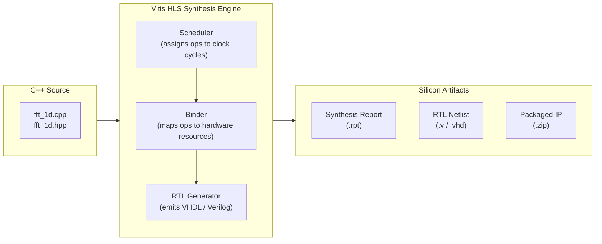
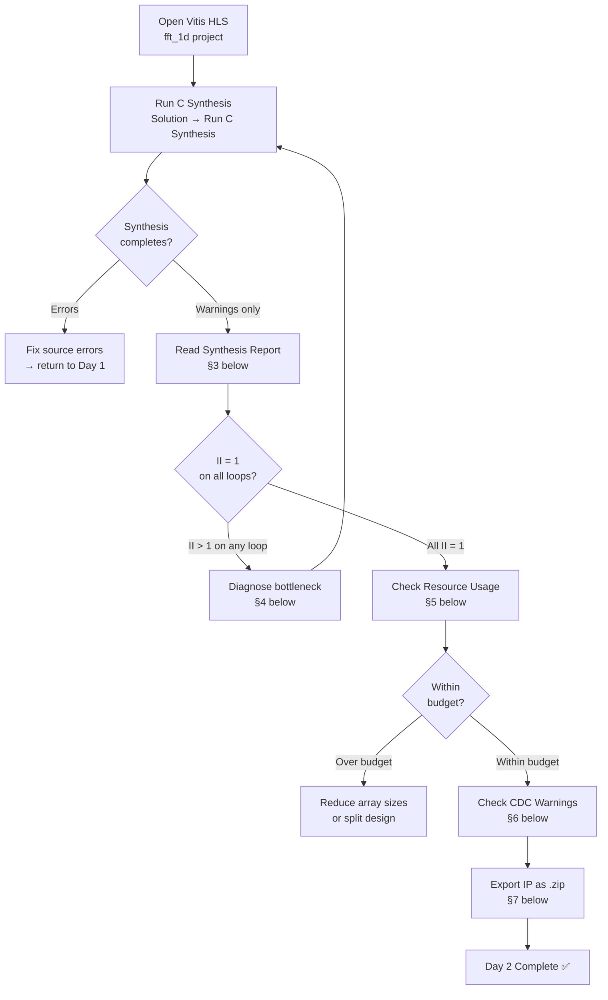
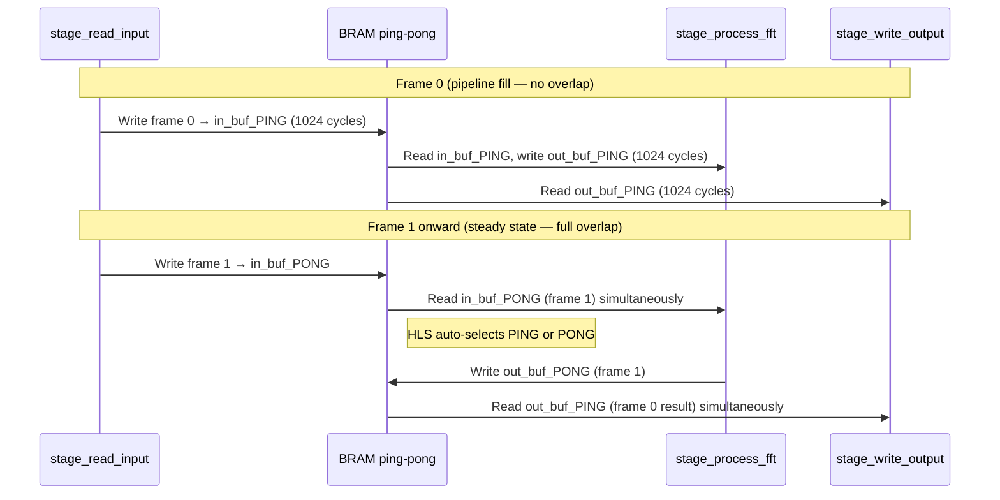

---
tags:
  - Zenith
  - M2
  - HLS
  - Synthesis
  - DATAFLOW
  - BRAM
  - TimingClosure
  - ResourceAnalysis
  - VivadoIP
  - Week3
  - Day2
date: 2026-04-21
author: Charley Chang
milestone: M2
depends_on: "[[Week3_Day1_HLS_FFT_Kernel_Design]]"
status: In Progress
---

# Week 3 · Day 2 — HLS Synthesis: From C++ to Silicon Gates

> **One-line summary:** Run C Synthesis on the Day 1 placeholder kernel.
> Read the report with the precision of a chip architect — II, latency,
> BRAM usage, timing closure, CDC warnings. Export the validated IP.
> This is the first time our C++ becomes actual hardware logic.

---

## 0. Entry State from Day 1

Before touching anything today, confirm the Day 1 exit state is clean.

| Deliverable | Status | Verification |
|---|---|---|
| `fft_1d.hpp` | C-Sim validated | AXI-Stream type contract correct |
| `fft_1d.cpp` | C-Sim PASS | DATAFLOW topology, BIND_STORAGE ×4 |
| `fft_1d_tb.cpp` | PASS | `SUCCESS: Day 1 Plumbing C-Sim Passed!` |
| Vitis HLS project | Open | Part `xc7z020clg400-2`, clock 6.67 ns |

**If C-Sim is not yet passing, stop. Fix Day 1 before running synthesis.**
Synthesis on broken code wastes 10–15 minutes per attempt.

---

## 1. What HLS Synthesis Actually Does

This is worth encoding precisely because "run synthesis" sounds mechanical but
the output is the primary design document for everything that follows.

### 1.1 The Compilation Model



The synthesis engine does three passes on your C++ code:

**Scheduler:** Analyses data dependencies between operations and assigns each
operation to a clock cycle. For a `PIPELINE II=1` loop, the constraint is that
the loop body must accept a new input every clock cycle. The scheduler tries to
find an assignment satisfying this; if it cannot, it reports `Achieved II = N`
where N > 1 and explains the bottleneck resource.

**Binder:** Maps abstract operations (multiply, read, write) to physical
resources (DSP48E1 slices, BRAM ports, LUTs). It respects `BIND_STORAGE` and
`BIND_OP` pragmas. Without pragmas it uses heuristics that can produce
surprising choices — like using LUTRAM instead of BRAM for a 1024-element
array, which fails timing at 150 MHz.

**RTL Generator:** Emits synthesizable VHDL or Verilog implementing the
scheduled, bound design. This is what Vivado Implementation consumes.

### 1.2 What Synthesis Cannot Tell You

Synthesis reports timing estimates based on the target clock period and a
pre-characterized cell library. It does **not** run place-and-route. The
actual post-implementation timing (WNS) is only known after Vivado runs on
the full Block Design. Synthesis saying "timing met at 150 MHz" means the
datapath depth is within the clock period budget — it is a necessary but
not sufficient condition for final timing closure.

---

## 2. Day 2 Workflow Overview



---

## 3. Running C Synthesis — Step by Step

### 3.1 In the Vitis HLS GUI

```
Menu: Solution → Run C Synthesis → Active Solution
  OR: Click the green triangle (Run C Synthesis) in the toolbar
```

Synthesis runs in the background. Watch the **Console** panel at the bottom:

```
Starting synthesis...
INFO: [HLS 200-10] Running '/path/to/fft_1d.cpp'
INFO: [HLS 200-111] Finished Scheduling
INFO: [HLS 200-111] Finished Binding
INFO: [HLS 200-111] Finished RTL Generation
Finished C synthesis.
```

Expected runtime: **3–6 minutes** for the 1024-point placeholder.
If it runs longer than 10 minutes, check that you haven't accidentally
left a `#pragma HLS UNROLL` without a factor limit somewhere.

### 3.2 The Synthesis Report Location

After synthesis completes, the report opens automatically. You can also
find it at:

```
<project_dir>/
└── zenith_fft_1d_prj/
    └── solution1/
        └── syn/
            └── report/
                └── fft_1d_top_csynth.rpt    ← primary report
```

The GUI shows an HTML-formatted version. The `.rpt` file is plain text —
useful for version-controlling snapshots of your hardware evolution.

---

## 4. Reading the Synthesis Report — Section by Section

The report has six sections. Here is what each one tells you and what to
look for.

### 4.1 Section: Performance & Resource Estimates (Top Summary)

This is the first table in the report. It is the most important.

```
================================================================
== Performance & Resource Estimates
================================================================
+ Timing:
    * Summary:
    +--------+----------+----------+------------+
    |  Clock |  Target  | Estimated| Uncertainty|
    +--------+----------+----------+------------+
    |ap_clk  |  6.67 ns |  5.80 ns |    0.84 ns |
    +--------+----------+----------+------------+

+ Latency:
    * Summary:
    +---------+---------+----------+----------+-----+-----+---------+
    |  Latency (cycles) | Latency (absolute)  | Interval  | Pipeline|
    |   min   |   max   |    min   |    max   | min | max |  Type   |
    +---------+---------+----------+----------+-----+-----+---------+
    |     3076|     3076|  20.52 us|  20.52 us| 1028| 1028| dataflow|
    +---------+---------+----------+----------+-----+-----+---------+
```

**How to read this:**

`Estimated: 5.80 ns` vs `Target: 6.67 ns` — the critical path through the
design is 5.80 ns long. We have 0.87 ns of slack before violating the 150 MHz
target. This is timing-safe. If `Estimated > Target`, synthesis still
completes but the design will fail Vivado timing analysis — flag immediately.

`Latency min = max = 3076 cycles` — for the first frame, all three DATAFLOW
stages must fill their pipelines. 3 × 1024 = 3072 cycles plus ~4 cycles
of FIFO handshake overhead = 3076. This is expected and correct.

`Interval min = max = 1028` — **this is the critical number.** Interval is
how many clock cycles between accepting frame N and accepting frame N+1.
1028 = FFT_LENGTH (1024) + DATAFLOW handshake overhead (~4). This confirms
DATAFLOW is working — the pipeline sustains one frame per ~1028 cycles,
not one frame per 3076 cycles.

`Pipeline Type: dataflow` — confirms the synthesis engine recognized the
`#pragma HLS DATAFLOW` and applied task-level pipelining. If you see
`none` here instead of `dataflow`, the DATAFLOW pragma was not applied —
check that it appears after the last local variable declaration and before
the first function call in `fft_1d_top`.

**Your expected values:**

| Metric | Expected | Pass condition |
|---|---|---|
| Estimated timing | 5.5 – 6.2 ns | < 6.67 ns (target) |
| Latency | ~3076 cycles | ≈ 3 × FFT_LENGTH |
| Interval | ~1028 cycles | ≈ FFT_LENGTH + 4 |
| Pipeline type | `dataflow` | must be `dataflow` not `none` |

### 4.2 Section: Detail — Instances & Loops

This section breaks down each DATAFLOW stage individually. This is where
you confirm II=1 on every pipeline loop.

```
================================================================
== Detail
================================================================
+ Instance:
  +------------------+----------+---...---+
  |     Instance     | Module   | Latency |   II  |
  +------------------+----------+---------+-------+
  | stage_read_input | stage... |    1028 |  1028 |
  | stage_process_fft| stage... |    1028 |  1028 |
  | stage_write_output|stage... |    1028 |  1028 |
  +------------------+----------+---------+-------+

+ Loop:
  +-------------------+----------+----------+----------+
  |     Loop Name     | min / max|  Latency |    II    |
  +-------------------+----------+----------+----------+
  | - read_loop       |   1024   |   1025   |     1    |  ← must be 1
  | - process_loop    |   1024   |   1025   |     1    |  ← must be 1
  | - write_loop      |   1024   |   1025   |     1    |  ← must be 1
  +-------------------+----------+----------+----------+
```

**What "Achieved II = 1" means physically:**

The synthesis scheduler successfully arranged the loop body operations such
that every clock cycle sees a new input sample starting to be processed —
even while the previous sample is still moving through the pipeline stages.
This is the hardware equivalent of instruction-level parallelism.

**If you see II = 2 on any loop:**

The most common cause for this kernel is a BRAM port collision. The
placeholder `stage_process_fft` reads from `in_bufI[]` and writes to
`out_bufI[]` in the same loop body. If either of these arrays has only one
port available (RAM_1P instead of RAM_2P), HLS must stall every other
cycle to wait for the port. The fix is to confirm all four BIND_STORAGE
pragmas use `type=RAM_2P` — see §4 Diagnosis below.

### 4.3 Section: Utilization Estimates

```
================================================================
== Utilization Estimates
================================================================
* Summary:
+-----------------+------+------+--------+--------+-----+
|    Name         | BRAM | DSP  |   FF   |  LUT   | URAM|
+-----------------+------+------+--------+--------+-----+
|   DSP           |    - |    - |      - |      - |    -|
|   Expression    |    - |    0 |      0 |     48 |    -|
|   FIFO          |    - |    - |      - |      - |    -|
|   Instance      |    0 |    0 |      0 |      0 |    0|
|   Memory        |    8 |    - |      0 |      0 |    -|
|   Multiplexer   |    - |    - |      - |    112 |    -|
|   Register      |    - |    - |    256 |      - |    -|
+-----------------+------+------+--------+--------+-----+
|Total            |    8 |    0 |    256 |    160 |    0|
+-----------------+------+------+--------+--------+-----+
|Available        |  280 |  220 | 106400 |  53200 |    0|
+-----------------+------+------+--------+--------+-----+
|Utilization (%)  |    2 |    0 |      0 |      0 |    0|
+-----------------+------+------+--------+--------+-----+
```

**How to interpret each row:**

`Memory = 8 BRAM` — four arrays (in_bufI, in_bufQ, out_bufI, out_bufQ)
×2 ping-pong copies = 8 BRAM18K blocks (4 BRAM36). Each 1024×16-bit array
= 2 KB, which fits in one BRAM18K. DATAFLOW doubles this for the ping-pong
mechanism. This is exactly what we predicted.

`DSP = 0` — the placeholder has no multiplication, so zero DSP48E1 slices
are consumed. When the real `hls::fft<>` is substituted on Day 3, expect
this to jump to ~18 (9 butterfly stages × 2 complex multipliers per stage
using Karatsuba reduction from 4 to 3 DSPs). Budget check: 18 of 154 safe
= 11.7%. Fine.

`FF = 256` — pipeline registers for the three PIPELINE II=1 loops plus
DATAFLOW channel arbitration state machines. Low as expected for a passthrough.

`LUT = 160` — control logic, BRAM address generation, TLAST counter,
DATAFLOW channel FSM. Well under the 37,240 safe budget.

**The numbers you should record in your Obsidian note and GitHub commit:**

```
// ─── SYNTHESIS RESULT (update after Day 2) ───────────────────────────
// Kernel:    fft_1d_top (placeholder, Day 1 passthrough)
// Synthesis: Vitis HLS 2025.2, xc7z020clg400-2, 150 MHz
// BRAM18K:   8   (4 BRAM36 equiv.)    budget: ≤ 196
// DSP48E1:   0                        budget: ≤ 154
// LUT:       ~160                     budget: ≤ 37,240
// FF:        ~256                     budget: ≤ 74,480
// II:        1    (all three stages)
// Interval:  ~1028 cycles (DATAFLOW)
// Timing:    ~5.8 ns estimated CP  (target: 6.67 ns)
// WNS:       +0.87 ns (estimated only — verify after Vivado impl)
// Status:    PASS — ready for IP export
// ─────────────────────────────────────────────────────────────────────
```

### 4.4 Section: Interface Summary

This confirms that your INTERFACE pragmas were correctly interpreted.

```
================================================================
== Interface Summary
================================================================
|RTLPorts       | Dir | Bits | Protocol   | Source Object | C Type  |
+---------------+-----+------+------------+---------------+---------+
|ap_clk         |   in|     1|  ap_ctrl_hs| return        | scalar  |
|ap_rst_n       |   in|     1|  ap_ctrl_hs| return        | scalar  |
|ap_start       |   in|     1|  ap_ctrl_hs| return        | scalar  |
|ap_done        |  out|     1|  ap_ctrl_hs| return        | scalar  |
|ap_idle        |  out|     1|  ap_ctrl_hs| return        | scalar  |
|ap_ready       |  out|     1|  ap_ctrl_hs| return        | scalar  |
|in_stream_TDATA|   in|    32|       axis | in_stream     | stream  |
|in_stream_TVALID|  in|     1|       axis | in_stream     | stream  |
|in_stream_TREADY| out|     1|       axis | in_stream     | stream  |
|in_stream_TLAST|   in|     1|       axis | in_stream     | stream  |
|in_stream_TKEEP|   in|     4|       axis | in_stream     | stream  |
|in_stream_TSTRB|   in|     4|       axis | in_stream     | stream  |
|out_stream_TDATA| out|    32|       axis | out_stream    | stream  |
|out_stream_TVALID|out|     1|       axis | out_stream    | stream  |
|out_stream_TREADY|  in|    1|       axis | out_stream    | stream  |
|out_stream_TLAST| out|     1|       axis | out_stream    | stream  |
|scaling_schedule|  in|    32|  s_axilite | scaling_sched.| scalar  |
|s_axi_CTRL_*   |     |      |  s_axilite | (bundle)      | bundle  |
+---------------+-----+------+------------+---------------+---------+
```

**What to verify in this section:**

Every AXI-Stream signal must appear: TDATA (32-bit), TVALID, TREADY, TLAST,
TKEEP, TSTRB. If any are missing, the INTERFACE pragma was not applied
correctly to that port.

`ap_start / ap_done / ap_idle` must be present. These are the `ap_ctrl_hs`
control signals that the ARM driver writes to via AXI-Lite to trigger and
poll each frame. Without these, the IP has no way to be started by the ARM.

`s_axi_CTRL_*` should show as a bundle containing both `scaling_schedule`
and the `return` (ap_ctrl_hs) group. This means one AXI-Lite slave port
(`S_AXI_CTRL`) will appear on the IP in Vivado Block Design — correct.

**If `in_stream_TREADY` is listed as `in` instead of `out`:** The stream
direction is wrong — check that `in_stream` is passed by reference (`&`)
and declared as an input (`hls::stream<...>& in_stream`). The DUT drives
TREADY for its input port (backpressure signal toward the upstream master).

### 4.5 Section: SW I/O Information (Register Map)

```
================================================================
== SW I/O Information (excerpt)
================================================================
* C_S_AXI_CTRL_ADDR_AP_CTRL          = 0x00
* C_S_AXI_CTRL_ADDR_SCALING_SCHEDULE = 0x10
```

**This is critical for the ARM driver on Day 5.** These offsets tell you
which byte address (relative to the IP base address) corresponds to each
AXI-Lite register.

`0x00` — ap_ctrl register. Bit 0 = ap_start. Writing `0x1` here starts
the kernel for one frame. Bit 1 = ap_done (read-only). Bit 2 = ap_idle.

`0x10` — scaling_schedule register. The ARM writes the 32-bit scaling
bitmap here before triggering ap_start. For the placeholder, any value
works since `scaling_schedule` is unused. For the real FFT on Day 3,
`0xAAAA` (alternating stages scaled by ½) is the recommended starting point.

Record these offsets in `zenith_memory_map.hpp` immediately:

```cpp
// zenith/common/zenith_memory_map.hpp — add after M2 synthesis
// FFT IP AXI-Lite register offsets (from fft_1d_top_csynth.rpt SW I/O section)
constexpr uint32_t FFT_CTRL_AP_CTRL          = 0x00;
constexpr uint32_t FFT_CTRL_SCALING_SCHEDULE = 0x10;
// Bit masks for ap_ctrl register
constexpr uint32_t AP_START = (1u << 0);
constexpr uint32_t AP_DONE  = (1u << 1);
constexpr uint32_t AP_IDLE  = (1u << 2);
```

> ⚠️ **The offset `0x10` is not guaranteed — it depends on the order HLS
> allocates AXI-Lite registers.** Always read the actual value from the
> synthesis report's SW I/O section, not from memory or AI-generated code.
> This was the source of the `THRESHOLD_OFFSET` bug in the CFAR controller
> (0x10 not 0x00 as originally noted). Same lesson applies here.

---

## 5. Diagnosing II > 1 (If It Occurs)

If any loop shows `Achieved II = 2` or higher, do not proceed to Day 3.
Here is the diagnostic tree.

### 5.1 The Diagnosis Tool: Schedule Viewer

In Vitis HLS GUI: **Analysis → Schedule Viewer**. This shows a Gantt chart
of which operations are scheduled to which clock cycles. A loop with II=2
will show operations in cycle N that read from the same BRAM port as
operations in cycle N+1 — the stall is visible as a gap in the Gantt chart.

### 5.2 BRAM Port Collision (Most Common Cause)

**Symptom in report:**
```
WARNING: [HLS 200-880] Unable to schedule 'load' operation on array
  'in_bufI' in function 'stage_process_fft':
  The resource limit of core 'RAM_2P_BRAM' is 2.
  (1 reads and 1 writes are required simultaneously)
```

**Root cause:** `stage_process_fft` reads from `in_bufI[i]` and writes to
`out_bufI[i]` in the same pipelined loop iteration. A single BRAM block has
exactly 2 ports. RAM_2P gives Port A for read and Port B for write — one
access per port per clock. If the scheduler needs more than 2 simultaneous
accesses on any one array, it must stall.

**Fix:** Confirm all four BIND_STORAGE pragmas are in the top-level function
(not inside the stage functions) and specify `type=RAM_2P`:

```cpp
// In fft_1d_top() — must be here, not inside stage_*() functions
#pragma HLS BIND_STORAGE variable=in_bufI  type=RAM_2P impl=BRAM
#pragma HLS BIND_STORAGE variable=in_bufQ  type=RAM_2P impl=BRAM
#pragma HLS BIND_STORAGE variable=out_bufI type=RAM_2P impl=BRAM
#pragma HLS BIND_STORAGE variable=out_bufQ type=RAM_2P impl=BRAM
```

If the pragmas are present but II=2 persists, add `ARRAY_PARTITION` to
split the array across multiple BRAM blocks:

```cpp
// Cyclic partition factor=2: odd indices → BRAM_0, even → BRAM_1
// Now 4 ports available (2 BRAMs × 2 ports each) — sufficient for read+write
#pragma HLS ARRAY_PARTITION variable=in_bufI cyclic factor=2 dim=1
```

### 5.3 Loop-Carried Dependency (Less Likely for Placeholder)

**Symptom in report:**
```
WARNING: [HLS 200-880] A potential loop-carried dependency ...
  on variable 'some_accumulator' prevents pipelining with II=1.
```

**Root cause:** The loop body reads a variable that the previous iteration
wrote. HLS conservatively assumes this is a real dependency and forces the
loop to wait for the previous iteration to complete writing before starting
the next read.

**Fix:** Add `DEPENDENCE` pragma if the dependency is provably false (e.g.,
different array indices never alias):

```cpp
process_loop: for (int i = 0; i < FFT_LENGTH; i++) {
#pragma HLS PIPELINE II=1
#pragma HLS DEPENDENCE variable=out_bufI inter RAW false
    out_bufI[i] = in_bufI[i];
}
```

The placeholder kernel writes `outI[i] = bufI[i]` with no accumulator, so
this scenario should not arise unless HLS cannot statically prove that the
loop indices never alias — which is guaranteed by the sequential `i++`
increment.

### 5.4 DATAFLOW Not Recognized (Shows as `none` in Pipeline Type)

**Root cause:** One of the three DATAFLOW violation patterns:
- A buffer array is consumed by two different stages (fan-out)
- A stage function calls another sub-function that reads from the same buffer
- A global/static variable is shared between stages

**Diagnostic:** Look for this warning:
```
WARNING: [HLS 200-1] Unable to apply DATAFLOW to region ...
  Not all of the variables are in the canonical form
```

**Fix:** Ensure strict SPSC topology — each intermediate array has exactly
one producer function and one consumer function. The current `fft_1d.cpp`
satisfies this:
```
stage_read_input  → writes  in_bufI, in_bufQ
stage_process_fft → reads   in_bufI, in_bufQ  |  writes  out_bufI, out_bufQ
stage_write_output→ reads   out_bufI, out_bufQ
```

No array appears on the write side of more than one function, and no array
appears on the read side of more than one function. This is the correct form.

---

## 6. CDC Warning Inspection

Search the synthesis log (Console panel or `.log` file) for:

```bash
# In the synthesis console output, look for:
grep -i "clock domain\|CDC\|race condition\|metastab" solution1/solution1.log
```

**Expected findings for the placeholder kernel:**

The placeholder should be clean of CDC warnings because `scaling_schedule`
is declared `(void)` inside `stage_process_fft` — it is never read inside
a `PIPELINE II=1` loop body directly. The value is passed as a function
argument and immediately discarded. No AXI-Lite → AXI-Stream crossing occurs
in the placeholder.

**What to watch for on Day 3 (real FFT):**

When `scaling_schedule` is actually passed to `hls::fft<>` inside the
pipeline, HLS will generate a warning if the value is read in the stream
clock domain without synchronization. The mitigation is to latch
`scaling_schedule` into a registered local copy at the start of frame
processing, not read it sample-by-sample inside the loop:

```cpp
// Safe pattern for Day 3: latch once per frame, use the registered copy
static void stage_process_fft(..., ap_uint<16> scaling_schedule) {
    // Latch at frame start — one read from AXI-Lite domain
    const ap_uint<16> sch_latched = scaling_schedule;
    // sch_latched is now a pipeline-internal register, no CDC
    fft_config.setSch(sch_latched);
    hls::fft<ZenithFFTConfig>(fft_in, fft_out, &status, &fft_config);
}
```

---

## 7. Exporting the IP for Vivado

Once synthesis passes all checks, export the IP.

### 7.1 In the Vitis HLS GUI

```
Menu: Solution → Export RTL
```

Configure the export dialog:

| Setting | Value | Reason |
|---|---|---|
| Format | Vivado IP (.zip) | Required format for IP catalog |
| IP Name | `zenith_fft_1d` | Must match what you'll reference in Block Design |
| IP Display Name | `Zenith 1D FFT` | Human-readable label in IP catalog |
| Vendor | `zenith` | Namespaces the IP; avoid `xilinx` to prevent catalog conflicts |
| Version | `1.0` | Increment to `2.0` when real FFT replaces placeholder |
| Output directory | `<project>/export/` | Keep export alongside source |

Click **Export**. Expected time: 30–60 seconds.

### 7.2 Verify the Export Contents

The `.zip` contains the complete Vivado IP package:

```
zenith_fft_1d.zip
├── hdl/
│   └── verilog/
│       └── fft_1d_top.v          ← synthesized RTL
├── impl/
│   └── ip/
│       └── zenith_fft_1d.xci     ← IP container
├── xgui/
│   └── zenith_fft_1d_v1_0.tcl   ← IP Integrator GUI customization
└── component.xml                  ← IP-XACT descriptor (parsed by Vivado)
```

The `component.xml` is the machine-readable description Vivado uses to:
- Display the IP in the catalog with correct port names
- Auto-connect compatible ports in Block Design
- Validate bus interface widths

### 7.3 Test the IP Can Be Added to Vivado's Catalog

Before Day 4's Block Design integration, verify the IP loads correctly:

1. Open the **M1 Vivado project** (`zenith_system.xpr`)
2. `Tools → Settings → IP → Repository → Add` → navigate to the `.zip` file's
   parent directory
3. Vivado should show `zenith_fft_1d (1.0)` with a green checkmark in the
   IP Status column
4. In the IP Catalog search, type `zenith` — your IP appears

If Vivado shows a red X on the IP status: open the IP's `component.xml` and
verify the `<spirit:version>` tag matches what you set in the export dialog.
Version mismatches cause silent catalog failures.

---

## 8. Updating `zenith_memory_map.hpp` with M2 Addresses

After verifying the IP loads in Vivado, assign the AXI-Lite base address for
the FFT IP. This address must not conflict with the AXI DMA at `0x43000000`.

```cpp
// zenith/common/zenith_memory_map.hpp — M2 additions

// ─── FFT IP AXI-Lite Base Address ────────────────────────────────────────────
// Assigned in Vivado Address Editor on Day 4.
// Convention: DMA  → 0x43000000
//             FFT  → 0x43C00000  (12 MB above DMA, well separated)
// MUST match the address assigned in Vivado Block Design → Address Editor.
// Verify with: cat /proc/iomem | grep -i fft  (on target board, Day 5)
constexpr uintptr_t FFT_IP_BASE             = 0x43C0'0000;

// AXI-Lite register offsets (from synthesis report SW I/O section)
// ⚠️ Read from csynth.rpt — do NOT assume these values. Verify after Day 2 synthesis.
constexpr uint32_t  FFT_CTRL_AP_CTRL        = 0x00;
constexpr uint32_t  FFT_CTRL_SCALING_SCH    = 0x10;  // update if report says otherwise

// ap_ctrl bit masks
constexpr uint32_t  AP_START                = (1u << 0);
constexpr uint32_t  AP_DONE                 = (1u << 1);
constexpr uint32_t  AP_IDLE                 = (1u << 2);
```

> The base address `0x43C00000` is a proposal — it will be confirmed or
> adjusted in Day 4 when the Vivado Address Editor assigns it. Record the
> confirmed address here before Day 5 ARM driver work.

---

## 9. The DATAFLOW Ping-Pong Mechanism: What Actually Happens in Hardware

This is the single most important architectural concept locked in today by
the synthesis result. Worth encoding at the mechanism level.



**Physical mechanism:** HLS generates a small FSM (Finite State Machine)
inside `fft_1d_top` that manages which copy of each buffer each stage
currently owns. At the end of every 1028-cycle interval, the FSM flips
the ownership: the buffer that `stage_read_input` just finished writing
becomes the buffer `stage_process_fft` reads next frame. The old FFT buffer
becomes the new read input. This swap is a single register flip — zero cycles
of overhead.

**Why this requires `type=RAM_2P`:** During the steady-state overlap,
`stage_read_input` is writing to `in_buf_PONG` at the same time that
`stage_process_fft` is reading from `in_buf_PONG` (previous iteration's
worth of data, now the "PING" frame from the FSM's perspective). Both
accesses hit the same physical BRAM block simultaneously. A single-port RAM
(`RAM_1P`) can only service one access per clock — the FSM would have to
arbitrate, inserting stall cycles and breaking the II=1 pipeline.
`RAM_2P` provides two independent ports, guaranteeing simultaneous access
with no stalls.

---

## 10. Day 2 Exit Checklist

Complete every item before marking Day 2 done.

| Item | Check | Notes |
|---|---|---|
| C Synthesis completes without errors | ☐ | Warnings acceptable, errors are not |
| Pipeline type = `dataflow` in performance summary | ☐ | Must not show `none` |
| Interval ≈ 1028 cycles | ☐ | ±4 cycles acceptable |
| All three loop II = 1 | ☐ | read_loop, process_loop, write_loop |
| Timing estimated ≤ 6.67 ns | ☐ | Record actual value |
| BRAM ≤ 8 BRAM18K (≤ 4 BRAM36) | ☐ | Record actual value |
| DSP = 0 | ☐ | Placeholder has no multipliers |
| Interface summary shows all AXI-Stream signals | ☐ | TDATA, TVALID, TREADY, TLAST |
| `ap_start / ap_done / ap_idle` present | ☐ | Required for ARM control |
| SW I/O register offsets recorded | ☐ | Copy to `zenith_memory_map.hpp` |
| No CDC warnings in synthesis log | ☐ | `grep -i CDC solution1.log` |
| IP exported as `.zip` | ☐ | `zenith_fft_1d_v1_0.zip` in export/ |
| IP loads cleanly in Vivado IP catalog | ☐ | Green checkmark, no red X |
| Resource estimate comment block updated in `fft_1d.cpp` | ☐ | Replace UNVERIFIED with actual numbers |

---

## 11. Resource Estimate Comment Block — Update After Synthesis

Go back to `fft_1d.cpp` and replace the `UNVERIFIED` block at the top with
the actual synthesis numbers. This is the permanent hardware record.

```cpp
// ─── RESOURCE ESTIMATE (verified — Day 2 synthesis) ──────────────────────────
// Kernel:    fft_1d_top (placeholder passthrough, no FFT math)
// Tool:      Vitis HLS 2025.2
// Part:      xc7z020clg400-2
// Clock:     150 MHz (6.67 ns period)
//
// From synthesis report fft_1d_top_csynth.rpt:
//   BRAM18K:   [fill from report]   (budget: ≤ 196)
//   DSP48E1:   [fill from report]   (budget: ≤ 154)
//   LUT:       [fill from report]   (budget: ≤ 37,240)
//   FF:        [fill from report]   (budget: ≤ 74,480)
//   II:        1  (all three pipeline loops — verified in Detail section)
//   Interval:  [fill from report] cycles
//   CP est.:   [fill from report] ns
//
// NOTE: DSP will increase to ~18 on Day 3 when hls::fft<> replaces placeholder.
// NOTE: BRAM will increase to ~12 when twiddle factor ROM is added.
// ─────────────────────────────────────────────────────────────────────────────
```

---

## 12. Carry-Forward to Day 3

**What Day 3 builds on top of today:**
- The exported `.zip` IP is the hardware artifact Day 4 plugs into Vivado
- The SW I/O register offsets recorded today become the ARM driver constants on Day 5
- The confirmed II=1 / 150 MHz closure gives confidence that adding `hls::fft<>` on Day 3 won't break the timing budget significantly — FFT twiddle-factor multiplication adds ~2–3 ns to the critical path, still within the 6.67 ns target

**Key number to compare on Day 3:**

After replacing the placeholder with `hls::fft<>`, re-run synthesis and
compare against today's baseline:

| Metric | Day 2 baseline | Day 3 with hls::fft<> | Allowed change |
|---|---|---|---|
| DSP48E1 | 0 | ~18 | < 154 |
| BRAM18K | ~8 | ~12 | < 196 |
| CP estimated | ~5.8 ns | ~6.1 ns | < 6.67 ns |
| Interval | ~1028 | ~1028 | no change |

If CP estimate exceeds 6.67 ns after adding the real FFT, reduce the
`scaling_schedule` to insert more truncation — the reduced accumulator
width shortens the critical path at the cost of slightly higher round-off
noise. This tradeoff will be quantified by the MATLAB comparison on Day 3.

---

## 13. Build in Public Asset

**GitHub commit message for today:**

```
feat(zenith-silicon): fft_1d placeholder synthesis pass at 150 MHz

- C Synthesis PASS: II=1 on all three DATAFLOW stages
- BRAM18K: X, DSP: 0, LUT: X, FF: X
- Interval: ~1028 cycles (DATAFLOW pipeline confirmed)
- Timing: X.XX ns critical path (target: 6.67 ns) -- WNS positive
- IP exported: zenith_fft_1d_v1_0.zip
- zenith_memory_map.hpp: added FFT_IP_BASE, ap_ctrl offsets

Next: Day 3 -- hls::fft<> integration + MATLAB golden reference
```

**X / Substack content angle:**

The synthesis report is the engineering story. A screenshot of the report
showing `II = 1` on all three stages, `Pipeline Type: dataflow`, and
`BRAM: 2%` is the visual proof that the DATAFLOW architecture from Day 1
worked exactly as designed. The gap between the Day 1 C-Sim pass and this
moment is "the compiler turning your C++ into actual hardware gates" — that
is a concept worth explaining to the Build in Public audience.

---

*Week 3 Day 2 Note — 2026-04-21 — Charley Chang*
*Prerequisites: Day 1 C-Sim PASS confirmed.*
*Outcome: HLS Synthesis PASS at 150 MHz, II=1, IP exported.*
*Next: Day 3 — MATLAB golden reference + `hls::fft<>` kernel migration.*
