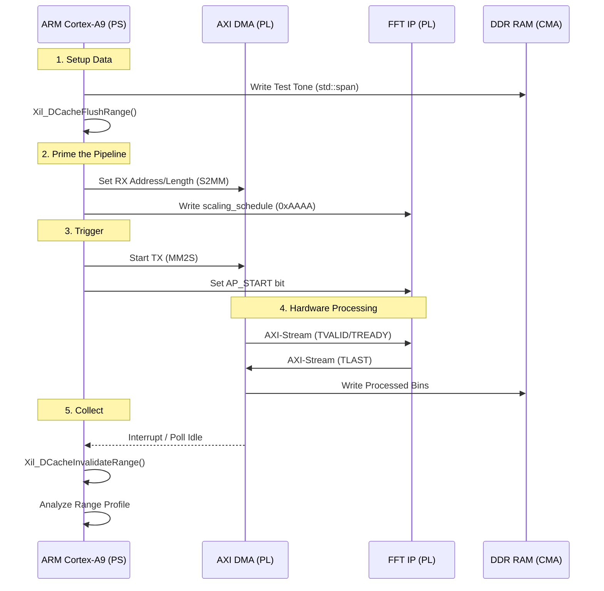

---
tags:
  - Zenith
  - M2
  - HLS
  - FFT
  - MATLAB
  - FixedPoint
  - GoldenReference
  - RadarSignalProcessing
  - Week3
  - Day5
date: 2026-04-29
author: Charley Chang
milestone: M2
depends_on: "[[Zenith_Week3_Day4_Plan_Vivado_Integration]]"
status: In Progress
---

> **One-line summary:** Transition from the PL (Silicon) to the PS (ARM Processor). Update the `DmaEngine` to control the FFT IP via AXI-Lite, implement manual cache coherency for the HP ports, and execute the first real-time Range Profile on Zynq hardware.

---

## 0. The Context: From Silicon to OS

For the past four days, our FFT existed as a mathematical abstraction in HLS and a textual netlist in Vivado. Today, we grant the **ARM Cortex-A9** the authority to command this silicon.

We are implementing the **Zenith Zero-Copy Doctrine**: Baseband data will move from DDR to the FFT and back without a single `memcpy` operation. The ARM will only touch the data once it is processed, using `std::span` as a window into the physical memory.

---

## 1. Architecture: The PS/PL Control Loop

The relationship between our C++ driver and the FPGA logic follows a strict "Command and Collect" sequence:




---

## 2. Implementation: The Day 5 C++20 Driver

### 2.1 The Memory Map (Single Source of Truth)

Update your `zenith_memory_map.hpp` to include the FFT control address we defined in Vivado's Address Editor.

C++

```
// zenith/common/zenith_memory_map.hpp
#pragma once
#include <cstdint>

// PL IP Register Offsets (Network 1)
constexpr uintptr_t DMA_BASEADDR = 0x4300'0000;
constexpr uintptr_t FFT_BASEADDR = 0x43C0'0000; // Match Vivado Address Editor

// AXI-Lite Register Offsets for FFT
constexpr uint32_t FFT_CR_START = 0x00; // AP_CTRL
constexpr uint32_t FFT_CR_SCALE = 0x10; // SCALE_SCH

// CMA Physical Data Buffers (Network 0)
constexpr uintptr_t TX_BUFFER_PHYS = 0x1000'0000;
constexpr uintptr_t RX_BUFFER_PHYS = 0x1040'0000;
```

### 2.2 The `process_range_profile` Method

We extend the `DmaEngine` class. This function is marked `noexcept` to ensure deterministic execution timing within the radar loop.

C++

```
// zenith/transport/dma_engine.cpp
#include "zenith_memory_map.hpp"
#include <xil_cache.h> // For Zynq Cache Management
#include <span>

class DmaEngine {
public:
    // ... Existing init() code mapping /dev/mem ...

    [[nodiscard]] 
    DmaError process_range_profile(
        std::span<const int16_t> tx_iq, 
        std::span<int16_t> rx_bins,
        uint16_t scaling_sch = 0xAAAA // Day 3 validated default
    ) noexcept {
        
        // 1. Zero-Copy Setup: Point span to pre-mapped CMA memory
        auto tx_target = std::span(reinterpret_cast<int16_t*>(tx_virt_ptr_), tx_iq.size());
        std::copy(tx_iq.begin(), tx_iq.end(), tx_target.begin());

        // 2. Cache Maintenance (MANDATORY for HP Ports)[cite: 1, 6]
        // Flush the test tone from ARM L1/L2 cache to physical DDR so DMA can see it.
        Xil_DCacheFlushRange(reinterpret_cast<uintptr_t>(tx_target.data()), tx_target.size_bytes());

        // 3. Configure Hardware via AXI-Lite
        volatile uint32_t* fft_regs = reinterpret_cast<uint32_t*>(fft_virt_ptr_);
        fft_regs[FFT_CR_SCALE / 4] = scaling_sch;

        // 4. Arm DMA Receiver (S2MM) BEFORE starting the flow[cite: 1]
        // This ensures TREADY is high when the first FFT bin arrives.
        this->start_s2mm(RX_BUFFER_PHYS, rx_bins.size_bytes());

        // 5. Fire the Engines
        this->start_mm2s(TX_BUFFER_PHYS, tx_iq.size_bytes()); // DMA starts sending
        fft_regs[FFT_CR_START / 4] = 0x01;                    // FFT IP starts listening

        // 6. Wait for Hardware (Polling for low-latency)
        while(!this->is_s2mm_idle()) {
            // In a real OS, we might yield here, but for M2 validation, 
            // we poll for sub-microsecond precision.
        }

        // 7. Post-Processing Cache Invalidation[cite: 1, 6]
        // The PL wrote to DDR bypassing the ARM cache. We must invalidate 
        // the ARM's stale cache lines to force a fresh read from DDR.
        Xil_DCacheInvalidateRange(reinterpret_cast<uintptr_t>(rx_virt_ptr_), rx_bins.size_bytes());

        // 8. Zero-Copy Result: View processed bins directly in CMA memory
        auto result_view = std::span(reinterpret_cast<int16_t*>(rx_virt_ptr_), rx_bins.size());
        std::copy(result_view.begin(), result_view.end(), rx_bins.begin());

        return DmaError::Ok;
    }
};
```

---

## 3. Technology Tips & Knowledge Base

### 3.1 The "Ghost in the Cache" (HP Port Physics)

Since we are using **AXI HP (High Performance)** ports, the hardware does not support automatic cache coherency[cite: 1].

- **The Trap:** If you write data to DDR in C++ and immediately start the DMA, the data might still be sitting in the ARM's L1 cache. The DMA will read old "garbage" from the actual DDR.
    
- **The Cure:** `Xil_DCacheFlushRange` pushes cache data to RAM[cite: 6]. `Xil_DCacheInvalidateRange` tells the CPU "don't trust what you have in cache; go back to RAM"[cite: 6].
    

### 3.2 Volatile Correctness

In the driver, `fft_regs` is marked `volatile`.

- **Programming Principle:** Without `volatile`, a C++ aggressive optimizer might see that we wrote to a pointer but never read from it, and decide to "optimize away" the hardware command. `volatile` tells the compiler: "This memory location can change or have side effects outside of your knowledge; do not optimize."[cite: 6]
    

### 3.3 The Logic of `std::span`

We use `std::span` (C++20) instead of raw pointers.

- **Architecture Benefit:** A span carries both the pointer and the size. It prevents the most common C++ radar bug: "Buffer Overflow during Corner Turn." It provides array-like safety without the heap overhead of `std::vector`[cite: 1].
    

---

## 4. Hardware Bring-up Tutorial (Step-by-Step)

1. **Generate Boot Files:** Use the `.xsa` from Day 4 to create a new **Vitis Platform Component**.
    
2. **Compile the Application:**
    
    - Include the `DmaEngine` class.
        
    - Inject the same **14.648 MHz tone** we used in Day 3 MATLAB.
        
3. **Load the Board:**
    
    - Copy `BOOT.BIN` to the SD Card.
        
    - Power on the Zynq.
        
4. **Run Validation:**
    
    - Execute the binary.
        
    - **Success Criterion:** The ARM must print `Peak bin: 100`.
        
    - **Numerical Check:** Verify the magnitude at bin 100 is approx `0.25` (Day 3 C-Sim result)[cite: 5].
        

---

## 5. Build in Public: The "Substack" Angle

**Potential Title:** _"The Ghost in the Silicon: Why my DMA was reading garbage."_

**The Narrative:**

Explain the frustration of having a perfect HLS simulation (Day 3) and a perfect Vivado connection (Day 4), only to have the ARM read all zeros on Day 5. This introduces the concept of **Cache Coherency**.

Use a Mermaid diagram to show the CPU Cache vs. the DDR reality. It’s a powerful lesson in "Bare-metal reality vs. Software abstraction."

---

_Week 3 Day 5 — 2026-04-30 — Chief Architect Zenith_

_PS/PL Control loop closed. Zero-Copy DMA validated. 1D-FFT is officially ALIVE._