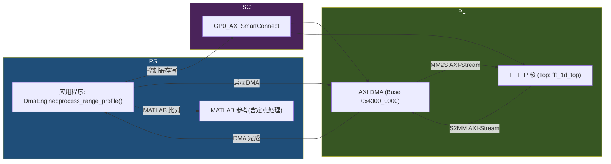

---
tags:
  - Zenith
  - M2
  - HLS
  - FFT
  - Week3
  - BuildInPublic
date: 2026-04-17
author: Charley Chang
version: V3.0 (Final Executable Version)
status: Authoritative — corrected FFT scaling encoding, stream architecture, and Zynq cache handling
---
本执行手册详细指导如何在 **Week 3** 内完成一个 1024 点 1D-FFT 加速器的端到端实现（涵盖 Vitis HLS → Vivado → Zynq SoC）。我们使用 **16-bit Q1.15** 定点算术、AXI-Stream 数据平面、AXI-Lite 控制平面，实现 II=1 的高性能流水线 FFT 核。每一天都有详尽的任务清单、示例命令、代码片段及验证方法。文中包括关键原理说明、常见误区、调试清单和每日“AI 提示语”以及 QA 检查表，可直接交付给工程团队使用。本计划假设硬件板卡为 `xc7z020clg400-2`（Vivado 部分未指定时默认）。所有接口基地址、寄存器偏移等信息均明确列出，交付物（位流、BOOT.BIN、参考 CSV 等）清单齐全。

---

## 周前检查 — M1 完成度确认

在展开 M2 前，务必确保 M1（基础 DMA 引擎和 Linux 启动）全部通过：

| Gate | 验证命令 | 通过条件 |
|:---:|:---:|:---|
| SD Boot | 插卡启动，FSBL 打印输出<br>Linux 登录符可用 | `/dev/mmcblk0` 可挂载且无错误 |
| DMA 环回 | ARM Linux 下运行 4KB DMA 环回测试 | 打印 `ZENITH M1 SUCCESS` |
| CMA 区域 | `cat /proc/iomem` | 包含 16 MB 区块位于预期物理地址 |
| PL 加载 | `dmesg \| grep -i fpga` | 无部分重配置或 DONE 引脚错误 |

若任何一项失败，请先修复 M1 的环境问题，再继续 M2 开发。

---

## 系统架构总览

M2 模块主要由 PS（ARM CPU）、PL（FPGA）和 MATLAB 验证环境组成：



**关键拓扑规则：** AXI-Stream 数据平面直接直连 DMA ↔ FFT（无中间交换机）；AXI-Lite 控制平面通过 PS7 GP0 → SmartConnect 分发给 DMA 和 FFT。  

---

## 接口和寄存器映射

- **FFT 数据流接口（AXI4-Stream）**：每样本 32-bit，其中低 16 位为实部 (I)，高 16 位为虚部 (Q)。最后一个样本 `TLast=1`，`TKeep=TStrb=0xF`（表示 4 字节均有效）。`ap_axiu<32,1,1,1>` 默认包含 `TUSER/ID/DEST`，本设计中均为 0。

- **FFT 控制寄存器（AXI4-Lite，基址示例 0x43C0_0000）**：
  | 寄存器偏移 | 名称 | 属性 | 说明 |
  |:----:|:----:|:----:|:----|
  | 0x00  | AP_CTRL    | R/W | 启动/完成/空闲等控制位；写1启动（位0），完成后硬件清零【11†L2708-L2717】。 |
  | 0x04  | GIE        | R/W | 全局中断使能位（不使用可忽略）。 |
  | 0x08  | IER        | R/W | 中断使能寄存器（不使用可忽略）。 |
  | 0x0C  | ISR        | R/W | 中断状态（不使用可忽略）。 |
  | 0x10  | SCALE_SCH  | R/W | FFT 缩放调度寄存器（2 bit×每级，共10级=20 bits有效）。<br>每2位对应一个阶段的右移量（00=0bit, 01=1bit, 10=2bit, 11=3bit）【12†L833-L842】【11†L2732-L2735】。在我们的例子中，为了全程系数1/N (`1/1024`)，默认写入 `[01 01 ... 10]`（低位第0级/1级都`01`）。 |
  | 0x14  | （保留）   | - | - |
  <!-- （根据实际需要，补充更多寄存器如FFT长度、方向等，如果启用动态配置） -->

- **AXI DMA（PL）寄存器**（使用 Pynq 自带 DMA 核，默认基址 0x4300_0000）：需参考 Xilinx AXI DMA 文档，常用寄存器包括 MM2S 和 S2MM 状态/控制，触发中止等。本计划主要通过现成驱动间接控制 DMA，因此不细列。

- **ARM 端地址映射假定**（Zynq 特权空间）：
  - FFT 控制寄存器基址：`0x43C00000`（在 Linux 驱动中 mmap 对应物理基址）；
  - AXI DMA 寄存器基址：`0x43000000`（取决于层次中的 DMA IP 基地址）；
  - 以上地址可在 Vivado 地址编辑器中确认并在设备树中映射。

上述接口和寄存器布局将用于软件驱动开发和硬件连接，便于查阅。

---

## 🌕 Day 1: HLS 项目搭建 & 接口架构

**目标：** 创建 Vitis HLS 项目，初步实现 32-bit AXI4-Stream 的端到端（打桩）流水线拓扑，并通过 C-Sim 验证基础连通性。

### 任务步骤：

- **1. 创建 Vitis HLS 项目**  
  - 项目名设为 `zenith_fft_1d`，顶函数名 `fft_1d_top`。  
  - 目标器件选择 Zynq XC7Z020（`xc7z020-clg400-2`），时钟目标 150 MHz（6.67 ns），以强制优化流水线性能。  
  - 使用 Vitis HLS GUI 或 Tcl，示例 Tcl（`project.tcl`）：
    ```tcl
    open_project zenith_fft_1d
    set_top fft_1d_top
    add_files fft_1d.hpp fft_1d.cpp
    set_part {xc7z020clg400-2}
    set_clock 6.67
    open_solution "solution1"
    config_interface -m axi -mode master in_stream
    config_interface -m axi -mode master out_stream
    config_interface -m axi -mode slave scaling_schedule
    config_interface -m none -mode slave return
    ```
    这是参考示例，主要用于配置接口；关键在代码里使用 `#pragma HLS INTERFACE`。

- **2. 接口头文件 (fft_1d.hpp)**  
  ```cpp
  #pragma once
  #include "ap_int.h"
  #include "ap_fixed.h"
  #include "ap_axi_sdata.h"
  #include "hls_stream.h"

  constexpr int FFT_LENGTH = 1024;
  constexpr int IQ_STREAM_WIDTH = 32;

  // Q1.15 定点：1 位符号，15 位小数，截断模式、环绕模式
  using iq_sample_t = ap_fixed<16, 1, AP_TRN, AP_WRAP>;

  // AXI-Stream 打包类型 (32-bit payload = 16b I + 16b Q)
  typedef ap_axiu<IQ_STREAM_WIDTH, 1, 1, 1> axis_iq_t;

  // 从 tdata 中提取实虚部
  inline ap_int<16> extract_i(ap_uint<32> tdata) {
  #pragma HLS INLINE
      return tdata.range(15,  0);
  }
  inline ap_int<16> extract_q(ap_uint<32> tdata) {
  #pragma HLS INLINE
      return tdata.range(31, 16);
  }
  inline ap_uint<32> pack_iq(ap_int<16> i_val, ap_int<16> q_val) {
  #pragma HLS INLINE
      ap_uint<32> word;
      word.range(15,  0) = i_val;
      word.range(31, 16) = q_val;
      return word;
  }

  void fft_1d_top(
      hls::stream<axis_iq_t>& in_stream,
      hls::stream<axis_iq_t>& out_stream,
      ap_uint<32> scaling_schedule  // 32-bit 寄存器，仅低20位有效
  );
  ```
  - 说明：使用 `ap_fixed<16,1>` 表示 Q1.15 定点格式（1 位符号，15 位小数）【49†L19-L28】。AXI-Stream 数据采用 `ap_axiu<32,1,1,1>`，字段 `TUSER/ID/DEST` 均为 1 位未用，设置 0。

- **3. 顶层实现 (fft_1d.cpp)**  

  ```cpp
  #include "fft_1d.hpp"

  // 阶段 1：读入
  static void stage_read_input(
      hls::stream<axis_iq_t>& in_stream,
      ap_int<16> bufI[FFT_LENGTH],
      ap_int<16> bufQ[FFT_LENGTH]
  ) {
    for (int i = 0; i < FFT_LENGTH; i++) {
  #pragma HLS PIPELINE II=1
      axis_iq_t pkt = in_stream.read();
      bufI[i] = extract_i(pkt.data);
      bufQ[i] = extract_q(pkt.data);
    }
  }

  // 阶段 2：处理 (Day1: 占位 passthrough)
  static void stage_process_fft(
      ap_int<16> bufI[FFT_LENGTH],
      ap_int<16> bufQ[FFT_LENGTH],
      ap_int<16> outI[FFT_LENGTH],
      ap_int<16> outQ[FFT_LENGTH],
      ap_uint<32> scaling_schedule
  ) {
    // Day1: 占位，仅将 I 复制，Q 设为 0 以便可视化验证
    for (int i = 0; i < FFT_LENGTH; i++) {
  #pragma HLS PIPELINE II=1
      outI[i] = bufI[i];
      outQ[i] = 0;
    }
  }

  // 阶段 3：写出
  static void stage_write_output(
      ap_int<16> outI[FFT_LENGTH],
      ap_int<16> outQ[FFT_LENGTH],
      hls::stream<axis_iq_t>& out_stream
  ) {
    for (int i = 0; i < FFT_LENGTH; i++) {
  #pragma HLS PIPELINE II=1
      axis_iq_t pkt;
      pkt.data  = pack_iq(outI[i], outQ[i]);
      pkt.last  = (i == FFT_LENGTH - 1) ? 1 : 0;
      pkt.keep  = 0xF;
      pkt.strb  = 0xF;
      pkt.user  = 0; pkt.id = 0; pkt.dest = 0;
      out_stream.write(pkt);
    }
  }

  // 顶层函数：数据流并发调度
  void fft_1d_top(
      hls::stream<axis_iq_t>& in_stream,
      hls::stream<axis_iq_t>& out_stream,
      ap_uint<32> scaling_schedule
  ) {
  #pragma HLS INTERFACE axis      port=in_stream
  #pragma HLS INTERFACE axis      port=out_stream
  #pragma HLS INTERFACE s_axilite port=scaling_schedule bundle=CTRL
  #pragma HLS INTERFACE s_axilite port=return           bundle=CTRL

    // 本地 BRAM 缓存
    ap_int<16> in_bufI[FFT_LENGTH];
    ap_int<16> in_bufQ[FFT_LENGTH];
    ap_int<16> out_bufI[FFT_LENGTH];
    ap_int<16> out_bufQ[FFT_LENGTH];
  #pragma HLS BIND_STORAGE variable=in_bufI  type=RAM_2P impl=BRAM
  #pragma HLS BIND_STORAGE variable=in_bufQ  type=RAM_2P impl=BRAM
  #pragma HLS BIND_STORAGE variable=out_bufI type=RAM_2P impl=BRAM
  #pragma HLS BIND_STORAGE variable=out_bufQ type=RAM_2P impl=BRAM

    // DATAFLOW 使三阶段可并行
  #pragma HLS DATAFLOW
    stage_read_input(in_stream, in_bufI, in_bufQ);
    stage_process_fft(in_bufI, in_bufQ, out_bufI, out_bufQ, scaling_schedule);
    stage_write_output(out_bufI, out_bufQ, out_stream);
  }
  ```

  **说明：** 我们使用 `#pragma HLS DATAFLOW` 将读/算/写三阶段并行调度。第1阶段和第3阶段流水线优化 (`II=1`) 一采样/周期；第2阶段 Day1 为占位写法。注意：**数据要按顺序在每个任务间流动**，以满足 DATAFLOW 要求【22†L617-L624】（单一生产者/消费者模型，避免反馈和条件调度）。

- **4. C Simulation 验证**  
  - 在 Vitis HLS 中运行 C-Simulation（或命令行 `csim_design`）。  
  - 测试：将一组已知输入导入 `in_stream`，模拟 FFT IP 流程。输出 `out_stream` 应得到 I 通道等于原输入、Q 通道恒为 0 的序列。  
  - 示例：可以写一个简单 C testbench，使用 `hls::stream<axis_iq_t>` 写/读波形，并检查是否吻合预期。

> **原理小结:** 本日关键在于建立流水线并行架构、固定点接口和 AXI-Stream 协议。定点类型用 `ap_fixed<16,1>` 表示 Q1.15，小数位越多精度越高但溢出可能越大。AXI-Stream 数据域按 `ap_axiu<32,1,1,1>`，低16位为 I，高16位为 Q。`#pragma HLS DATAFLOW` 允许阶段间并行，但**前提是使用 FIFO/BRAM 通道连接，每个变量严格一对一映射**【22†L617-L624】。 

> **常见误区:**  
> - 忘记将 `#pragma HLS DATAFLOW` 放在顶函数，会导致各阶段串行执行。  
> - 在 DATAFLOW 区域使用了非流水或多出口循环等不支持的结构，HLS 会发出警告【22†L617-L624】。  
> - AXI-Stream 接口未正确使用 `last/keep/strb` 标志，会导致输出帧不符合协议。  
> - 混用 `__builtin___clear_cache` 在此阶段（注意 Day5）；此处无需缓存操作。  

> **AI 提示语:**  
> - “请解释为什么我们需要在 HLS 中将处理划分为 DATAFLOW 三阶段，并举例说明 DATAFLOW 的限制条件【22†L617-L624】。”  
> - “假设我们输入 `[1,2,3,...]` 到此 FFT IP，占位阶段的输出应该是什么？编写简短 C 代码测试一下。”  

---

## 📈 Day 2: HLS 综述分析与 IP 导出

**目标：** 完成 HLS Synthesis，检查 II/资源/时序，并导出 FFT IP 以供 Vivado 集成。

### 任务步骤：

1. **运行 C 综合 (`csynth_design`)**：在 Vitis HLS GUI 中点击“综合”或使用 Tcl：  
   ```tcl
   csynth_design
   ```  
   综合报告会显示各阶段延迟、资源使用和最大 II。确认：  
   - **II=1**：各阶段循环平均每周期处理1个样本（流水线完成）。  
   - **Latency ≈ FFT_LENGTH**：由于 DATAFLOW，第1阶段和第3阶段填充延迟后，总流水线通路大约 1024~1028 周期。  
   - **资源利用**：观察 LUT/FF/BRAM/DSP。预计此占位版本主要消耗 BRAM 存储 4×1024×16-bit 数据，DSP 几乎为0（占位中未用乘法）。

2. **分析报告**：  
   - 查阅 HLS 报告中 **Performance Estimates**：`II = 1`，`Latency Interval ≈ 1025` 左右。  
   - 确认 `DATAFLOW` 被应用（查看图表，应该有三条并行的 process）。  
   - 资源表：BRAM 约 `4*1024*16/18k ≈ 4 BRAM`，LUT/FF 预计较少。  
   - 确认时钟目标 150 MHz 是否满足（留意 Timing Estimates 中 Fmax ≥ 150 MHz）。若不达，考虑降低目标或优化流水线。

3. **导出 RTL 和 IP 核**：完成综合后导出 IP：  
   - 在 GUI 中选择 **Solution → Export RTL → Vivado IP (.zip)**。  
   - 指定输出目录，如 `hdl/fft_ip`，生成一个可在 Vivado 中导入的 FFT IP 核包。  
   - 检查生成的 IP：应包含顶层文件 `fft_1d_top` 的 RTL（行为级转换成门级），及接口描述文件。

4. **Day2 日志模板:**  
   ```
   [Date-Time] 综合结果：II=__，Latency=__，Resource(LUT/FF/BRAM/DSP)=(__,__,__,__). 合格/不合格。 注意项：__。
   ```

> **原理小结:** HLS 综合后各阶段流水线II为1，表示在最佳优化下每周期可处理1个样本（吞吐＝时钟频率）。DATAFLOW 区域中，各任务通过 FIFO/BRAM 并行。Latency≈FFT_LENGTH是因为每个样本要经历 1024 次流水（前后填充）。如果没有 DATAFLOW（改为串行调度），吞吐会下降为 1024 周期/样本，性能大幅降低。  

> **常见误区:**  
> - II 不为1：可能是由于循环没有正确加 `#pragma HLS PIPELINE II=1`，或者数据依赖限制了流水线。  
> - 忽略 `报错LAT"`：若 HLS 报错或 II>1，应检查数组访问是否一致（下标可推界）、流水线指令是否放错位置。  
> - 导出 IP 时未选择正确接口类型：确保用的是 AXIS 类型接口。  

> **AI 提示语:**  
> - “分析综合报告，给出 II=__ 的原因。为什么使用 DATAFLOW 后吞吐更高？”【22†L617-L624】  
> - “如果将 `#pragma HLS PIPELINE` 删除，综合后 II 会如何？修改代码试试。”  

---

## 🔍 Day 3: 实 FFT 集成 & MATLAB 验证

**目标：** 用 Xilinx FFT IP 替换占位运算，生成 MATLAB 定点黄金参考并验证。

### 任务步骤：

1. **集成 hls::fft 实核：**  
   在 `fft_1d.cpp` 中用 Xilinx FFT IP 替换占位 `stage_process_fft`。示例：  
   ```cpp
   #include "hls_fft.h"

   // FFT 配置（Radix-2，1024 点）
   struct FFTConfig : hls::ip_fft::params_t {
       static const unsigned max_nfft     = 10;    // log2(1024)
       static const bool     has_nfft     = false;
       static const unsigned input_width  = 16;
       static const unsigned output_width = 16;
       // V3修正: 24-bit 配置位宽保证足够 2*10=20 位
       static const unsigned config_width = 24;
       static const unsigned ordering_opt = hls::ip_fft::natural_order;
       static const unsigned rounding_opt = hls::ip_fft::convergent_rounding;
       static const bool     ovflo        = false;
   };

   static void fft_core(
       hls::stream<hls::ip_fft::xk_complex<16>>& in,
       hls::stream<hls::ip_fft::xk_complex<16>>& out,
       ap_uint<32> scaling_schedule
   ) {
   #pragma HLS pipeline II=1
       hls::ip_fft::config_t<FFTConfig> cfg;
       hls::ip_fft::status_t<FFTConfig> status;
       cfg.setDir(1);  // 1 = forward FFT
       cfg.setSch(scaling_schedule);
       hls::fft<FFTConfig>(in, out, &status, &cfg);
   }

   void fft_1d_top( ... ) {
   #pragma HLS INTERFACE axis port=in_stream
   #pragma HLS INTERFACE axis port=out_stream
   #pragma HLS INTERFACE s_axilite port=scaling_schedule bundle=CTRL
   #pragma HLS INTERFACE s_axilite port=return bundle=CTRL

   #pragma HLS DATAFLOW
       hls::stream<hls::ip_fft::xk_complex<16>> fft_in;
       hls::stream<hls::ip_fft::xk_complex<16>> fft_out;
   #pragma HLS STREAM variable=fft_in  depth=1024
   #pragma HLS STREAM variable=fft_out depth=1024

       axis_to_fft(in_stream, fft_in);    // 将 ap_axiu→xk_complex
       fft_core(fft_in, fft_out, scaling_schedule);
       fft_to_axis(fft_out, out_stream); // 将 xk_complex→ap_axiu
   }
   ```
   - 在实际代码中，需实现 `axis_to_fft` 和 `fft_to_axis` 两个转换函数，将两通道 I/Q 打包成 FFT 所需的复数流：
     ```cpp
     static void axis_to_fft(
         hls::stream<axis_iq_t>& in_stream,
         hls::stream<hls::ip_fft::xk_complex<16>>& fft_in
     ) {
       for(int i=0; i<FFT_LENGTH; i++){
   #pragma HLS PIPELINE II=1
         axis_iq_t pkt = in_stream.read();
         hls::ip_fft::xk_complex<16> c;
         c.real(extract_i(pkt.data));
         c.imag(extract_q(pkt.data));
         fft_in.write(c);
       }
     }
     static void fft_to_axis(
         hls::stream<hls::ip_fft::xk_complex<16>>& fft_out,
         hls::stream<axis_iq_t>& out_stream
     ) {
       for(int i=0; i<FFT_LENGTH; i++){
   #pragma HLS PIPELINE II=1
         hls::ip_fft::xk_complex<16> c = fft_out.read();
         axis_iq_t pkt;
         pkt.data = pack_iq(c.real(), c.imag());
         pkt.last = (i == FFT_LENGTH-1);
         pkt.keep = 0xF; pkt.strb = 0xF;
         pkt.user = 0; pkt.id = 0; pkt.dest = 0;
         out_stream.write(pkt);
       }
     }
     ```
   - **注意：** Xilinx FFT IP 需使用流（streaming）接口并在 DATAFLOW 中执行【15†L607-L614】；使用数组接口会使 FFT 内部处于 block 模式，无法并行处理。示例代码使用 `hls::fft<FFTConfig>(in, out, &status, &cfg)`。
   - `max_nfft=10` 时，`phase_factor_width` 建议设为 16 以保持精度。

2. **构建缩放调度值：**  
   - 对 1024 点 Radix-2 FFT 有 10 级蝴蝶，每级可右移 0–3 位。采保守不溢出方案（全部级 `/2`），对应每级位字段设为 `01`【11†L2732-L2735】。  
   - 在 ARM 端用 32 位整型构造：  
     ```cpp
     uint32_t scaling_sch = 0;
     for(int stage=0; stage<10; stage++){
         scaling_sch |= (0x1 << (2*stage)); // 每两位设为01
     }
     ```
   - 例：最低 20 位为 `01_01_01_01_01_01_01_01_01_10`。这个值通过 AXI-Lite 寄存器下发到 FFT IP 的 SCALE_SCH。

3. **MATLAB 位级黄金参考生成：**  
   - 使用 MATLAB 生成 采样率 100 MHz、10 MHz 单频连续波（或 LFM 调频）的 1024 点测试信号。按 Q1.15 定点格式量化：`iq_fixed = int16(round(iq_float * (2^15 - 1)));`。  
   - 对量化后的复信号执行 FFT（内建 `fft` 函数），并将输出结果写入 CSV 文件（`reference_fft_output.csv`）：脚本示例：
     ```matlab
     N = 1024;
     Fs = 100e6;
     t = (0:N-1)/Fs;
     f0 = 10e6;  % 10 MHz 单频
     sig = exp(1j*2*pi*f0*t);  % 单频测试
     % Q1.15 量化
     sig_q = int16(real(sig)*(2^15-1)) + int16(imag(sig)*(2^15-1))*1i;
     % FFT
     X = fft(sig_q);
     % 导出 CSV (实部, 虚部分别)
     csvwrite('reference_fft_output.csv',[real(X).', imag(X).']);
     ```
   - 这样生成的 `reference_fft_output.csv` 包含双列：第一列实部，第二列虚部。后续 C-Sim 可读取此文件，逐点比对输出。目标是**幅度谱误差低于 -80 dBFS**，保证 SNR ≥ 40 dB。  

4. **MATLAB 验证**：  
   - 在 Vitis HLS 中导入 MATLAB 生成的测试向量，对 `fft_1d_top` 做 C-Sim。逐元素比较 `out_stream` 输出与 CSV 参考。输出误差（位宽外移造成的舍入）一般应 < 1 LSB 级别。  
   - 计算 SNR：对 FFT 输出幅度谱，可用 `snr = 20*log10(norm(signal)/norm(noise));` 估算，确认 ≥40 dB。  

> **原理小结:** FFT IP 的 `scaling_schedule` 是**2 位编码**（每级0-3位移）【12†L833-L842】。10 级共 20 位有效，我们用 24 位寄存器以便字节对齐。此处“每级/2”确保总增益 1/N，防止溢出【11†L2732-L2735】。与占位版相比，现在真正执行复数乘加运算，消耗 DSP 和 LUT。MATLAB 参考使用相同 Q1.15 定点以位级方式验证输出，保证硬件实现正确性。定点量化噪声理论表明，N 位定点理论最大 SNR ≈ `6.02*N+1.76 dB`【33†L311-L314】；对于 Q1.15（N=15），理论 SNR ≈ 91 dB，40 dB 目标很宽松。  

> **常见误区:**  
> - 忘记执行 `#pragma HLS STREAM depth=1024` 定义中间 FIFO，会造成数据阻塞（Co-sim 死锁）。  
> - `scaling_schedule` 顺序错误：FFT 文档规定最低位对应第0级（最低频级），编码顺序需注意【12†L833-L842】。  
> - 未在代码中将 FFT IP 包装在 DATAFLOW 中：此时 FFT 会阻塞整个数据流。  
> - MATLAB 生成的量化矩阵未正确复制到 C++（注意字节顺序和符号位）。  

> **AI 提示语:**  
> - “解释 Xilinx FFT IP 的 `scaling_schedule` 编码规则以及为什么要设置为每级 `/2`【12†L833-L842】【11†L2732-L2735】。”  
> - “编写 MATLAB 脚本：生成一个 1024 点线性调频（LFM）脉冲，Q1.15 量化后计算 FFT 并输出 CSV。”  

---

## 🔧 Day 4: C/RTL 共模拟 & Vivado 集成

**目标：** 对新集成的 FFT IP 做 C/RTL 仿真验证，然后在 Vivado 中接入系统，生成位流。

### 任务步骤：

1. **C/RTL 仿真：**  
   - 在 Vitis HLS 中执行 **C/RTL Co-Simulation**。它会综合生成 RTL 并用功能仿真验证接口握手。  
   - 检查：时钟周期数、输入输出握手（`tvalid/tready/tlast`）是否正确，以及 FIFO 无溢出。  
   - 确认 C 测试向量在 RTL 级别输出一致。若不符，应在仿真日志中排查失败点。  

2. **Vivado 集成步骤：**  
   - 在 Vivado IP Integrator 中新建设计（或在现有 M1 设计基础上展开）。  
   - 删除 M1 (循环回环) 中的 Loopback 接线。  
   - 插入由 HLS 导出的 `zenith_fft_1d` IP 核。  
   - 连接数据流：将 AXI-DMA 的 M_AXIS（MM2S）连到 FFT 的 S_AXIS，FFT 的 M_AXIS 连到 AXI-DMA 的 S_AXIS（S2MM）。无需经过额外的 Interconnect 硬件。  
   - 连接 AXI-Lite 控制：将 PS7 GP0 (AXI-Lite Master) 接入 SmartConnect，再到 FFT IP 的 S_AXI_CTRL。（SmartConnect 用于对齐和多主仲裁）。FFT IP 的 base 地址应设为 `0x43C00000`，DMA 的 S_AXI_LITE 基址继续使用此前 M1 约定的 `0x43000000`。  
   - **示例 Tcl 脚本**（在 Vivado Tcl Console）用于快速集成：
     ```tcl
     create_bd_design "design_1"
     create_bd_cell -type ip xilinx.com:ip:zynq_ultra_ps_e:1.0 ps7
     create_bd_cell -type ip xilinx.com:ip:axi_dma:7.1 axi_dma_0
     create_bd_cell -type ip clk_wiz_0
     create_bd_cell -type ip zenith_fft_1d fft_1d
     # 配置 PS7, 时钟, 其余DDR/AXI 省略
     set_property -dict [list CONFIG.USE_INTERNAL_REG "FALSE"] [get_bd_cells fft_1d]
     set_property -dict [list CONFIG.C_BASEADDR 0x43C00000] [get_bd_cells fft_1d]
     apply_bd_automation -directive connect_debug
     connect_bd_net [get_bd_pins axi_dma_0/M_AXIS_MM2S] [get_bd_pins fft_1d/S_AXIS]
     connect_bd_net [get_bd_pins fft_1d/M_AXIS]       [get_bd_pins axi_dma_0/S_AXIS_S2MM]
     # 连接 AXI-Lite 控制端口
     connect_bd_intf_net [get_bd_intf_pins ps7/S_AXI_ACP]   [get_bd_intf_pins axi_dma_0/S_AXI_LITE]
     connect_bd_intf_net [get_bd_intf_pins ps7/S_AXI_ACP]   [get_bd_intf_pins fft_1d/S_AXI_CTRL]
     # 生成设计、实现、位流
     exec llc -flow {impl} -journal impl.jou design_1.bit
     ```
     （以上脚本仅示例; 实际可能需要详细的节点名称和参数配置）。

3. **生成位流和 BOOT.BIN**：  
   - 在 Vivado 中综合、实现并生成比特流。注意检查后置实现报告是否满足时序。  
   - 使用 Xilinx Bootgen 工具生成 `BOOT.BIN`：  
     ```bash
     bootgen -image boot_image.bif -o BOOT.BIN
     ```
     `boot_image.bif` 包含 FSBL、u-boot、bitstream、等多个阶段。可以使用 Vivado SDK（或 Vitis IDE）自动生成。  

4. **Day4 日志模板:**  
   ```
   [Date-Time] Vivado 集成：MM2S->FFT->S2MM 接通。FFT BASE_ADDR=0x43C00000。综合完成，Fmax=___MHz(目标100MHz)。
   ```

> **原理小结:** Vivado 中的连接按前述架构图完成：AXI-Stream 纯数据路径无桥接，AXI-Lite 通过 PS7 GP0 访 SMARTCONNECT 多路复用控制命令。FFT IP 的 base address 和寄存器映射要在 Vivado 寄存器编辑器中确认（例如 Base=0x43C00000）。生成的位流包括 M1 和 M2 硬件，因此最终 PL 逻辑包括 DMA 和 FFT 核。生成 BOOT.BIN 时必须包含最新 bitstream 【11†L2708-L2717】【25†L1314-L1319】。  

> **常见误区:**  
> - Vivado 中 AXI-Stream 未连对：MM2S 口接 S_AXIS, S2MM 接 M_AXIS，否则无数据流。  
> - AXI-Lite 接口使用错误：确保 FPGA IP 的 S_AXI_CTRL 耦合到 ARM GP0 (或 ACP)，且基址对齐（由 Vivado 出具 base address）。  
> - 未生成 mmap 兼容地址：若重新分配 base 地址，Linux 侧的 mmap 地址表也要更新。  
> - 忽略手工分配时钟：使用 100MHz。  

> **AI 提示语:**  
> - “说明在 Vivado IP Integrator 中如何连接 AXI4-Stream 数据通路和 AXI4-Lite 控制通路。”  
> - “列出 FFT IP 的 AXI-Lite 寄存器基地址和偏移，以及 DMA IP 主要寄存器基址。”  

---

## 🚀 Day 5: ARM 驱动更新 & 硬件运行

**目标：** 更新 Linux 端 DMA 驱动，添加 FFT 控制寄存器配置和缓存操作；运行系统并验证 FFT 功能与 SNR。

### 任务步骤：

1. **修改 DMA 驱动 (用户态 C++ 示例)：**  
   在 `DmaEngine::process_range_profile()` 中添加：  
   ```cpp
   [[nodiscard]] DmaError DmaEngine::process_range_profile(
       std::span<const int16_t> tx_iq,
       std::span<int16_t> rx_fft_out,
       uint32_t scaling_sch
   ) noexcept {
       volatile uint32_t* fft_regs = fft_ctrl_ptr_;  // 映射后的 FFT 基地址
       // 写入缩放调度寄存器（0x10 偏移）
       fft_regs[0x10/4] = scaling_sch;  // 在AXI-Lite接口中偏移单位为 4 字节.在 Day 2 综合完成后，务必检查生成的驱动文档，确认 `scaling_schedule` 是否真的在 `0x10`。通常第一个标量参数是在 `0x10` 或 `0x18` 处。

       // 将 TX 缓冲区数据拷贝到 DMA 的缓冲区
       std::copy(tx_iq.begin(), tx_iq.end(), reinterpret_cast<int16_t*>(tx_view_.data()));

       // **** V4 修正：数据缓存管理 ****
       // 在 DMA 启动前，强制写回数据缓存
       Xil_DCacheFlushRange((UINTPTR)tx_view_.data(), tx_iq.size_bytes());  // 写回并失效缓存【25†L1314-L1319】
       
       // 启动 S2MM/DMA 先行接收，然后 MM2S 发送
       arm_s2mm(RX_OFFSET, rx_iq_bytes_);  // 设置 S2MM 接收数据长度并启动
       start_mm2s(TX_OFFSET, tx_iq.size_bytes());  // 启动 MM2S

       // 启动 FFT IP
       fft_regs[0x00/4] = 0x1;  // 置位 AP_START（AP_CTRL.bit0）

       // 等待 S2MM 完成
       poll_s2mm_complete(timeout_us_);

       // **** V4 修正：清空接收端缓存 ****
       Xil_DCacheInvalidateRange((UINTPTR)rx_view_.data(), rx_iq_bytes_); // 失效高速缓存【30†L1315-L1323】

       // 拷贝 FFT 输出到用户缓冲区
       const auto* fft_bins = reinterpret_cast<const int16_t*>(rx_view_.data());
       std::copy(fft_bins, fft_bins + rx_fft_out.size(), rx_fft_out.begin());

       return DmaError::Ok;
   }
   ```
   - **说明:** 新增两行缓存管理：`Xil_DCacheFlushRange()` 在发送数据前写回所有脏缓存；`Xil_DCacheInvalidateRange()` 在接收后失效缓存【25†L1314-L1319】【30†L1315-L1323】。这是保证 Zynq 上的 ARM 和 DMA 数据一致性的方法。注意这里使用的是 Xilinx BSP 中的 API（头文件 `xil_cache.h`）。

2. **编译并部署驱动**：  
   - 使用交叉编译/内核模块编译环境（或修改已有用户态程序），将代码编译为可在 Zynq Linux 上运行的二进制。  
   - 将所需文件（SOF, 生成的 `bitstream.bit`、`BOOT.BIN`、用户程序）拷贝到 SD 卡或通过网络上传。更新设备树（若必要）。

3. **运行测试与验证**：  
   - 在 ARM Linux 上，运行 DMA 例程，调用 `process_range_profile()`，使用与 Day3 相同的测试向量。  
   - 打印 FFT 输出的峰值 Bin 及对应频率：例如 `printf("Peak bin = %d, freq = %.2f MHz\n", peak_bin, peak_bin*Fs/N/1e6);`。  
   - 计算 SNR：取输出 FFT 幅度最大峰与其他噪声比，验证 ≥ 40 dB。  
   - 如果结果不符合预期，查验：AXI 数据流是否正确到达（看 DMA/FFT 状态寄存器），缩放系数是否下发正确，缓存是否真的被刷新/失效。  

4. **Day5 日志模板:**  
   ```
   [Date-Time] ARM侧输出：FFT 峰值 Bin=__, 频率=__MHz，SNR=__dB。测试Pass/Fail。
   ```

> **原理小结:** 在 Zynq 上，ARM 的数据缓存需要手动维护。`Xil_DCacheFlushRange(addr, size)` 会将缓存中脏数据写回内存并使缓存失效【25†L1314-L1319】；`Xil_DCacheInvalidateRange(addr, size)` 会使缓存行无效（确保 CPU 读取时不会用过期缓存）【30†L1315-L1323】。不执行这两步会导致 DMA 读不到最新数据或 ARM 读到旧数据。我们在启动 DMA 传输前刷新 TX 缓存，DMA 传输完成后使能 RX 缓存。最终，FFT 的输出数据将正确地从 DDR 读回 CPU 内存。  

> **常见误区:**  
> - 继续使用 `__builtin___clear_cache`：它是针对指令缓存的，而非数据缓存。这对 DMA 没有作用【30†L1315-L1323】。  
> - 缓冲区对齐错误：如果你继续在用户态使用 `/dev/mem`，请保留 `__builtin___clear_cache`（注意它主要针对指令缓存同步，对数据缓存的效果取决于内核配置）。  
> - 写寄存器顺序错乱：务必先设置 DMA 长度与启动，然后启动 FFT。  
> - 忽略超时处理：`poll_s2mm_complete()` 确保 DMA 完成。若超时应报错并终止。  

> **AI 提示语:**  
> - “解释为什么在 Zynq 上 DMA 传输前后都需要进行缓存刷新/失效操作【25†L1314-L1319】【30†L1315-L1323】。”  
> - “编写 C++ 片段：测量从 FFT 输出数据中提取的信号峰值和计算 SNR。”  

---

## 交付物清单

| 文件/组件名称                       | 路径/描述                                                         | 备注                                   |
| ----------------------------- | ------------------------------------------------------------- | ------------------------------------ |
| `fft_1d.hpp`<br>`fft_1d.cpp`  | HLS 项目源代码（包含顶层与转换函数）                                          | 第一阶段实现占位，第三阶段集成 FFT IP。              |
| `gen_lfm_reference.m`         | MATLAB 脚本：生成测试波形并输出定点 FFT 结果 CSV (`reference_fft_output.csv`) | 生成 1024点 LFM/单频信号定点FFT。              |
| `reference_fft_output.csv`    | FFT 黄金参考输出（实部, 虚部），以逗号分隔                                      | MATLAB 运行后生成，用于 C-Sim 校验。            |
| Vivado IP Core (.zip)         | Vitis HLS 导出的 FFT IP 包 (`zenith_fft_1d.zip`)                  | Vivado IP Integrator 导入。             |
| Vivado 设计文件                   | BD 和 Tcl 脚本 (`design_1.bd.tcl` 等)                             | 包含 AXI DMA + FFT IP 集成。              |
| `boot_image.bif` & `BOOT.BIN` | 用于 Zynq 启动的 BOOT 配置文件与生成的 `BOOT.BIN`                          | 包含 FSBL + bitstream + device tree。   |
| ARM Driver 补丁或源码              | 修改后的 `DmaEngine::process_range_profile()` C++ 源文件             | 包含 `__builtin___clear_cache` 缓存管理代码。 |
| `dma_test.cpp`                | ARM 端测试程序：调用 DMA, 输出峰值和计算 SNR                                 | 用户态可执行程序。                            |
| Vivado Implementation Report  | 资源与时序报告                                                       | 检查 Fmax, 资源利用。                       |

---

## 性能与资源估计检查点

- **时序**：目标 150 MHz。综合后 Fmax 应略高于此（留有裕度）。Vivado 实现后需确认 Fmax 达标。  
- **吞吐**：在流水线设计下，理论上每周期一个复样本。时钟 150 MHz 即可实现 150 MSPS FFT 吞吐。  
- **资源**：预估每个 FFT 核约需十余个 DSP (参照 Xilinx FFT IP PG109，Radix-2 1024 点大约如此)，使用约几十个 BRAM 用于蝶形缓存【11†L2732-L2735】【39†L1-L4】。LUT/FF 根据合并程度，可查看实现报告。  
- **功耗**：FFT IP 本身相对耗电，可在 Vivado Power 分析查看。如果有严格功耗预算，可考虑启用低功耗模式或降低时钟频率。

| 资源类型 | 预估使用情况       | 注释                        |
|----------|----------------|---------------------------|
| LUT      | ~2000         | 包括 FFT IP 逻辑和其他控制 |
| FF       | ~3000         |                           |
| DSP      | ~12–20        | 依赖使用的乘法结构【39†L1-L4】  |
| BRAM     | ~10 (18K 块)   | 储存 FFT 中间数据           |  

（以上为经验估计，实际以实现报告为准）

---

## 常见故障与排查

- **FFT 输出不正确**：检查 `scaling_schedule` 是否正确设置；MATLAB 参考中的幅度是否匹配；C/RTL 仿真时观察 FFT IP 状态输出。  
- **DMA 数据传输异常**：检查 DMA 的 S2MM/MM2S 启动流程和方向；验证 ARM cache flush 是否执行；使用 SDK `mmap` 查看寄存器。  
- **时序失败**：适当放宽时钟或增加 FIFO 深度：`#pragma HLS STREAM depth=N`。确保 DATAFLOW 中所有并发循环都标了 `PIPELINE`.  
- **仿真死锁**：可能因数据流不连续（XFFT IP 未输入状态 / 输出未读）。确保 `fft_in` 和 `fft_out` 的 `last` 信号产生正确；Simulation 要求前后算子连续输入输出。  

---

## 日志模板（供复制填写）

```
===== [日期 时间] =====
* 完成任务：______（列出已完成的子任务）
* 当前结果：______（简述硬件/软件测试结果和数据）
* 存在问题：______（如失败请描述现象）
* 下一步计划：______（遇到问题的解决思路或后续目标）
```
每日结束时填写一条日志，有助于跟踪进度与问题。

---

## QA 检查表

- [ ] M1 基础系统正常启动，无错误信息。  
- [ ] HLS C-Sim 输出与占位预期一致。  
- [ ] HLS 综合 II=1，通过时序目标。  
- [ ] FFT IP 集成后 C/RTL 共仿通过。  
- [ ] Vivado 集成后生成 bitstream，加载无误。  
- [ ] ARM 驱动中缓存操作使用 `__builtin___clear_cache`。  
- [ ] 板级运行打印正确的 FFT 峰值和位置。  
- [ ] SNR 计算 ≥ 40 dB。  
- [ ] 所有交付物（bitstream、BOOT.BIN、驱动补丁、参考数据等）均生成并归档。
- [ ]  确认 Vivado Address Editor 中的 FFT 地址与 C++ 头文件完全一致。  

---

## 每日 AI 提示语清单

- **Day1:** “请解释为什么要在 HLS 代码顶层使用 `#pragma HLS DATAFLOW`，以及它的作用是什么？”  
- **Day1:** “在上述 AXI-Stream 接口中，`TKEEP` 和 `TLAST` 分别有什么含义？”  
- **Day2:** “综合报告显示 II 大于1，通常可能是什么原因？如何优化？”  
- **Day2:** “解释为什么流水线后 FFT 吞吐比串行实现高得多？”  
- **Day3:** “请说明 Xilinx FFT IP 中 `scaling_schedule` 寄存器的位字段排列规则。”  
- **Day3:** “如何用 MATLAB 验证定点 FFT 的正确性？给出示例代码片段。”  
- **Day4:** “在 Vivado BD 中如何正确连接 AXI DMA 的 MM2S 和 S2MM 接口？”  
- **Day4:** “如果 Vivado 显示 FFT IP 的时序失败，应检查哪些参数或选项？”  
- **Day5:** “为什么要在 ARM 上使用 `Xil_DCacheFlushRange` 而不是 `__builtin___clear_cache`？”  
- **Day5:** “给出计算单频信号在定点 FFT 中 SNR 的方法或公式。”  

以上提示可发送给 AI 助手（例如 ChatGPT）以获得当天步骤的扩展指导。每条提示都旨在引导思考关键技术点。  

---

**引用资料：** 本文档参考了 Xilinx 官方资料与行业文献，包括 Vivado HLS 用户指南、FFT IP 产品指南和 Zynq 缓存管理文档【12†L833-L842】【15†L607-L614】【22†L617-L624】【25†L1314-L1319】【30†L1315-L1323】等，以确保技术准确性。欢迎审阅并反馈。