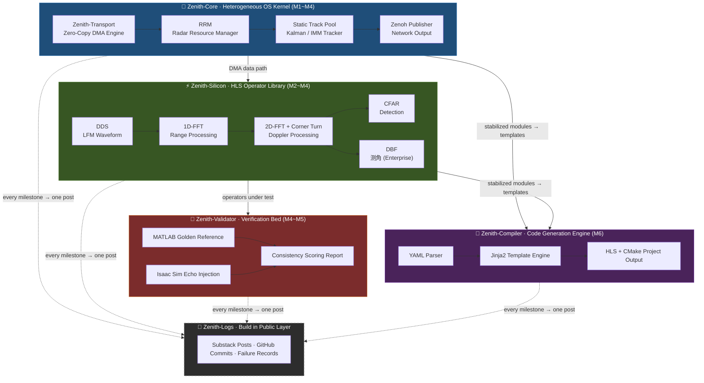

---
tags:
  - Radar
  - Architecture
  - AXI-DMA
  - CPP20
  - FPGA
  - HLS
  - BuildInPublic
date: 2026-03-05
author: Charley Chang
version: V5.0
---

## 研发全景规划白皮书 V5.0

> **一句话定位：** 专为 Zynq-7000 异构平台设计的软件定义雷达编译器与闭环验证环境——同时也是一个全程公开的、用 AI 做硬件的真实实验。

---

## 一、产品愿景 (Vision)

**技术愿景：** 成为雷达行业的"Windows XP"。向下接管天线波束与基带处理的物理时序，向上通过以太网输出平滑的航迹数据，实现软件定义雷达的一键生成。

**叙事愿景：** 用一个真实项目回答一个没人公开回答过的问题——*一个信号处理背景的工程师，在没有完整 FPGA 项目经验的起点，借助 AI 能走多远？* 全程用英文 Build in Public，把踩坑过程本身变成护城河。

这两个愿景不是分离的。技术可信度让内容有价值，内容可见度让技术有客户。

---

## 二、产品构成 (Product Architecture)

交付物由五个组件构成，前四个是技术资产，第五个是影响力资产。**组件之间存在硬性依赖关系，必须按顺序构建，不可并行跳跃。**

| 组件 | 定位 | 核心能力 | 构建阶段 |
|---|---|---|---|
| **Zenith-Core** | 异构 OS 内核（地基） | ARM 侧零拷贝 DMA 调度框架（Zenith-Transport）、雷达资源管理器（RRM）、静态内存池航迹跟踪器 | M1 → M4 |
| **Zenith-Silicon** | 信号处理算子库 | DDS / 1D-FFT / 2D-FFT / CFAR / DBF 等 HLS 算子；社区版 GPL 开源，企业级模块 IEEE 1735 加密 | M2 → M4 |
| **Zenith-Validator** | 仿真验证床 | MATLAB 黄金参考模型（逐模块对标）+ NVIDIA Isaac Sim 闭环注入，出具物理一致性打分报告 | M4 → M5 |
| **Zenith-Compiler** | 代码生成引擎（皇冠） | 解析 YAML 参数，一键生成完整 Vitis HLS（PL 端）与 C++20（PS 端）工程；前三个组件全部稳定后才能模板化 | M6 |
| **Zenith-Logs** | Build in Public 资产 | 全英文研发日志：踩坑记录、AI 纠错过程、架构决策思考，构成不可复制的品牌护城河 | 贯穿全程 |

---

## 三、功能矩阵与版本策略 (Feature Matrix)

采用**开源底座建立标准、闭源高级功能获取利润、公开叙事构建信任**的三轨模式。

### 3.1 基带处理与射频控制层 (Zenith-DSP)

| 功能模块 | YAML 配置项 | 社区版 (GPL 开源) | 企业版 (IEEE 1735 加密) |
|---|---|---|---|
| **波形发生 (DDS)** | `f_carrier`, `bandwidth`, `tx_num` | 单通道单载频 / 基础 LFM | 多通道相位对齐、跳频捷变、PM 调制 |
| **距离维 (1D-FFT)** | `n_fft_range`, `window_type` | 最大 N=1024，Hann 窗 | UltraRAM 级联大点数，Taylor / Chebyshev 窗 |
| **速度维 (2D-FFT)** | `n_fft_doppler`, `mti_order` | 基础 MTI（双脉冲对消） | 完整 MTD 处理，硬件级矩阵转置（Corner Turn） |
| **恒虚警检测 (CFAR)** | `pfa`, `guard_cells`, `train_cells` | 1D CA-CFAR | 2D-CFAR（OS / GO / SO），动态杂波图 |
| **数字波束形成 (DBF)** | `ant_elements`, `steer_vec` | 不支持 | 4/8 通道 ULA 相位补偿与高精度测角 |

### 3.2 OS 控制与航迹管理层 (Zenith-Core & RRM)

| 功能模块 | YAML 配置项 | 社区版 (GPL 开源) | 企业版 (Commercial Lib) |
|---|---|---|---|
| **时序控制 (RRM)** | `scan_mode`: Search / TWS / TAS | 固定死循环扫描 | TWS 边搜边跟、TAS 抢占式调度状态机 |
| **电扫控制 (ESA)** | `antenna_type`, `steer_step` | 不支持 | 兼容 1D/2D 相控阵，自动计算相位梯度 |
| **航迹管理 (Tracker)** | `filter_type`: EKF / IMM | 基础 Alpha-Beta 滤波 | 静态内存池化 Kalman / IMM 滤波，自定义接口 |
| **数据分发 (Output)** | `protocol`: Zenoh / UDP | 串口打印 / 原始 UDP | Zenoh 零拷贝发布，完美对接 ROS2 |

### 3.3 编译器与验证床 (Zenith-Compiler & Validator)

| 功能模块 | 功能描述 | 社区版 (GPL) | 企业版 (Commercial) |
|---|---|---|---|
| **代码生成引擎** | 参数化生成 HLS 与 ARM 代码 | 手动拷贝模板 | CLI 自动拼接生成完整工程 |
| **资源预测评估** | 综合前资源预警 | 不支持 | DSP48 / BRAM / 拥塞度精确预估报告 |
| **仿真验证床** | 物理数据注入与一致性验证 | 仅基础 C-Sim 接口 | Isaac Sim 闭环仿真，出具一致性打分报告 |

---

## 四、技术指标与硬核约束 (Technical Specs)

这些约束是架构决策的"宪法"，不可随意修改：

- **硬件平台：** 首发适配 Zynq-7020（ALINX AX7020），向上兼容 UltraScale+。资源红线：DSP48 消耗 < 200，BRAM 36K < 120。
- **时序约束：** 保证 `II=1` 的硬件流水线，PL 时钟频率 150 MHz（速度等级 -1 安全裕量）。
- **内存守则：** ARM 端零动态分配（Zero Heap Allocation），所有航迹池与缓冲区在启动时一次性预分配，确保微秒级确定性时延。
- **数据带宽：** PS/PL 间 Zero-Copy 传输（`std::span` 管理共享物理内存），CPU 负载较 memcpy 方案降低 80% 以上。
- **接口标准：** 统一使用 AXI4-Stream，屏蔽不同板卡的管脚差异。
- **代码风格：** 强制 `[[nodiscard]]`、`noexcept`、`constexpr`，所有 C++ 代码默认包含现代安全特性。
- **仿真精度：** 与 MATLAB 黄金参考逐位对齐，SNR 损失控制在理论量化极限内。

---

## 五、研发与内容双轨里程碑 (Unified Roadmap)

**节奏前提：** 每天晚上 1-3 小时，周末可能略多。每个里程碑的时间估算基于此节奏，含调试反复和卡壳缓冲，不按理想速度计算。**代码是素材，内容是杠杆，每个里程碑完成后触发一次 Substack 发布。**

---

### M1 · Zenith-Core 地基（第 1-3 月）
**对应组件：Zenith-Core 第一层**

这是整个项目的地基，后续所有算子都跑在这条数据通路上。做不稳就不要往前推。

| 任务 | 具体内容 | 验收标准 |
|---|---|---|
| 开发环境搭建 | PetaLinux / Vitis 工具链，交叉编译 C++20，板卡串口通信验证 | 能在 AX7020 上跑 Hello World，编译器支持 `std::span` |
| CMA 内存配置 | 设备树添加 CMA 分区，mmap 映射物理地址，验证 PS 侧读写 | 16MB 静态内存池正确分配，地址 4KB 对齐 |
| DMA 寄存器驱动 | 实现 `DmaEngine` 类，轮询模式，MM2S + S2MM 双向 | 单次 4KB 传输延迟 ≤ 10μs |
| 吞吐量基准测试 | 连续传输 1MB 数据块，测量实际带宽 | MM2S / S2MM 双向带宽各 ≥ 200 MB/s |
| DDS IP 集成 | Vivado Block Design 搭建，HLS DDS 接入 AXI-DMA，IQ 回环 | MATLAB 对标误差 < -60 dBc |

**内容产出 → Post #1**
*"Why I'm building a radar from scratch with AI — and why Xilinx's tools drove me to it"*
素材：Vivado 安装踩坑截图、第一次 DMA 传输成功的串口打印、工具链配置的完整笔记。

---

### M2 · Zenith-Silicon 第一层：距离维（第 4-6 月）
**对应组件：Zenith-Silicon（DDS + 1D-FFT）+ Zenith-Validator 起步**

在 M1 数据通路上叠加第一个真正的信号处理算子，同时建立 MATLAB 验证习惯——这个习惯贯穿后续所有里程碑。

| 任务 | 具体内容 | 验收标准 |
|---|---|---|
| MATLAB 黄金参考 | 编写 `gen_lfm_reference.m`，建立 LFM 波形与 1D-FFT 的定点数参考输出 | MATLAB 输出与理论值误差 < -80 dBc |
| 1D-FFT HLS 算子 | 实现基 2 Cooley-Tukey FFT，`#pragma HLS PIPELINE II=1`，BRAM 存储 | HLS C-Sim 与 MATLAB bit-exact 对齐 |
| HLS 综合与时序 | Vitis HLS 综合，确认 150 MHz 时序满足，导出 IP | 综合报告：II=1，无时序违例，BRAM < 8 个 |
| 板级验证 | PS 注入 LFM 信号，PL 做 FFT，回传 PS，MATLAB 读取绘图 | 距离维频谱峰值位置误差 ≤ 1 个 FFT bin |

**内容产出 → Post #2**
*"I asked Claude to write HLS code. Here's what the synthesis report said."*
素材：AI 生成代码的原始版本 vs. 修改后版本对比、HLS 综合报告截图、MATLAB 对标图。

---

### M3 · Zenith-Silicon 第二层：速度维与检测（第 7-10 月）
**对应组件：Zenith-Silicon（2D-FFT + CFAR）**

这是信号处理链路中技术难度最高的阶段，矩阵转置（Corner Turn）和跨时钟域是两个公认的卡点，时间估算偏保守。

| 任务 | 具体内容 | 验收标准 |
|---|---|---|
| 矩阵转置单元 | 实现 Corner Turn（距离维→速度维数据重排），BRAM 双口缓冲，CDC 安全 | 无亚稳态告警，数据顺序与 MATLAB 参考一致 |
| 2D-FFT 流水线 | 速度维 FFT 算子，与距离维 FFT 串联，实现完整 Range-Doppler Map | RD Map 峰值 SNR 与 MATLAB 参考差值 < 0.5 dB |
| 1D CA-CFAR 算子 | 实现社区版 CFAR，输出点迹坐标 | 虚警率与理论 Pfa 误差 < 10%（高斯杂波仿真） |
| 全链路集成测试 | DDS → 1D-FFT → Corner Turn → 2D-FFT → CFAR 全通 | 静止目标点迹稳定输出，距离/速度估计正确 |

**内容产出 → Post #3**
*"Corner Turn: the two-hour bug that took me two weeks"*
素材：矩阵转置的调试过程、CDC 分析报告、Range-Doppler Map 图像对比。

---

### M4 · Zenith-Core 完成：OS 调度与 MVP（第 11-15 月）
**对应组件：Zenith-Core（RRM + Tracker + 网络输出）**

在这个里程碑结束时，系统第一次从传感器输入到网口航迹输出全部打通——这是整个项目最重要的节点，也是 Substack 付费层开放的时机。

| 任务 | 具体内容 | 验收标准 |
|---|---|---|
| 静态航迹池 | 预分配固定大小的 Track 对象池，Zero Heap，实现 Alpha-Beta 滤波器 | 32 条航迹同时运行，ARM 堆内存使用量为零 |
| RRM 扫描调度 | 实现固定扫描模式（社区版），ARM 控制 PL 脉冲重复间隔 | PRI 抖动 < 1μs |
| Zenoh 网络输出 | 集成 Zenoh-C，将点迹/航迹数据发布到局域网 | 在另一台 PC 上用 Zenoh subscriber 接收到航迹数据 |
| 端到端 MVP 演示 | 全链路录像：板卡上电 → 信号注入 → 网口输出航迹可视化 | 可录制的演示视频，航迹稳定持续 > 30 秒 |

**内容产出 → Post #4 + 演示视频**
*"First real-world track on a $150 board — 15 months of nights and weekends"*
这篇是整个系列的高潮，预期传播效果最好。同步开放 Substack 付费层。

---

### M5 · Zenith-Validator 完成（第 16-20 月）
**对应组件：Zenith-Validator（MATLAB 全链路 + Isaac Sim）**

把之前分散在各里程碑的 MATLAB 验证脚本整合成完整的验证床，并完成 Isaac Sim 接口。这是企业版的核心差异化功能。

| 任务 | 具体内容 | 验收标准 |
|---|---|---|
| MATLAB 验证床整合 | 将 M1-M4 的所有参考脚本整理成统一框架，自动化运行全链路对标 | 一键运行，输出通过/失败报告 |
| Isaac Sim 数据接口 | 实现 Isaac Sim → Zenith 的雷达回波注入接口，支持多径场景 | 仿真场景中至少一个运动目标被正确检测和跟踪 |
| 一致性打分报告 | 定义打分标准（检测率、虚警率、航迹连续性），自动生成 PDF 报告 | 报告格式可直接提交给客户作为质检文件 |

**内容产出 → Post #5 + 技术白皮书**
*"How we prove a radar works before it ships: Sim-to-Real determinism"*
白皮书作为企业版销售的技术背书材料。

---

### M6 · Zenith-Compiler + 商业打包（第 21-24 月）
**对应组件：Zenith-Compiler + 企业版发布**

前五个里程碑完成后，所有模块的接口和参数空间已经被真实项目验证过，这时候做模板化才是有意义的——而不是一开始就设计编译器。

| 任务 | 具体内容 | 验收标准 |
|---|---|---|
| YAML 规范定义 | 定义 `radar_config.yaml` 完整 schema，含默认值推导规则 | 用户只输入 `f_carrier: 77GHz`，其余参数自动填充 |
| Jinja2 代码生成 | 实现模板引擎，从 YAML 生成完整 Vitis HLS 工程和 ARM CMake 工程 | 生成的工程可直接在 Vivado 2022.2 综合通过 |
| IEEE 1735 加密打包 | 企业级算子加密，FlexLM License 绑定 | 过期后综合失败，License 更新后恢复 |
| 企业版发布 | 完整文档、License 购买流程、技术支持 SLA | 第一个付费企业客户签约 |

**内容产出 → Post #6**
*"Building a compiler that writes radar code — and why I waited 2 years to start"*

---

### 里程碑总览

| 里程碑 | 时间（现实节奏） | 核心组件 | 关键交付 | 内容发布 |
|---|---|---|---|---|
| **M1** | 第 1-3 月 | Zenith-Core（地基） | DMA 通路 + DDS 回环 | Post #1 |
| **M2** | 第 4-6 月 | Zenith-Silicon（距离维） | 1D-FFT 板级验证 + MATLAB 对标 | Post #2 |
| **M3** | 第 7-10 月 | Zenith-Silicon（速度维+检测） | 全链路点迹输出 | Post #3 |
| **M4** | 第 11-15 月 | Zenith-Core（OS + MVP） | 端到端航迹演示视频 | Post #4 ★ 付费层开放 |
| **M5** | 第 16-20 月 | Zenith-Validator | Isaac Sim 闭环 + 一致性报告 | Post #5 + 白皮书 |
| **M6** | 第 21-24 月 | Zenith-Compiler + 企业版 | 一键生成工具 + 首个企业客户 | Post #6 |

---

## 六、变现策略 (Monetization)

变现路径按时间顺序自然生长，不需要在早期做任何推销动作：

**阶段一（M1-M4）：建立信任，不变现。**
专注发布内容，在 r/FPGA、Hackster、Hacker News 建立英文社区存在感。在 Substack 积累免费订阅者，在 GitHub 积累 Star 和 Watcher。这个阶段的产出是声誉，不是收入。

**阶段二（M4 之后）：Substack 付费层开放。**
免费层保持公开内容；付费层（$10/月）提供深度架构分析、私有代码仓库访问权限、以及 Q&A。目标：200 付费订阅者 = $2,000/月被动收入。

**阶段三（M6 之后）：企业版 License。**
向低空经济初创公司、无人机研发商、高校课题组销售加密 IP 核与编译器工具。定价 $3,000-$8,000/年。卖的核心价值不是代码本身，而是**免责、合规与确定性**——客户买的是"这套方案在 Vivado 当前版本下保证能综合通过"的承诺。

**阶段四（长期）：课程与书籍。**
完成 Zenith 后拥有"用 AI 从零做出完整 FPGA 雷达系统"的稀缺身份，可衍生 $299-$499 的英文课程或技术电子书。这个阶段的变现依赖前三个阶段积累的受众，无需额外获客成本。

---

## 七、护城河分析 (Moat Analysis)

Zenith 的护城河不依赖任何单一防线，而是三层叠加：

**第一层：声誉护城河（最深、最持久）**
Build in Public 的全程记录让这个项目成为"首创者叙事"。任何人可以 fork 代码，但没有人能复制这个公开建造的过程和由此积累的社区信任。这是任何加密手段都无法提供的保护。

**第二层：技术护城河（中等深度）**
核心算子以 IEEE 1735 加密网表形式交付，License 绑定 FlexLM。商业防线来自"持续兼容性"：Vivado 版本和 Zynq 芯片迭代，客户续费以获得最新补丁。验证防线来自 Isaac Sim 一致性打分系统的部分逻辑留在云端，不续费无法获得质检报告。

**第三层：合规护城河（针对企业客户）**
欧美企业的供应链合规审查要求使用经过授权的 IP。对大厂而言，主动购买 License 的成本远低于因使用未授权代码引发的法律风险。这条防线不需要技术手段，靠制度驱动。

**需要正视的局限：** AMD/Xilinx 迟早会将 AI 辅助功能集成进 Vivado 官方工具链，届时第二层护城河会被侵蚀。第一层声誉护城河不受此影响——这也是为什么 Build in Public 是整个项目最重要的战略动作，而不只是营销附属品。

---

## 八、目标客户与核心价值主张 (Target Market)

**主要客户群体：**
- 低空经济初创公司与无人机避障团队（英文市场优先）
- 特种机器人研发商
- 高校与科研院所（课题经费驱动，决策周期短）
- 全球 FPGA 开发者社区（内容受众，部分转化为付费用户）

**客户核心痛点：**
缺乏能同时覆盖算法、FPGA 和 C++ 的跨界工程师；硬件试错成本高；AI 生成的代码无法保证物理正确性。

**价值主张：** 廉价租赁的总师判断力 + 工程上可验证的确定性。

---

*文档版本 V5.0 · 2026-03-05 · Charley Chang*
*本文档是 Obsidian 知识库与 NotebookLM 语料库的唯一真相源（Single Source of Truth）。*
